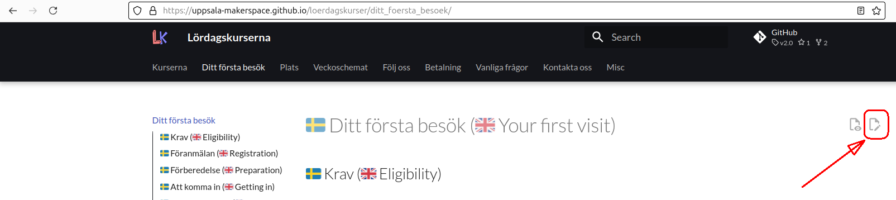

# Contributing

???- question "Varför är den här sida på Engelska?"

    For att bidragare förstår ibland ej svenska
    och bör inte förstår svenska för att bidra :-)

Thanks for considering to contribute and reading this!

You can contribute by:

- Fixing typos, clarifying sentences
- Add lessons

You can do so by:

- Sending an email to `rjcbilderbeek@gmail.com`
- For questions, you can [create an issue](https://github.com/richelbilderbeek/arduino_foer_ungdomar/issues)
- Textual changes go via pull requests.
  Whatever these are, these are created when clicking the 'Edit page' icon
  located at the top-right of each page.

???- question "Where is the 'Edit page' icon?"

    The 'Edit page' icon is
    located at the top-right of each page.

    

There will be a tendency to accept your contributions
when it helps achieve this website's goal,
which is to have Arduino teaching material in Swedish for ~10 year olds.

This GitHub repository follows the [Contributor Covenant Code of Conduct](CODE_OF_CONDUCT.md).
