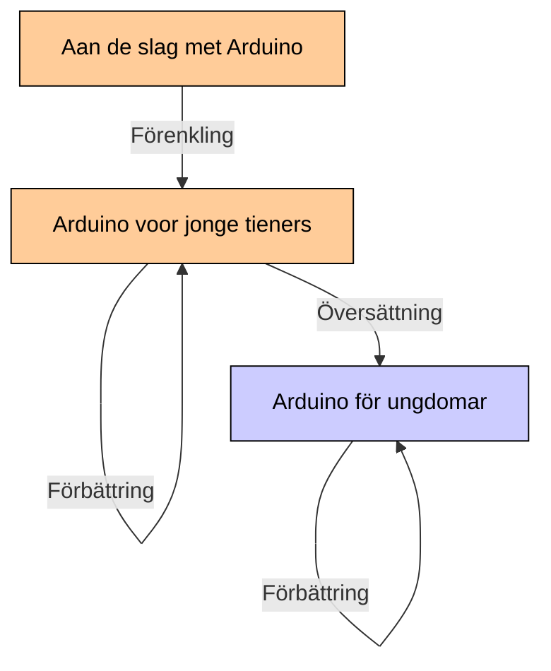

# Vanliga frågor

## Var kan jag hitta böckerna?

I mappen '[boecker](boecker/README.md)'.

## Finns det några kurser som använder dessa böcker?

Japp:

* [Uppsala](https://github.com/richelbilderbeek/arduinokurs)

## Vad är licensen på böckerna?

Böckerna har alla en [CC-BY-NC-SA](https://sv.wikipedia.org/wiki/Creative_Commons#Licenser)-licens:


Bokstäver|Mening          |Översättning
---------|----------------|-----------------------------------------------
CC       |Creative Commons|Licenstypen
BY       |Av              |Denna webbplats bör citeras som källa
NC       |Icke-kommersiell|Ingen vinst får göras på detta material
SA       |Dela lika       |Materialet måste distribueras med samma licens

Upphovsrätten till dessa böcker finns på:

```
(C) Richèl Bilderbeek och alla lärare och alla elever
```

Det här är många människor, så det här häftet kommer alltid att förbli gratis, gratis och öppet.

## Får jag distribuera dessa böcker?

Ja tack!

## Hur skickar jag in ett förslag?

Trevlig!

Det finns flera alternativ:

* Skicka ett e-postmeddelande till @richelbilderbeek, sök efter "Richel Bilderbeek email"
* Skapa en Issue
* Skapa en Pull Request

## Kan jag ändra dessa böcker?

Ja, förutsatt att den här webbplatsen anges som källa
och upprätthåller samma fria licens.

## Kan jag sälja dessa böcker?

Att sälja är inte rätt ord här.

Böckerna får tryckas fritt.
Detta ger tryckkostnader.
Böckerna kan säljas för dessa kostnader.
På så sätt kan du se priset på häften som servicekostnader.
Ingen vinst får göras på bokföringen.

## Varför finns Uppsala Makerspacets logotyp på omslaget?

Dessa häften användes för första gången
hos Uppsala Makerspace. Eftersom de trycker häften,
denna logotyp finns på omslaget.

Det är fullt möjligt att byta omslag, utan eller med annan logotyp.

## Vad är historien om kursen?

Denna kurs började som en svensk översättning från en nederländska
kurs 'Arduino voor jonge tieners'. Efter första översättning,
var kursen förbättrat tack vore eleverna.

'Arduino voor jonge tieners' var andvänd under kurser i Nederländerna
för fler år. 'Arduino voor jonge tieners' var redan en
förenkling av kursen 'Aan de slag met Arduino' (ej på internet än?).



