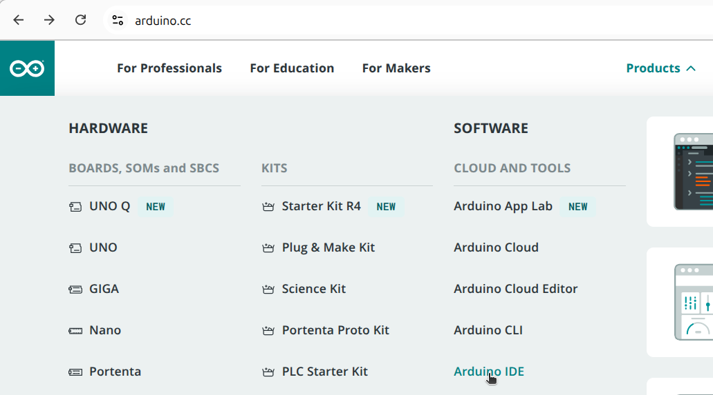
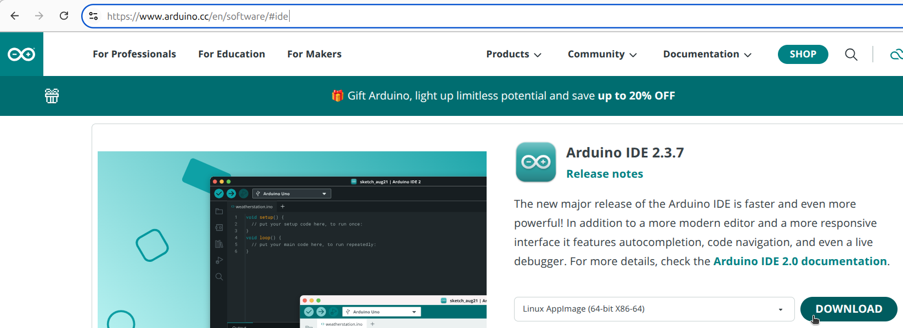

# Att installera Arduino IDEn

Vi använder en programm för att programmera en Arduino.
Program heter 'Arduino IDEn'. En 'IDE' (som är en förkortning
av 'Integrated Development Environment') är typ 'programmeringsprogram'.

## 0.1. Surf till Arduino hemsida

I en internet browser, surf till
[`https://www.arduino.cc`](https://www.arduino.cc).

## 0.2. Surf till Arduino IDE sida

Söka efter 'Arduino IDE' eller gå direkt till
[`https://www.arduino.cc/en/software/#ide`](https://www.arduino.cc/en/software/#ide).

## 0.3. Ladd ner Arduino IDE

Klicka på 'Download'.

## 0.4. Installera

Kör den filen som är nerladdad.
Under installationen, bara klicka 'Next' ('Nästa')
hela tiden.

Efter installation kan du nu starta Arduino IDE.
