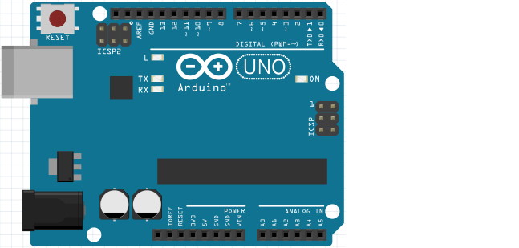
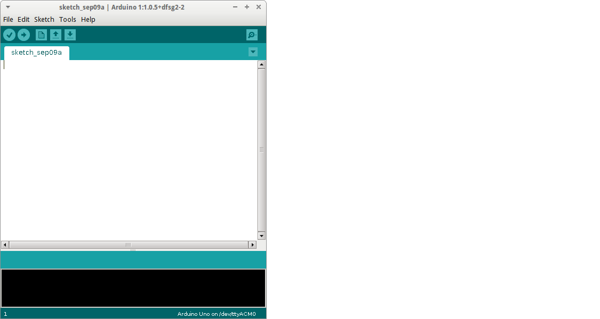

# Lektion 1: Programmering av den inbyggda lysdioden

Under den här lektionen ska vi programmera den inbyggda lysdioden
i Arduino.

 | Arduino har redan en lampa som du kan programmera.
:-------------:|:----------------------------------------:

## 1.1. Ansluta en Arduino

Anslut en Arduino så här:



Anslut en USB-kabel till din Arduino och till din dator.

\pagebreak

## 1.2. Startar Arduino IDE

 | Vi programmerar Arduino med Arduino IDE
:-------------:|:----------------------------------------:

 | 'IDE' uttalas som 'i-d-ee'
:-------------:|:----------------------------------------:

Starta Arduino IDE genom att:

- Klicka på genvägen på skrivbordet
- Tryck på Windows-tangenten (nedre till vänster, mellan `Ctrl` och `Alt`). Skriv
   sedan `arduino` (små bokstäver) och tryck sedan Enter


\pagebreak

Nu ser du Arduino IDEn:



 | IDE betyder 'Integrated Development Environment', mjukvaran du använder för att programmera.
:-------------:|:----------------------------------------:

\pagebreak

## 1.3. Vårt första program

Här är kod för Arduino:

```c++
void setup()
{
  pinMode(13, OUTPUT);
}

void loop()
{
  digitalWrite(13, HIGH);
  delay(1000);
  digitalWrite(13, LOW);
  delay(1000);
}
```

 | 
:-------------:|:----------------------------------------:
`void setup() { }`|'Kära dator, gör allt inom måsvingarna i början av programmet'

 | 
:-------------:|:----------------------------------------:
`void loop() { }`|'Kära dator, gör allt inom måsvingarna hela tiden.'

 | 
:-------------:|:----------------------------------------:
`pinMode(13, OUTPUT);`|'Se till att spänning kan komma ut ur stift 13'

 | 
:-------------:|:----------------------------------------:
`digitalWrite(13, HIGH);`|'Sätt spänning på stift 13'

 | 
:-------------:|:----------------------------------------:
`delay(1000);`|'Vänta 1000 millisekunder'

Skriv in koden i Arduino IDE och klicka på 'Upload' ('Ladda up').


\pagebreak

## 1.4. Uppgift 2

Få LEDen att blinka 10 gånger snabbare.

Tips: LED är nu på i 1000 millisekunder (1 sekund) och av i 1000 millisekunder (1 sekund).

\pagebreak

## 1.5. Lösning 2

```c++
void setup()
{
  pinMode(13, OUTPUT);
}

void loop()
{
  digitalWrite(13, HIGH);
  delay(100);
  digitalWrite(13, LOW);
  delay(100);
}
```

## 1.6. Uppgift 3

Få LEDen att blinka så snabbt du kan. Vad ser du?

 | Det blir antagligen nåt du inte förväntade dig!
:-------------:|:----------------------------------------:

\pagebreak

## 1.7. Lösning 3

Det finns fler lösningar, det här är en:

```c++
void setup()
{
  pinMode(13, OUTPUT);
}

void loop()
{
  digitalWrite(13, HIGH);
  delay(1);
  digitalWrite(13, LOW);
  delay(1);
}
```

Du kommer inte längre att kunna se lampan blinka.

 | Du kommer inte längre att kunna se lampan blinka!
:-------------:|:----------------------------------------:

\pagebreak

 | Ljuset blinkar, men våra ögon kan inte uppfatta det tillräckligt snabbt för att se det.
:-------------:|:----------------------------------------:

 | 
:-------------:|:----------------------------------------:
`digitalWrite(13, LOW);`|'Ingen spänning på stift 13'

 | Också bra: `delay(0);` eller ta bort raderna med `delay` helt.
:-------------:|:----------------------------------------:

\pagebreak

## 1.8. Slutuppgift

Hämta:

- 1 st dator
- 1 st USB sladd
- 1 st Arduino

Läs igenom slutuppgiften först, för du har 5 minuter på dig.

1. Fråga någon för att få göra provet. Den personen får inte hjälpa dig.

2. Stäng av dator helt. Starta dator. Starta timern när Arduino IDE är startat

3. Få lysdioden att blinka varje sekund,
   dvs lysdioden är på i 1 sekund och av i 1 sekund.
   Du får använda kod som redan finns!

4. Få lysdioden att blinka så snabbt som möjligt.
   Förklara varför vi kann inte ser det
