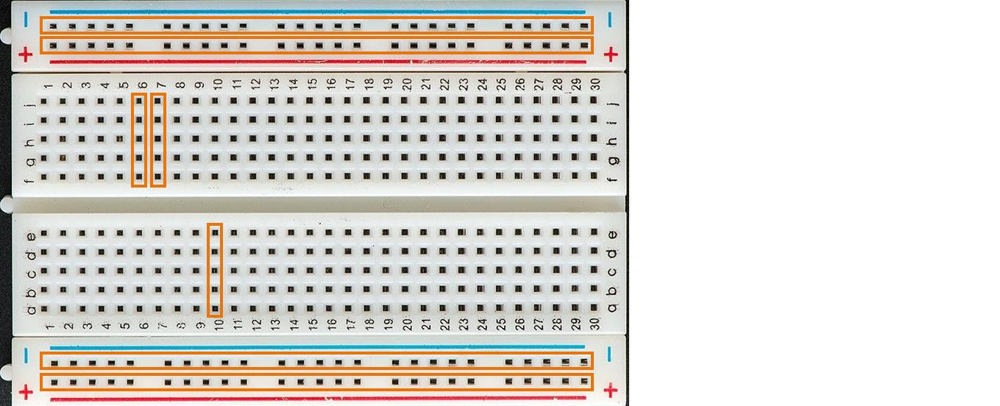
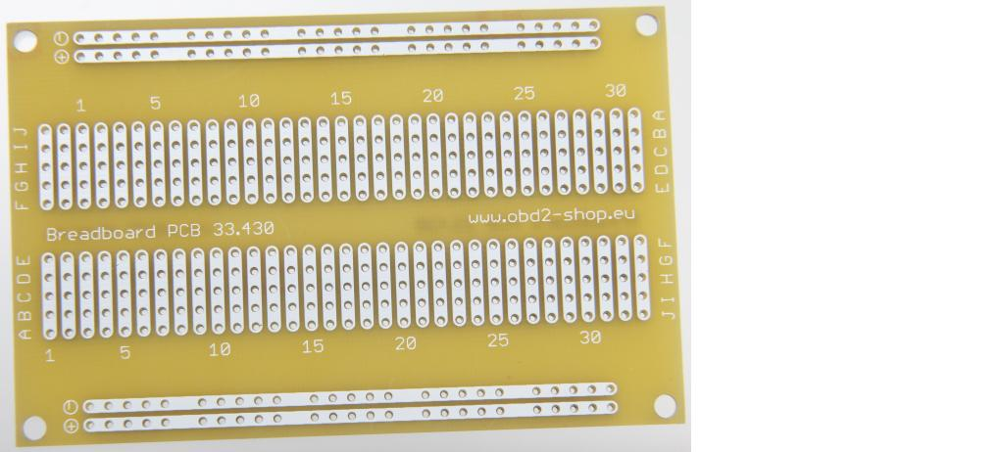
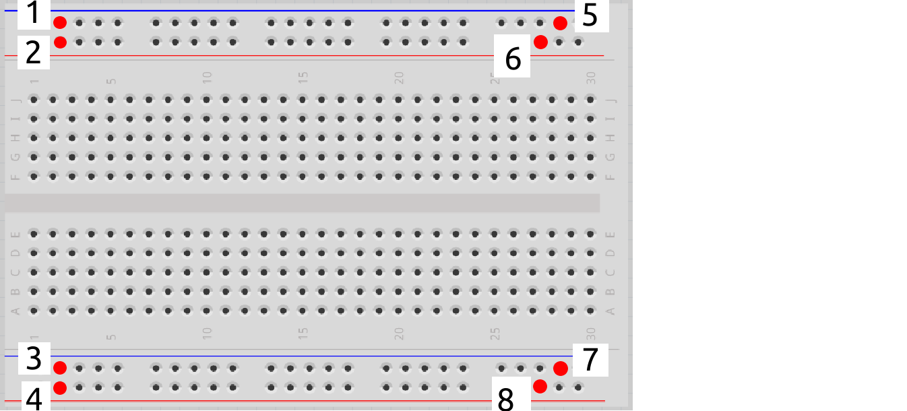
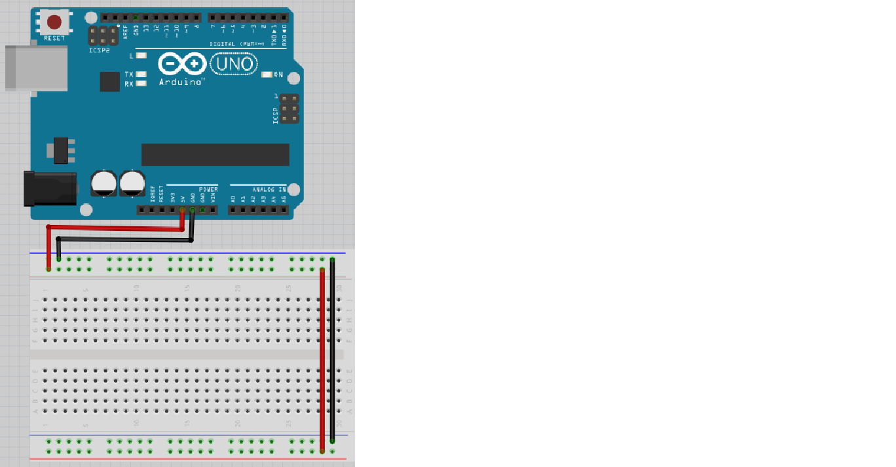
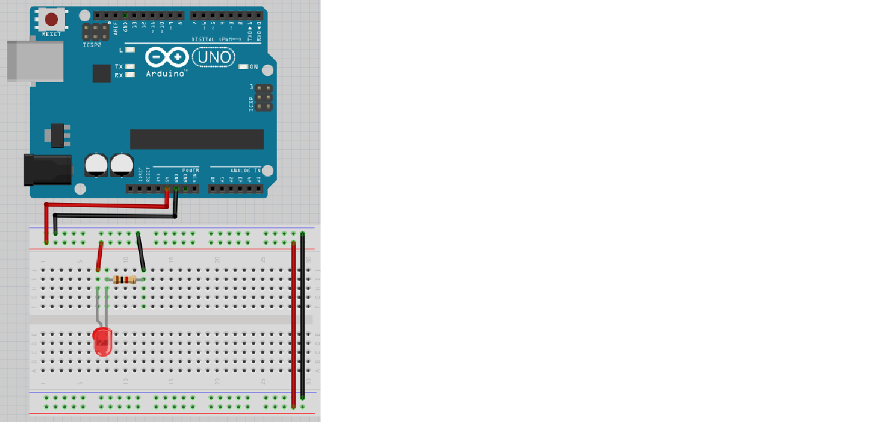
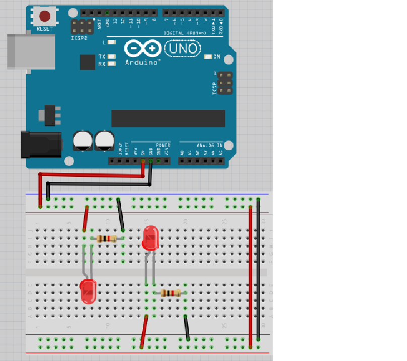
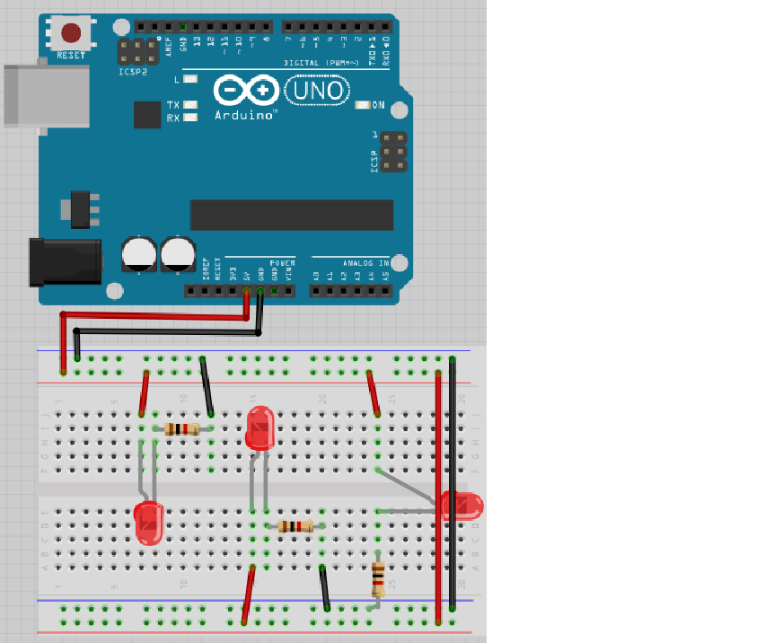

# Lektion 5: Anslutning av flera lysdioder

Under den här lektionen ska vi ansluta flera lysdioder till en Arduino!

## 5.1. Kopplingsdäcket

Vi använder ett kopplingsdäck för att ansluta grejer till Arduino.

Här ser vi ett:

Och här är baksidan av samma kopplingsdäck:

\pagebreak

Kom ihåg hur baksidan av kopplingsdäcket såg ut och titta på det här:

Vilka av hålen är sammanlänkade?

\pagebreak

### 5.1. Svar

* 1 är sammanlänkat med 5
* 2 är sammanlänkat med 6
* 3 är sammanlänkat med 7
* 4 är sammanlänkat med 8

## 5.2. Anslut motstånden och lysdioden

Kolla på den här bilden:

Den fyra långa horisontella raderna av hål kallas 'skenor'.

* Två skenor levererar 5V spänning.
   Ofta har de en röd linje brevid sig.
* Två skenor fungerarar som jord eller GND.
   Ofta har den en svart eller blå linje brevid sig

Försök förklara:

* Vad gör sladden mellan 5V på Arduino och kopplingsdäcket?
* Vad gör sladden mellan GND på Arduino och kopplingsdäcket?
* Vad gör sladden mellan +skenorna?
* Vad gör sladden mellan -skenorna?

\pagebreak

### 5.2. Svar

Sladden mellan 5V på Arduino och kopplingsdäcket
gör så att kopplingsdäcket är kopplat till 5V spänning.

Sladden mellan GND på Arduino och kopplingsdäcket
gör så att kopplingsdäcket är kopplat till jord/GND.

Sladden mellan 5V och skenorna gör så att båda skenorna kopplade dit har 5V spänning.

Sladden mellan GND och skenorna gör
så att båda skenorna kopplade dit är jordade.

## 5.3. Krets 1: Anslut motstånden och lysdioden

Nu är det dags att bygga kretsen på riktigt:

* Koppla ur USB-kabeln från datorn, så att Arduino inte längre har ström
* Montera kretsen enligt bild
* Sätt tillbaka USB-kabeln i datorn

 | Det böjda benet i ritningen symboliserar det längre benet på en lysdiod
:-------------:|:----------------------------------------:

Lyser lysdioden? Bygg ihop kretsen och kontrollera!

\pagebreak

### 5.3. Svar

Elen kan gå från `5V` till 5 voltsskena, igenom lysdioden och motståndet,
till jordningsskena och fram till `GND`.

Så ja, det funkar! Om inte, fråga om hjälp!

## 5.4. Krets 2

Kolla på den här kretsen:

Nu finns två lysdioder!

Tror du att lysdioderna kommer att lysa? Varför?

Bygg ihop kretsen och kontrollera!

\pagebreak

### 5.4. Svar

Lysdioderna kommer båda att lysa, då båda har tillgång till `5V` och jord tack vare skenorna.

Så ja, det funkar! Om inte, fråga om hjälp!

## 5.5. Krets 3

Kolla på den här kretsen:

Nu finns tre lysdioder!

Tror du att nya lysdioden kommer att lysa? Varför?
Bygg ihop kretsen och kontrollera!

\pagebreak

### 5.5. Svar

Lysdioderna kommer alla tre att lysa, för att varje
har tillgång till `5V` och jord tack vare skenorna.

Så ja, det funkar! Om inte, fråga om hjälp!

## 5.6. Slutuppgift

Material som krävs:

* 1 dator
* 1 Arduino
* 1 USB sladd
* 1 kopplingsdäck
* 7 1.000 Ohm motstånd
* 7 lysdioder
* lagom många sladdar

1. Fråga någon för att examinera. Den personen får inte hjälpa dig.

Starta en timer på 10 minuter och gör följande:

2. Får 7 lysdioder att lysa
