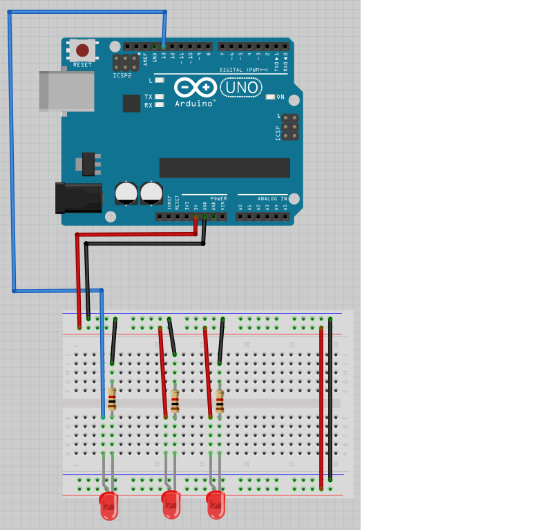

# Lektion 6: Programmering av flera lysdioder

Under den här lektionen ska vi programmera flera lysdioder med en Arduino!

## 6.1: Anslutning

Bygg upp den här kretsen:


Alla lysdioder ska lysa. Om de inte gör det, be om hjälp!

\pagebreak

## 6.2: Koden

Ladda upp denna kod:

```c++
void setup() 
{
  pinMode(11, OUTPUT);
  pinMode(12, OUTPUT);
  pinMode(13, OUTPUT);
}

void loop() 
{
  digitalWrite(11, HIGH);
  digitalWrite(12, HIGH);
  digitalWrite(13, HIGH);
  delay(1000);
  digitalWrite(11, LOW);
  digitalWrite(12, LOW);
  digitalWrite(13, LOW);
  delay(1000);
}
```

Vad tror du att koden gör? Vad händer? Varför?

\pagebreak

### Svar

Koden tänder lysdioden vid hål 11, 12 och 13,
väntar en sekund (dvs. tusen millisekunder),
släcker alla lysdioder
och väntar en sekund. 
Efter det upprepas koden.

Men ingenting händer, eftersom det inte sitter några sladdar i hålen.

\pagebreak

## 6.3: Anslutning 1

Bygg om till den här kretsen:



Lysdioden till vänster skall blinka. Om inte, fråga om hjälp!

\pagebreak

## 6.4: Anslutning 2

Bygg om till den här kretsen:


De två lysdioderna till vänster skall blinka. Om inte, fråga om hjälp!

\pagebreak

## 6.5: Anslutning 3

Bygg om till den här kretsen:


Den tre lysdioderna skall blinka. Om inte, fråga om hjälp!

\pagebreak

## 6.6: Ett nytt mönster

Ändra koden till koden nedan:

```c++
void setup() 
{
  pinMode(11, OUTPUT);
  pinMode(12, OUTPUT);
  pinMode(13, OUTPUT);
}

void loop() 
{
  digitalWrite(11, HIGH);
  digitalWrite(12, HIGH);
  delay(1000);
  digitalWrite(13, HIGH);
  digitalWrite(11, LOW);
  delay(1000);
  digitalWrite(12, LOW);
  digitalWrite(13, LOW);
  delay(1000);
}
```

Vad ser du?

\pagebreak

### Svar

Mönstret upprepar:

 * lysdioderna i 11 och 12 lyser
 * en sekund händer ingenting
 * lysdioden i 13 lyser, lysdioden i 11 släcker
 * en sekund händer ingenting
 * lysdioden i 12 och i 13 släcker
 * en sekund händer ingenting

## 6.13: Knight Rider mönstret

Förbered kod:

Få nu LEDs lysa i ett 'Knight Rider-mönster': 1-2-3-2. 
Det ska alltid vara exakt en LED som lyser.

 | Knight Rider var en TV-serie med en talande bil.
:-------------:|:----------------------------------------: 


\pagebreak

### Svar

```c++
void setup() 
{
  pinMode(11, OUTPUT);
  pinMode(12, OUTPUT);
  pinMode(13, OUTPUT);
}

void loop() 
{
  digitalWrite(11, HIGH);
  delay(1000);
  digitalWrite(11, LOW);
  digitalWrite(12, HIGH);
  delay(1000);
  digitalWrite(12, LOW);
  digitalWrite(13, HIGH);
  delay(1000);
  digitalWrite(13, LOW);
  digitalWrite(12, HIGH);
  delay(1000);
  digitalWrite(12, LOW);
}
```

\pagebreak

## 6.13: Slutuppgift

Material som krävs:

 * 1 dator
 * 1 Arduino
 * 1 USB sladd
 * 1 kopplingsdäck
 * 3 1.000 Ohm motstånd
 * 3 lysdioder
 * lagom många sladdar

På datorn: har koden redo!

Läs slutuppgiften först, efter det har du 10 minuter på dig.

1. Fråga någon för att examinera. Personen får inte hjälpa dig!

Starta en timer och gör följande:

2. Bygg upp kretsen från början, ladda upp koden och visa Knight Rider mönstret!
