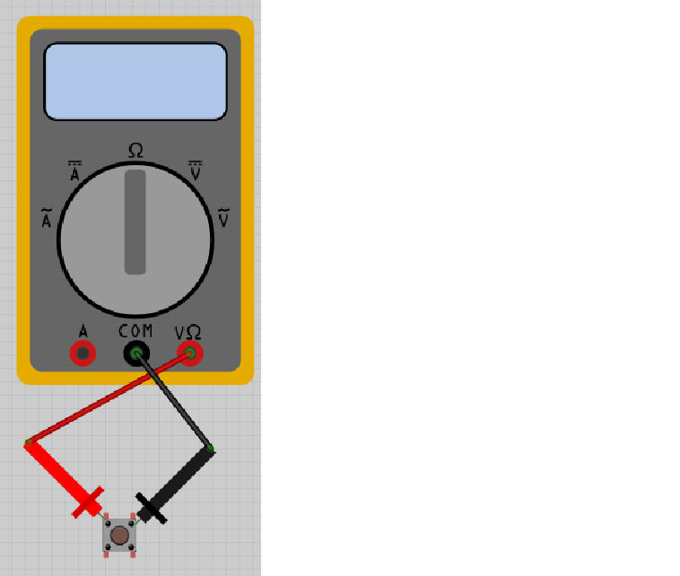

# Lektion 7: Mätning av en knapp

Under den här lektionen ska vi lära oss hur knappar fungerar!

## 7.1. Att mäta en knapp 1

Vrid vredet på multimetern till Ohm symbolen.
Sätt på multimetern och koppla:

- den röda mätpinnen till det övre vänstra benet på knappen
- den svarta mätpinnen till det övre högra benen på knappen

Vad visar multimetern? Och vad visar den om du trycker på knappen?

\pagebreak

### 7.1. Svar

När du inte trycker på knappen ska skärmen visa 'Inf' eller 'OL'. 'Inf' är an förkortning av 'Infinity', som är engelska för oändligt.

När du trycker på knappen ska skärmen visa ett motstånd på 0 Ohm.
Ett motstånd på 0 Ohm betyder att det inte finns något motstånd mellan mätpunkterna.

Det betyder att elen leds genom knappen när den är nedtryckt. När knappen inte är nertryckt leds elen inte igenom (och motståndet blir därför oändligt)
Smart!

## 7.2. Att mäta en knapp 2

Vrid vredet på multimetern till Ohm symbolen.
Sätt på multimetern och koppla:

- den röda mätpinnen till det övre vänstra benet på knappen
- den svarta mätpinnen till det nedre högra benet på knappen

Vad visar multimetern? Och vad visar den om du trycker på knappen?

\pagebreak

### 7.2. Svar

När du inte trycker på knappen ska skärmen visa 'Inf' eller 'OL'.

När du trycker på knappen skulle skärmen visa ett motstånd på 0 Ohm.

Det är samma resultat som förra gången.

## 7.3. Att mäta en knapp 3

Vrid vredet på multimetern till Ohm symbolen.
Sätt på multimetern och koppla:

- den röda mätpinnen till det övre vänstra benet på knappen
- den svarta mätpinnen till det nedre vänstra benet på knappen

Vad visar multimetern? Och vad visar den om du trycker på knappen?

\pagebreak

### 7.3. Svar

Skärmen visar alltid ett motstånd på 0 Ohm.
Det betyder att de vänstra benen alltid är sammankopplade.
Knappen gör ingen skillnad när man kopplar in den på detta sätt

## 7.4. Att mäta en knapp 4

Vrid knappen på multimetern till Ohm symbolen.
Sätt på multimetern och koppla:

- den röda mätpinnen till det nedre vänstra benet på knappen
- den svarta mätpinnen till det övre högra benet på knappen

Vad visar multimetern? Och vad visar den om du trycker på knappen?

\pagebreak

### 7.4. Svar

När du inte trycker på knappen ska skärmen visa 'Inf' eller 'OL'. 'Inf' är an förkortning av 'Infinity', som är engelska för oändligt.

När du trycker på knappen skulle skärmen visar ett motstånd på 0 Ohm.
Ett motstånd på 0 Ohm betyder att det inte finns någonting emellan mätpunkterna.

Det betyder att en knapp är inget problem för el att gå igenom om knappen
är tryckt. Men om knappen är inte tryckt, kan ingen el gå igenom den.
Smart!

## 7.5. Att mäta en knapp 5

Vrid knappen på multimetern till Ohm symbolen.
Sätt på multimetern och koppla:

- den röda mätpinnen till det nedre vänstra benet på knappen
- den svarta mätpinnen till det nerdre högra benet på knappen

Vad visar mätningen? Och om du trycker på knappen?

\pagebreak

### 7.5. Svar

När du inte trycker på knappen skulle skärmen visar 'Inf' eller 'OL'.

När du trycker på knappen skulle skärmen visar ett motstånd på 0 Ohm.

Det är samma resultat som förra gången.

## 7.6. Att mäta en knapp 6

Vrid vredet på multimetern till Ohm symbolen.
Sätt på multimetern och koppla:

- röda mätpinnen till det nere vänstra benet på knappen
- svarta mätpinnen till det övre vänstra benet på knappen

Vad visar mätningen? Och om du trycker på knappen?

\pagebreak

### 7.6. Svar

Skärmen visar alltid ett motstånd på 0 Ohm.
Det betyder att de vänstra benen alltid är ihopkopplade.
Man skulle inte koppla en knapp på den här vis.

## 7.7. Slutuppgift

Hämta:

- 1 st multimeter
- 1 st knapp

Läs igenom slutuppgiften först, efter det har du 5 minuter på dig.

- Steg 1: Fråga någon för att få göra provet. Den personen får inte hjälpa dig.

Starta en timer på 5 min och gör följande:

- Steg 2: Visa när knappen funkar bra

2. Visar när knappen är ikopplad så att den inte funkar
