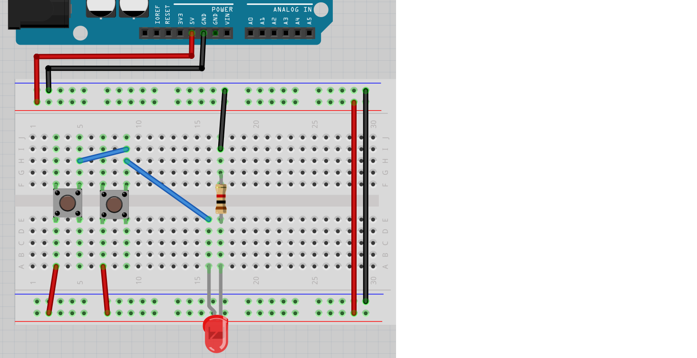

# Lektion 8: Anslutning av en knapp

Under den här lektionen ska vi ansluta en knapp till en Arduino!

## 8.1. Koppla in lysdioden och knappen

Bygg den här kretsen:

* Koppla ur USB-kabeln från datorn, så att Arduino inte längre har ström
* Montera kretsen enligt bilden
* Sätt tillbaka USB-kabeln i datorn

 | Det böjda benet i ritningen symboliserar det längre benet på en lysdiod
:-------------:|:----------------------------------------:

Lyser lysdioden? Gör knappen något? Varför tror du det?

Bygg ihop kretsen och kontrollera!

\pagebreak

### Svar

Elen kan gå från `5V` till 5voltsskenorna, igenom lysdioden och motståndet,
genom jordskenorna och till `GND`.

Så ja, lysdioden lyser! Om inte, fråga om hjälp!

Knappen gör dock ingenting: om du trycker ner den eller inte gör ingen skillnad.

\pagebreak

## 8.2. Krets 2

Kolla på den här kretsen:

Nu används knappen!

Lyser lysdioden? gör knappen något? Varför tror du det?

Bygg ihop kretsen och kontrollera!

\pagebreak

### Svar

Lysdioden ska alltid att lysa: de vänstra benen på knappen är sammanlänkade!

Om inte, fråga om hjälp!

## 8.3. Krets 3

Kolla på den här kretsen:

Nu är sladden mellan lysdioden och knappen sammanlänkade vid det nedre högra hörnet på knappen.

Lyser lysdioden? gör knappen något? Varför tror du det?

Bygg ihop kretsen och kontrollera!

\pagebreak

### Svar

Nu funkar knappen som tänkt: lysdioder kommer att lysa om du trycker knappen.

Så ja, det funkar! Om inte, fråga om hjälp!

## 8.4. Krets 4

Kolla på den här kretsen:

Nu sitter den blå sladden mellan lysdioden och knappen vid det övra högra hörnet på knappen.

Lyser lysdioden? gör knappen något? Varför tror du det?

Bygg ihop kretsen och kontrollera!

\pagebreak

### Svar

Knappen funkar fortfarande bra: lysdioder kommer att lysa om du trycker knappen.

Så ja, det funkar! Om inte, fråga om hjälp!

## 8.5. Krets 5

Kolla på den här kretsen:

Nu är sladden mellan +skenan och knappen sammanlänkade vid det nedre vänstra hörnet på knappen.

Lyser lysdioden? gör knappen något? Varför tror du det?

Bygg ihop kretsen och kontrollera!

\pagebreak

### Svar

Knappen funkar fortfarande bra: lysdioden kommer att lysa om du trycker knappen.

Om den inte gör det, fråga om hjälp!

## 8.6. Krets 6

Kolla på den här kretsen:

Nu finns det två knappar!

Lyser lysdioden? gör knapparna något? Varför tror du det?

Bygg ihop kretsen och kontrollera!

\pagebreak

### Svar

Knappen funkar så dem skulle: om du trycker på båda
kommer lysdioden att lysa.

Så ja, det funkar! Om inte, fråga om hjälp!

## 8.7. Krets 7

Kolla på den här kretsen:

Nu finns det två knappar med en annan sammanlänkning.

Lyser lysdioden? gör knapparna något? Varför tror du det?

Bygg ihop kretsen och kontrollera!

\pagebreak

### Svar

knapparna funkar så de ska: om du trycker **en av båda**
kommer lysdioden att lysa.

Så ja, det funkar! Om inte, fråga om hjälp!

## 8.8. Krets 8

Kolla på den här kretsen:

Nu finns det två lysdioder till!

Kan du förutspå när vilka av dem lyser?
Varför tror du det?

Bygg ihop kretsen och kontrollera!

\pagebreak

### Svar

Om du trycker en knapp, kommer alltid två lysdioder att lysa.

## 8.9. Slutuppgift

Material som krävs:

* 1 dator
* 1 Arduino
* 1 USB sladd
* 1 kopplingsdäck
* 2 knapp
* 3 1.000 Ohm motstånd
* 3 lysdioder
* lagom många sladdar

1. Fråga någon för att examinera. Den personen får inte hjälpa dig.

Starta en timer på 10 minuter och gör följande:

2. Bygg upp den sista kretsen från början. När du trycker på knappen ska alltid två lysdioder lysa.
