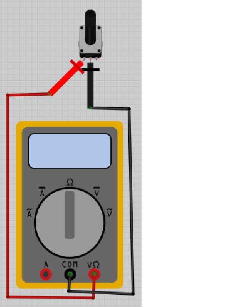
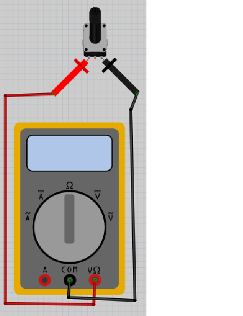
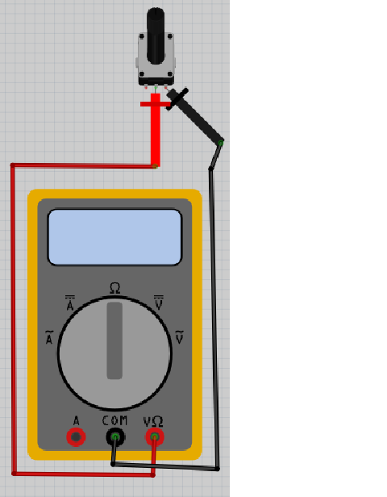
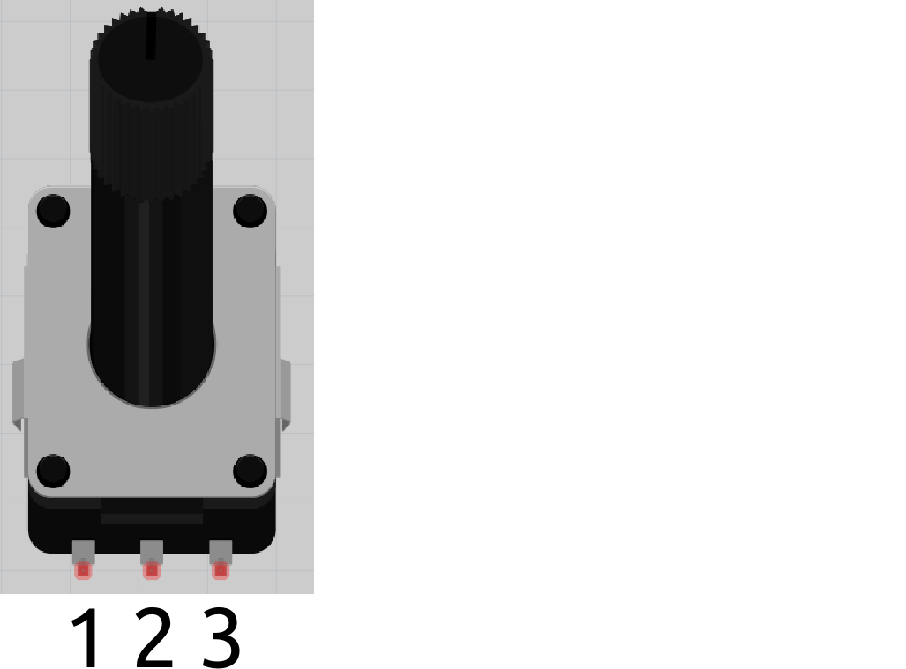

# Lektion 10: Mätning av en vridmotstånd

Under den här lektionen ska vi mäta en vridmotstånd!

## 10.1. Att mäta en vridmotstånd 1

\pagebreak

Vrid vridknappen på multimetern till Ohm symbolen.
Sätt på multimetern och koppla:

- röda mätpinnen på den vänstra benen av vridmotstånden
- svarta mätpinnen på den mittna benen av vridmotstånden

1. Vridar vridmotstånden till vänster (dws. emot klockan) till slutet. Vad visar mätningen?

2. Vridar vridmotstånden till höger (dws. med klockan) till slutet. Vad visar mätningen?

3. Vridar vridmotstånden till vänster (dws. emot klockan) till slutet igen. Nu, vridar vridmotstånden till höger (dws med klockan) under mätningen. Vad visar mätningen?

4. Vridar vridmotstånden tillbaka till vänster (dws emot klockan) under mätningen. Vad visar mätningen?

\pagebreak

### 10.1. Svar

Så här funkar vridmotståndet bra! Mätningar skull vara så här (om inte: fråga hjälp!):

1. Om vridmotstånden är till mest vänster (dws. emot klockan) blir motståndet lågt,
   till exempel noll eller ett Ohm

2. Om vridmotstånden är till mest högra (dws. med klockan) blir motståndet högst,
   till exempel tusen eller tiotusen Ohm. Värden beror på vridmotståndet.

3. Under vridning till höger (dws med klockan) ska skärmen visar en ökning av värdet.

4. Under vridning till vänster (dws emot klockan) ska skärmen visar en nedring av värdet.

## 10.2. Att mäta en vridmotstånd 2

\pagebreak

Vrid vridmotstånden på multimetern till Ohm symbolen.
Sätt på multimetern och koppla:

- röda mätpinnen på den vänstra benen av vridmotstånden
- svarta mätpinnen på den högra benen av vridmotstånden

1. Vridar vridmotstånden till vänster (dws. emot klockan) till slutet. Vad visar mätningen?

2. Vridar vridmotstånden till höger (dws. med klockan) till slutet. Vad visar mätningen?

3. Vridar vridmotstånden till vänster (dws. emot klockan) till slutet igen. Nu, vridar vridmotstånden till höger (dws med klockan) under mätningen. Vad visar mätningen?

4. Vridar vridmotstånden tillbaka till vänster (dws emot klockan) under mätningen. Vad visar mätningen?

\pagebreak

### 10.2. Svar

Vad du än gör, skärmet visar högsta värd du har hittat under före mätningen.

Så här funkar vridmotståndet inte :-)

## 10.3. Att mäta en vridmotstånd 3

\pagebreak

Vrid vridmotstånden på multimetern till Ohm symbolen.
Sätt på multimetern och koppla:

- röda mätpinnen på den mittna benen av vridmotstånden
- svarta mätpinnen på den högra benen av vridmotstånden

1. Vridar vridmotstånden till vänster (dws. emot klockan) till slutet. Vad visar mätningen?

2. Vridar vridmotstånden till höger (dws. med klockan) till slutet. Vad visar mätningen?

3. Vridar vridmotstånden till vänster (dws. emot klockan) till slutet igen. Nu, vridar vridmotstånden till höger (dws med klockan) under mätningen. Vad visar mätningen?

4. Vridar vridmotstånden tillbaka till vänster (dws emot klockan) under mätningen. Vad visar mätningen?

\pagebreak

### 10.3. Svar

Nu mäter du tvartomna värd av första mätningar:

1. Om vridmotstånden är till mest vänster (dws. emot klockan) blir motståndet högst,
   till exempel tusen eller tiotusen Ohm. Värden beror på vridmotståndet.

2. Om vridmotstånden är till mest högra (dws. med klockan) blir motståndet lågt,
   till exempel noll eller ett Ohm

3. Under vridning till höger (dws med klockan) ska skärmen visar en nedring av värdet.

4. Under vridning till vänster (dws emot klockan) ska skärmen visar en ökning av värdet.

Så här funkar vridmotståndet bra på en annat vis.

\pagebreak

## 10.4. Att mäta en vridmotstånd 4

- vrida vridmotståndet någonstans in mitten av vridning
- mäta motstand mellan stift 1 och 2 av vridmotståndet
- mäta motstand mellan stift 1 och 3 av vridmotståndet
- mäta motstand mellan stift 2 och 3 av vridmotståndet

Vilka mätningar får du? Kan du hitta nån monster i mätningen?
Vridar motstandet igen för att kontrollera dig själva!

\pagebreak

### 10.4. Svar

Mätet motstand mellan stift 1 och 3 av vridmotståndet är **summan**
av den andra två!

Nedåt finns fler exampler:

1 och 3|1 och 2|2 och 3
-------|-------|-------
1000   |400    |600
1000   |500    |500
1000   |600    |400
10000  |4000   |6000
10000  |5000   |5000
10000  |6000   |4000

## 10.5. Slutuppgift

Hämta:

- 1 st multimeter
- 1 st vridmotstånd

Läs igenom slutuppgiften först, för du har 5 minuter på dig.

1. Fråga någon för att få göra provet. Den personen får inte hjälpa dig.

Starta en timer och gör följande:

2. Visar när vridmotstånden funkar bra

3. Visar när vridmotstånden är användt på fel sätt

4. Visar hur tre värd man kann mäta av en vridmotstånd forhålla sig med varann
