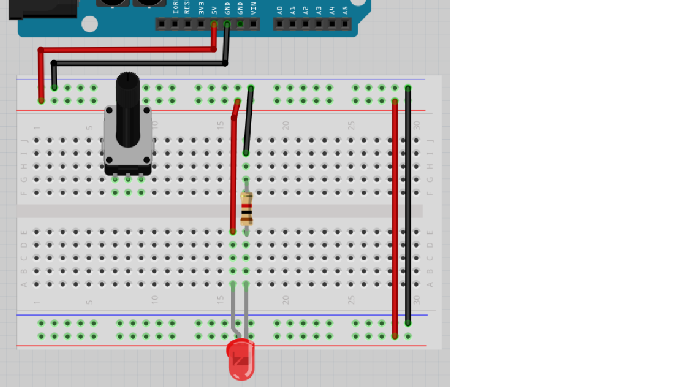
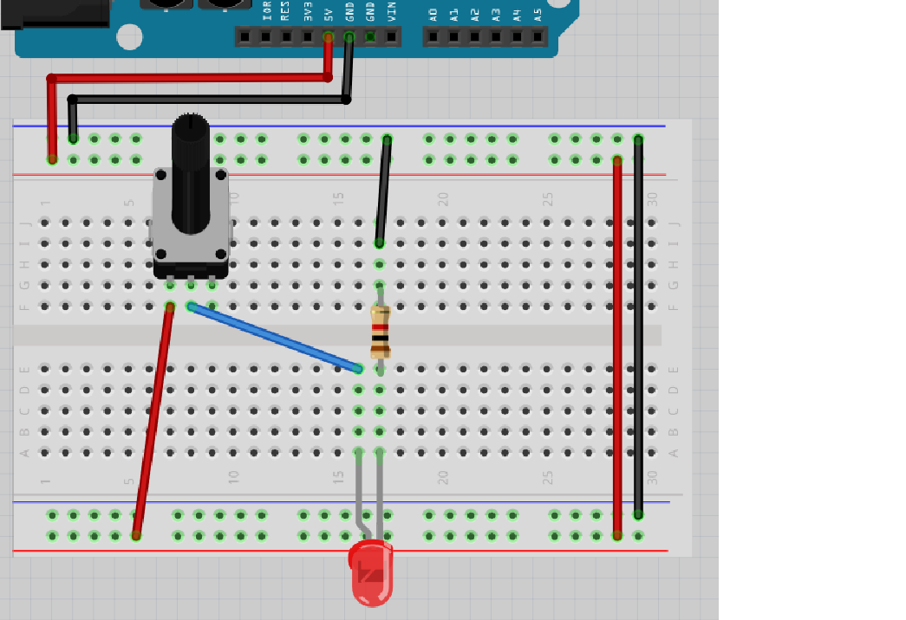
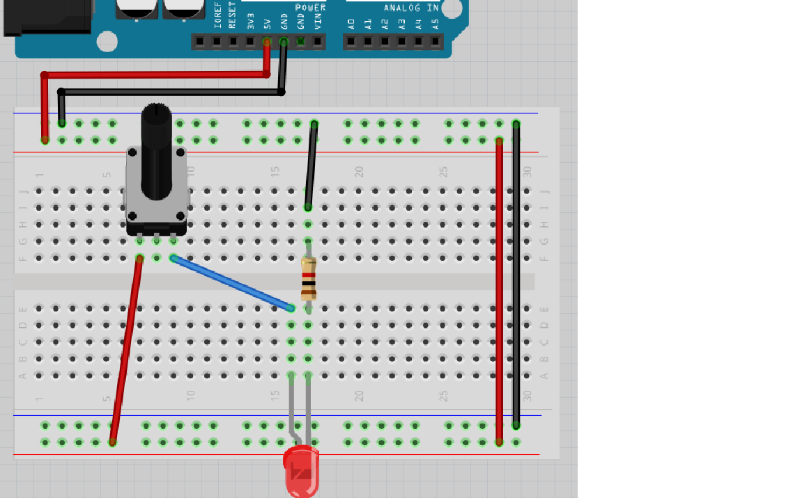
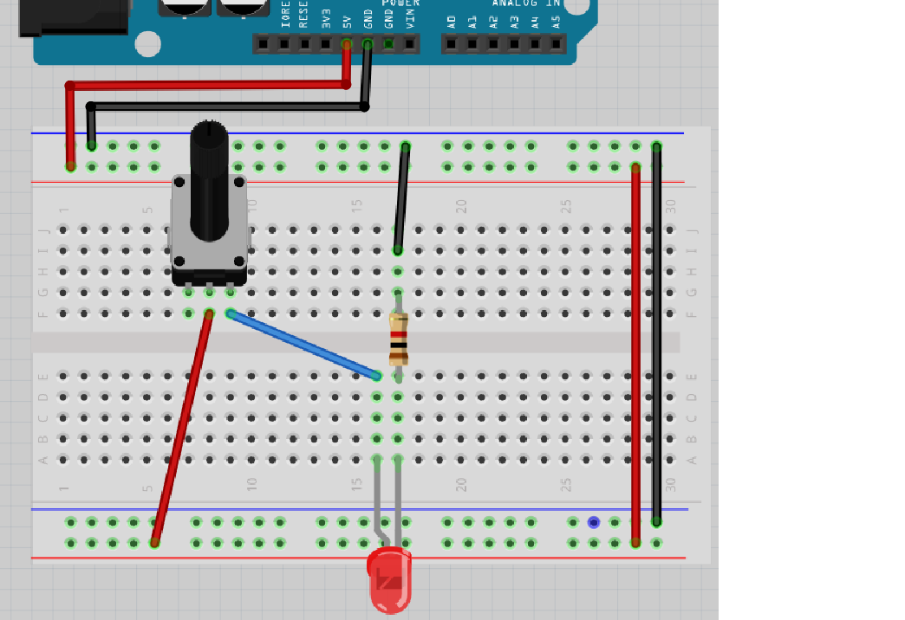
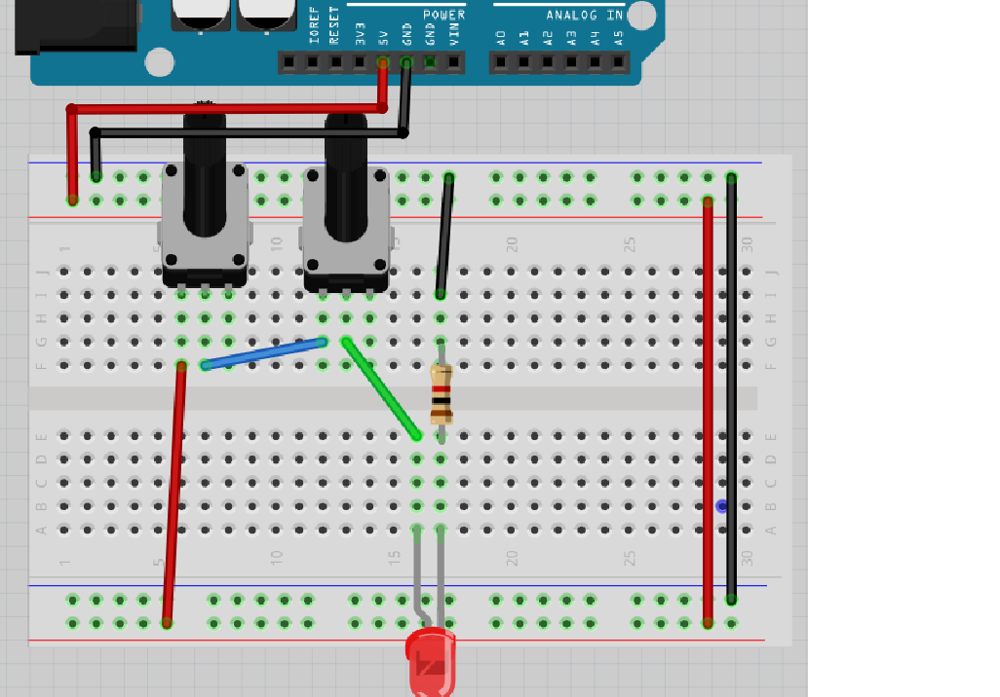
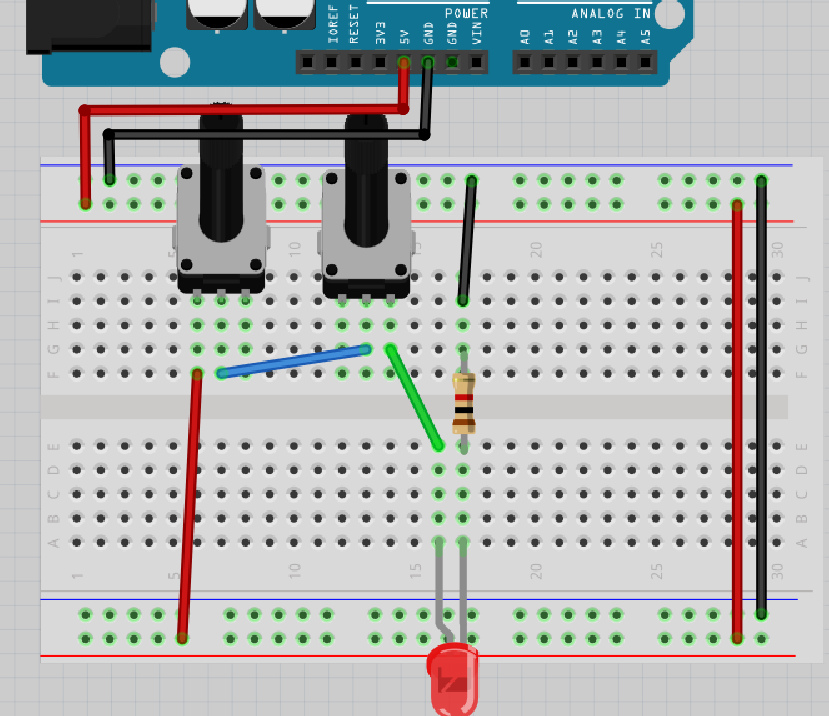
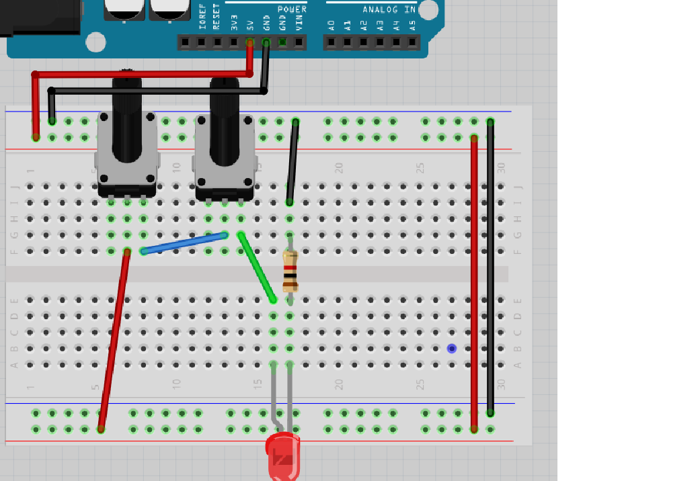

# Lektion 11: Anslutning av en vridmotstånd

Under den här lektionen ska vi ansluta en vridmotstånd till en Arduino!

## 11.1. Anslut lysdioden och vridmotstånd

Bygg den här kretsen:

* Koppla ur USB-kabeln från datorn, så att Arduino inte längre har ström
* Montera kretsen enligt bild
* Sätt tillbaka USB-kabeln i datorn

 | Det böjda benet i ritningen symboliserar det längre benet på en lysdiod
:-------------:|:----------------------------------------:

Lyser lysdioden? Gör vridmotstånden nåt? Varför tror du det?

Bygg ihop kretsen och kontrollera!

\pagebreak

### Svar

Elen kan gå från `5V` till 5 voltskraftrems, igenom lysdioden och motståndet,
till jordenskraftrems och till `GND`.

Så ja, lysdioden lyser! Om inte, fråga om hjälp!

Vridmotstånd, dock, gör ingenting: vad du än gör, gör det ingen skillnad.

## 11.2. Krets 2

Kolla på den här kretsen:

Nu är vridmotstånden användt!

Lyser lysdioden? Gör vridmotstånden nåt? Varför tror du det?

Bygg ihop kretsen och kontrollera!

\pagebreak

### Svar

Lysdioder kommer alltid att lysa när du vrider vridmotstånden helt till
vänster (dws. emot klockan).
Desto mer du vridmotstånden till höger (dws. med klockan) desto
mindre lysdioden lyser.

Så ja, det funkar! Om inte, fråga om hjälp!

## 11.3. Krets 3

Kolla på den här kretsen:

Nu får vridmotstånden el på vänstra ben
och framföra elet med högra ben till lysdioden.

Lyser lysdioden? Gör vridmotstånden nåt? Varför tror du det?

Bygg ihop kretsen och kontrollera!

\pagebreak

### Svar

Nu funkar det inte: lysdioder kommer aldrig att lysa. Om du har tur, lyser lysdioden
litegrann. Vridning gör ingenting.

Vridning gör ingenting för att motståndet mellan vänstra och högra ben
av vridmotståndet har alltid samma motstånd.

## 11.4. Krets 4

Kolla på den här kretsen:

Nu får vridmotstånden el på mittna ben
och framföra elet med högra ben till lysdioden.

Lyser lysdioden? Gör vridmotstånden nåt? Varför tror du det?

Bygg ihop kretsen och kontrollera!

\pagebreak

### Svar

Lysdioder kommer alltid att lysa när du vrider vridmotstånden helt till
höger (dws. med klockan).
Desto mer du vridmotstånden till vänster (dws. emot klockan) desto
mindre lysdioden lyser.

Så ja, det funkar! Om inte, fråga om hjälp!

## 11.5. Krets 5

Kolla på den här kretsen:

Nu finns det två vridmotstånd!

Lyser lysdioden? Gör vridmotstånden nåt? Varför tror du det?

Bygg ihop kretsen och kontrollera!

\pagebreak

### Svar

Lysdioder kommer alltid att lysa när du vrider **båda vridmotstånden** helt till
vänster (dws. emot klockan).
Desto mer du vrider en/båda av vridmotstånden till höger (dws. med klockan) desto
mindre lysdioden lyser.

Så ja, det funkar! Om inte, fråga om hjälp!

## 11.6. Krets 6

Kolla på den här kretsen:

Lyser lysdioden? Går vridmotståndorna nåt? Varför tror du det?

Bygg ihop kretsen och kontrollera!

\pagebreak

### Svar

Lysdioder kommer alltid att lysa när du vrider vänstra vridmotståndet helt till
vänster (dws. emot klockan) och högra vridmotståndet helt till
höger (dws. med klockan).
Desto mer du vrider vridmotstånden till andra sida desto
mindre lysdioden lyser.

Så ja, det funkar! Om inte, fråga om hjälp!

## 11.7. Krets 7

Kolla på den här kretsen:

Nu finns det två vridmotståndor med en annat sammanlänkning.

Lyser lysdioden? Går vridmotståndorna nåt? Varför tror du det?

Bygg ihop kretsen och kontrollera!

\pagebreak

### Svar

Lysdioder kommer alltid att lysa när du vrider **båda vridmotstånden** helt till
höger (dws. med klockan).
Desto mer du vrider en/båda av vridmotstånden till vänster (dws. emot klockan) desto
mindre lysdioden lyser.

Så ja, det funkar! Om inte, fråga om hjälp!

## 11.9. Slutuppgift

Försammla:

* 1 dator
* 1 Arduino
* 1 USB sladd
* 1 kopplingsdäck
* 2 vridmotstånd
* 1 1.000 Ohm motstånd
* 1 lysdiod
* tillräckligt mycket sladdar

1. Fråga någon för att examinera. Den där person får inte hjälpa dig.

Start en timer på 10 minuten och gör följande:

2. Bygga up sista krets från början och visar att den funkar
