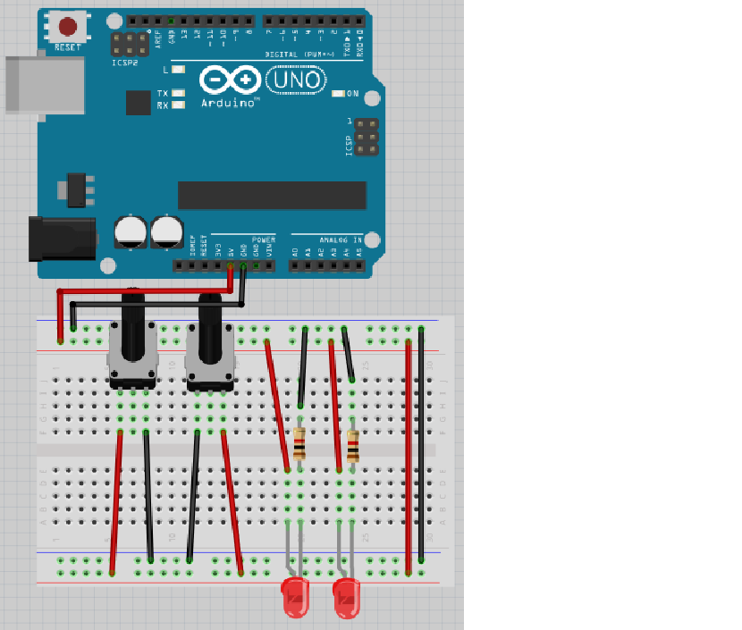
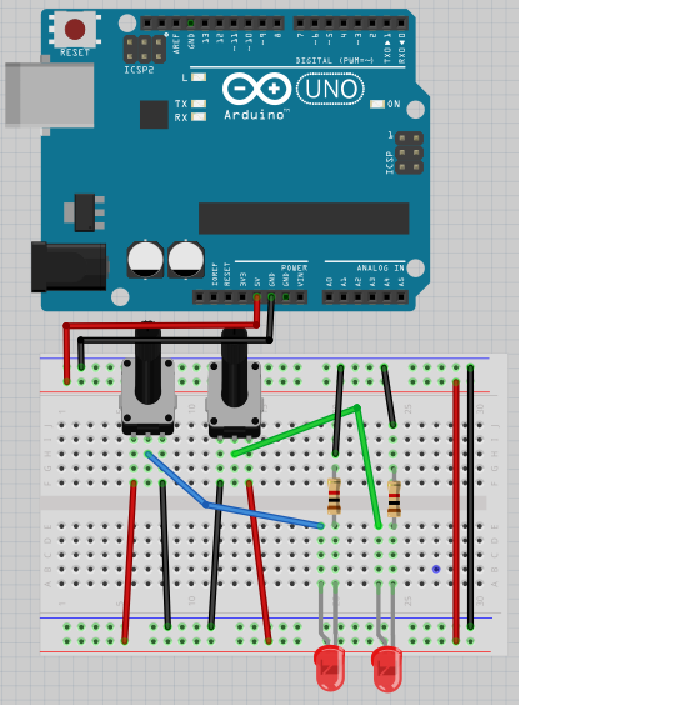
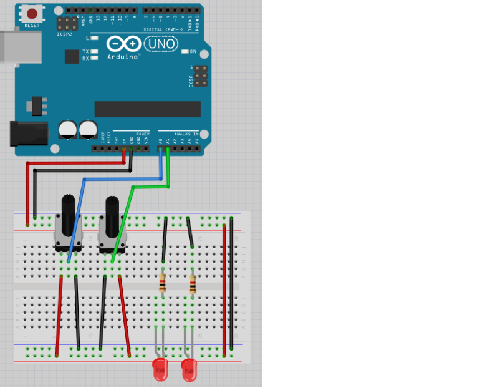
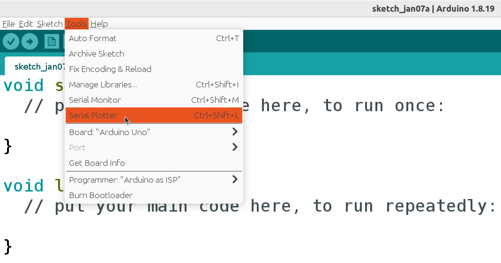
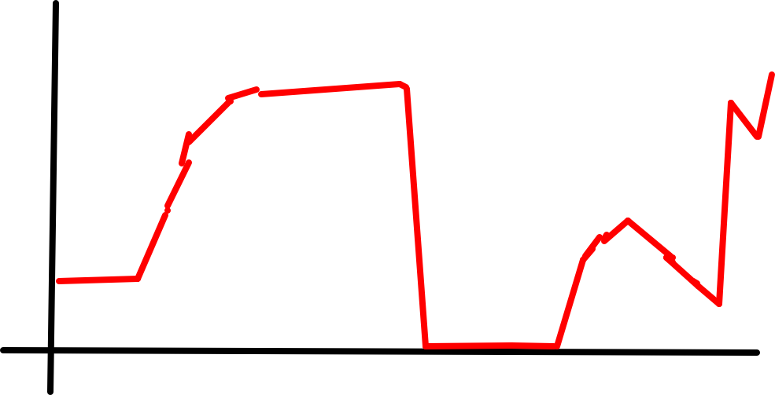
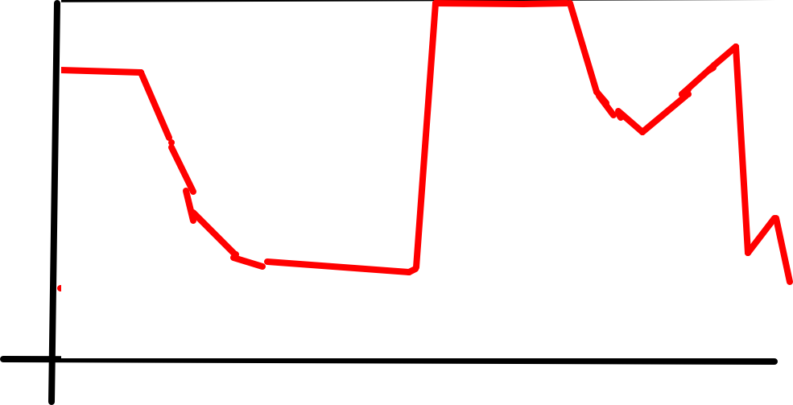
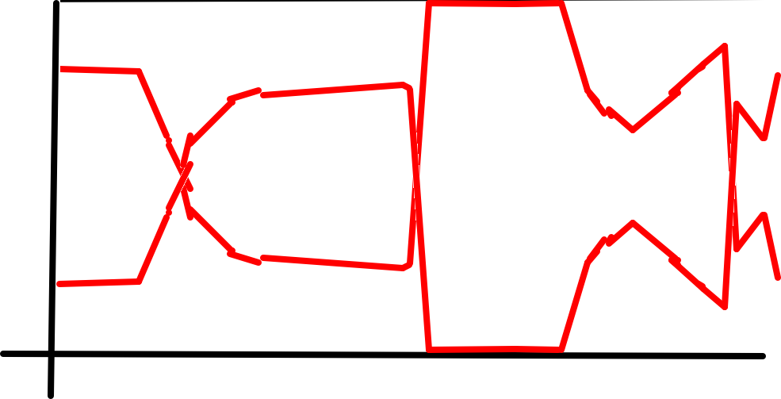
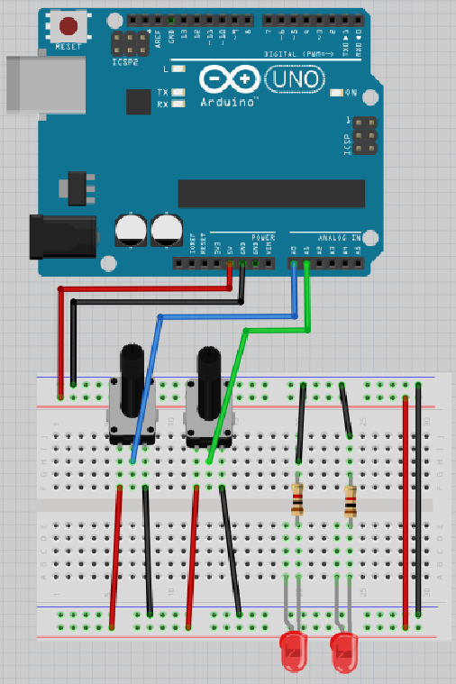
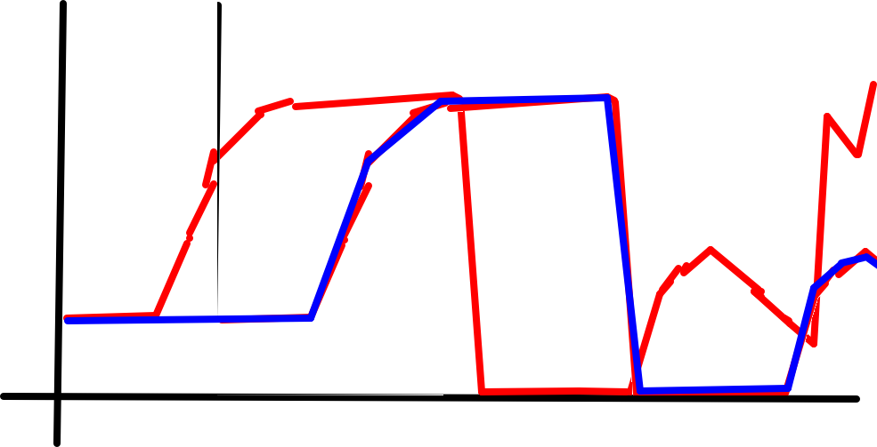
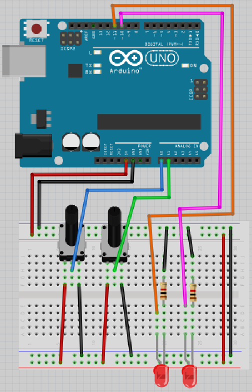

# Lektion 12: Användning av en vridmotstånd

Under den här lektionen ska vi ansluta vridmotstånd till en Arduino!

## 12.1: Krets 1

Bygg upp den här kretsen:



Skulle lysdioder lysa hela tiden? Gör vridmotstånd nåt? 

\pagebreak

### Svar

Båda lysioder skulle hela tiden lysa.
Båda vridmotstånd gör ingenting.
Nu är vi säkert att lysdioder funkar!

Om inte, fråga om hjälp!

## 12.2: Krets 2

Bygg upp den här kretsen:



Skulle lysdioder lysa hela tiden? Gör vridmotstånd nåt? 

\pagebreak

### Svar

Lysdioden på höger skulle lysar om vridmotståndet på höger är vridat
helt till vänster (dws. emot klockan).
Lysdioden på vänster skulle lysar om vridmotståndet på vänster är vridat
helt till vänster (dws. emot klockan).
Nu är vi säkert att vridmotstånd funkar!

Om inte, fråga om hjälp!

## 12.3: Krets 3

Bygg upp den här kretsen:



Skulle lysdioder lysa hela tiden? Gör vridmotstånd nåt? 

\pagebreak

### Svar

Lysdioden lyser aldrig, för den får ingen 5V.
Båda vridmotstånd gör ingenting.

## 12.4: Kod 1

Uploada den här koden:

```c++
void setup() 
{
  pinMode(A0, INPUT);
  Serial.begin(9600);
}

void loop() 
{
  Serial.println(analogRead(A0));
}
```

Efter uploadning, klick på 'Tools | Serial Plotter':



Vad ser du när du vrider vridmotstånd åt vänster?
Vad ser du när du vrider vridmotstånd åt höger?
Varför är det så?

\pagebreak

### Svar



När du vrider vänstra vridmotståndet ändrar värden i Serial Plotter.
Det är för att detta vridmotståndet är använt i programmet: den är
sammenkopplat till stiftet `A0`. 

Vridmotståndet åt höger gör ingenting: vi aldrig använder `A1` i programmet.

## 12.3: Kod 2

Uploada den här koden:

```c++
void setup() 
{
  pinMode(A1, INPUT);
  Serial.begin(9600);
}

void loop() 
{
  Serial.println(analogRead(A1));
}
```

Vad gissar du att du ska ser när du vrider vänstra vridmotståndet?
Vad gissar du att du ska ser när du vrider högra vridmotståndet?
Varför trodde du det?

\pagebreak

### Svar



Vänstervridmotståndet gör ingenting, för att den är inte använt
i programmet.

När du vrider högra vridmotståndet ändrar värden i Serial Plotter.
Det är för att detta vridmotståndet är använt i programmet: den är
sammenkopplat till stiftet `A1`. 
Skillnad är att värder i Serial Plotter gå i annat riktning när du vrider
vridmotståndet i relation med andra vridmotståndet.

## 12.3: Kod 3

Uploada den här koden:

```c++
void setup() 
{
  pinMode(A0, INPUT);
  pinMode(A1, INPUT);
  Serial.begin(9600);
}

void loop() 
{
  Serial.print(analogRead(A0));
  Serial.print(",");
  Serial.println(analogRead(A1));
}
```

Vad gissar du att koden gör? Vad händer? Varför?

\pagebreak

### Svar



Nu ser du båda två linjer i Serial Plotter tillsammans.

## 12.5: Krets 4

Bygg upp den här kretsen:



Upload koden igen och kolla i Serial Plotter.
Kan du gissar hur Serial Plotter ser ut nu? Varför?

\pagebreak

\pagebreak

### Svar



Nu har båda vridmotstånd samma effect på värde i Serial Plotter.
På den här vis funkar vridmotstånd som man tror att det skulle.

## 12.3: Krets 5

Bygg upp den här kretsen:



Upload koden igen och kolla i Serial Plotter.
Kan du gissar vad lysdioder ska göra nu? Varför?

\pagebreak

### Svar

Lysdioder fortfarande gör ingenting, för at den är aldrig använd i koden.


## 12.3: Kod 4

Uploada den här koden:

```c++
void setup() 
{
  pinMode(A0, INPUT);
  pinMode(A1, INPUT);
  pinMode(10, OUTPUT);
  pinMode(11, OUTPUT);
}

void loop() 
{
  analogWrite(10, analogRead(A0));
  analogWrite(11, analogRead(A1));
}
```

Vad gissar du att koden gör? Vad händer? Varför?

\pagebreak

### Svar

Nu funkar vänstra vridmotstånd som en dimmer för vänstra lysdioden.
Det gäller för högra vridmotståndet och lysdioden också.

## 12.13: Slutuppgift

Försammla:

 * 1 dator
 * 1 Arduino
 * 1 USB sladd
 * 1 kopplingsdäck
 * 2 1.000 Ohm motstånd
 * 2 lysdiod
 * 2 vridmotstånd
 * tillräckligt mycket sladdar

På dator: har redo koden!

Läs slutuppgift först, för att du har 15 minuten.

1. Fråga någon för att examinera. Den där person får inte hjälpa dig!

Start en timer och gör följande:

2. Bygg upp sista krets från början, uploada koden och visar att allt funkar

