# Lektion 13: Mätning av en joystick

Under den här lektionen ska vi mäta spänningen på en joystick med ett oscilloskop!

## 13.1. Att koppla en joystick till ett skop

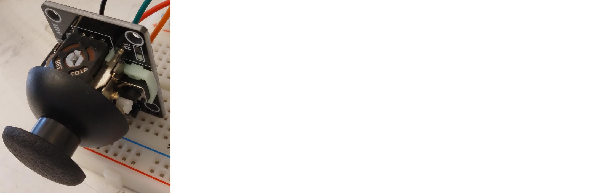

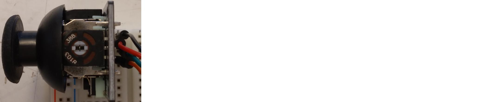

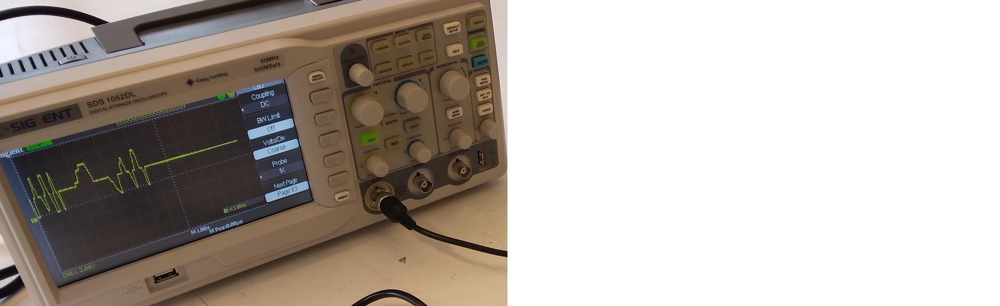

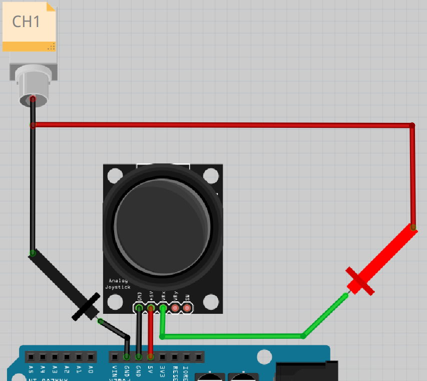

\pagebreak

Gör foljande:

- koppla ihop efter schemat ovanpå.
- starta skopet
- trycker på knapp 'CH1' i rutan 'Vertical' tills den lyser (ser en bild nedåt)

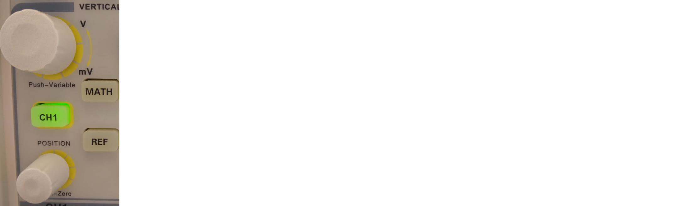

Frågor:

- Vad visar skopet?
- Vad händer om du drar joysticken i olika riktningar?

\pagebreak

### Svar

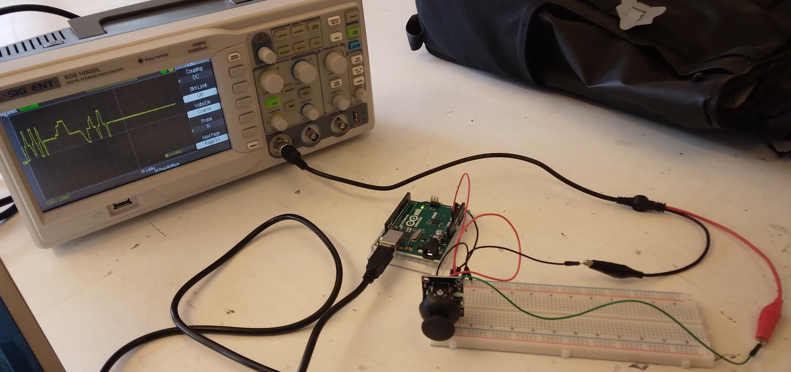

> hur det ska ser ut

Vad skopet visar är svårt att förutspå.
Kanske ser du en gul horisontell linje, som här:

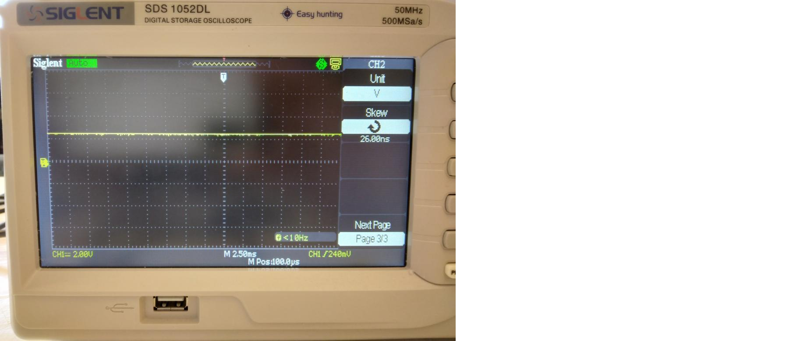

Om du drar joysticken i en specifik riktning, om du har tur,
flyttas linjen uppåt och nedåt.

\pagebreak

## 13.2. Att välja tidskalan av skopen

Vad du ser beror på inställningen av tidskalan på skopet.

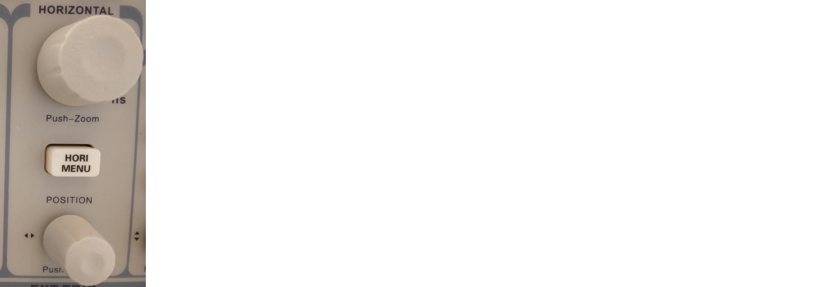

Om du vridar den högre knapp av 'Horizontal' ändrar du tidskalan.
Du kann också ser det på skärmen av skopen:
om du vridar knappen änder sig vita text på nedåt av skärmen.

Vrid på den översta knappen i rutan 'Horizontal' tills att den visar 'M 1.00s'.
Hur ser den gula linjen ut nu?

\pagebreak

### Svar

Så här kan det se ut:

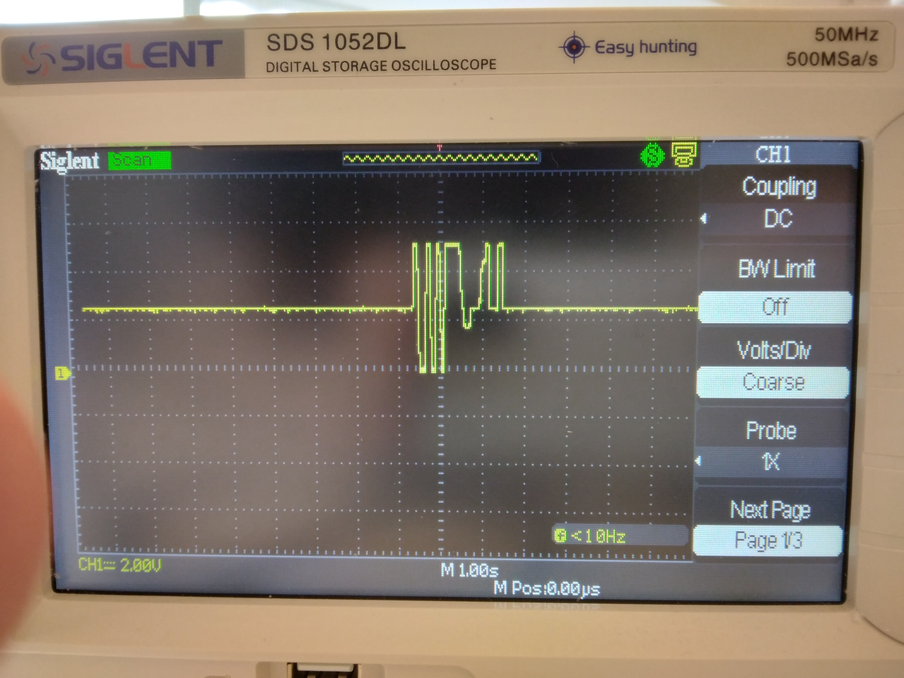

Lägg märke till texten 'M 1.00s', som betyder att varje ruta horisontellt betyder en sekund.
Du kan se att den gula linjen långsamt rör sig.

\pagebreak

## 13.3. Att välja spänningskalan av skopen

Vad du ser nu beror på spänningskalan på skopet också.

Om du vrider den övre vänstra knappen i 'Vertical'
ändrar du spänningsskalan.
Du kan också se det på skärmen på skopet:
om du vrider knappen änras den gula texten i botten av skärmen.

Vrid den övre vänstra knappen i 'Vertical' tills att den visar 'CH1 2.00V'.
Hur ser gula linje ut nu? Dra också på joysticken för att se något coolt!

\pagebreak

### Svar

Så här kan det se ut:

Lägg märke till texten 'CH1 2.00V', som betyder att varje ruta horisontellt
betyder två volt spänning.

När du drar joysticken i olika riktningar rör sig den gula linjen uppåt och nedåt.

\pagebreak

## 13.4. Att koppla joysticken igen till skopet

Nu ska vi koppla ännu ett stift på joysticken till skopet:

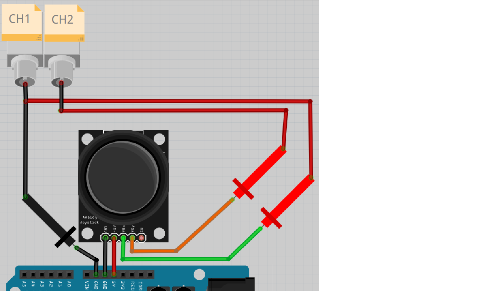
> Schemat på kopplingen

Leta efter ytterligare en prob.

Följ schemat och bygg vidare på kopplingen:

Starta ocilloskopet.

Tryck på knappen 'CH2' i 'Vertical' tills den lyser.
Vridar den övre högra knappen i 'Vertical' tills den visar 'CH2 2.00V'.

Vad visar skopet? Vad händer om du rör på joysticken?

\pagebreak

### Svar

Så här kan det se ut:

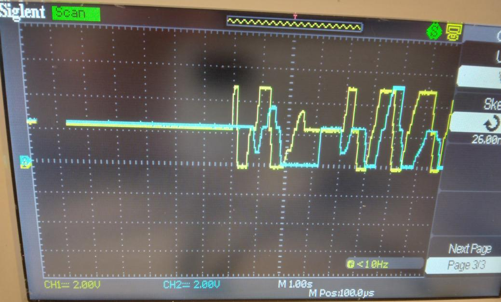

Lägg märke till texten 'CH1 2.00V', som betyder att varje ruta horisontellt
står för två volt spänning.

När du rör joysticken ska du se gula och blåa linjer gå uppåt och nedåt.

\pagebreak

## 13.5. Slutuppgift

Ta bort alla sladdar.

Läs igenom slutuppgiften först, efter det har du 10 minuter på dig att slutföra uppgiften.

1. Be någon att kontrollera medan du gör provet. Den personen får inte hjälpa dig.
1. Den personen vrider eller trycker fler gånger på alla dessa fem knappar:

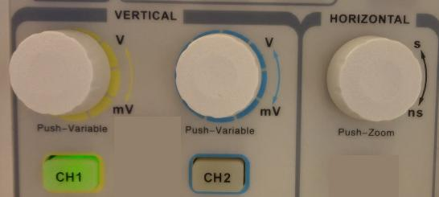

Starta en timer och gör följande:

1. Koppla ihop allt på samma sätt som tidigare
1. Mät sänningen över motstånden i joysticken i riktningarna VRx och VRy samtidigt, som i tidigare uppgifter
