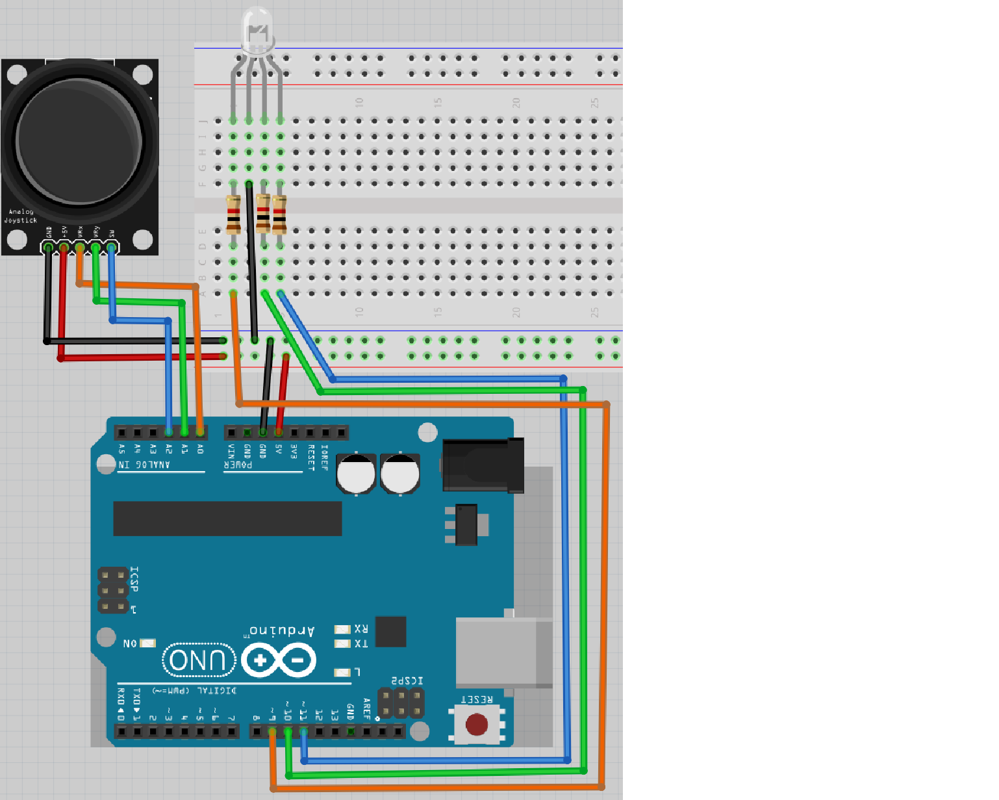

# Lektion 15: Användning av en joystick

Under den här lektionen ska vi använda en joystick!

## 15.1. Elkretsen



> Schemat av kopplingen

Koppla tillsammans som schemat och förbind Arduino till en dator.
Det er den långsta ben av RGB ljusdiod som skulle kopplades till GND.

\pagebreak

## 15.2. Ett lysdiod

Ladda upp den här koden:

```c++
const int pin_joy_x{A0};
const int pin_led_r{9};

void setup() {
  pinMode(pin_joy_x, INPUT);
  pinMode(pin_led_r, OUTPUT);
}

void loop() {
  const int joy_x{analogRead(pin_joy_x)};
  const int ljus_styrka_r{joy_x / 4};
  analogWrite(pin_led_r, ljus_styrka_r);
}
```

Kör koden och rör joysticken. Vad ser du?

\pagebreak

### 15.2. Svar

Om du inte rör joysticken är färgen röd, eller grön eller blå:
det beror på typ av RGB lysdiod (bäst vore den röd, för att det
skulle stämma med koden).
Om du rör joysticken i ena rikting kan du ändra ljusstyrka.
Om du rör joysticken i andra rikting ändrar färgen sig inte.

## 15.3. Vad koden betyder

Kolla igenom kod.

Kan du översätta varje mening till svenska?

### 15.3. Svar

```c++
const int pin_joy_x{A0};
```

> Kära dator, minns en variabel kallades `pin_joy_x`, som
> är en helvärtstal som kan inte ändrar sig, med initiälvärd `A0`

```c++
const int pin_led_r{9};
```

> Kära dator, minns en variabel kallades `pin_led_r`, som
> är en helvärtstal som kan inte ändrar sig, med initiälvärd `9`

```c++
void setup() {}
```

> Kära dator, göra detta mellan parantheser
> ett gång i början av programmet

\pagebreak

```c++
pinMode(pin_joy_x, INPUT);
```

> Kära dator, Arduino stift `pin_joy_x` är för att mäta el

```c++
pinMode(pin_led_r, OUTPUT);
```

> Kära dator, Arduino stift `pin_led_r` är för att schicka el

```c++
void loop() {}
```

> Kära dator, göra detta mellan parantheser
> för evigt, efter `setup` är färdigt

```c++
const int joy_x{analogRead(pin_joy_x)};
```

> Kära dator, minns en variabel kallades `joy_x`, som
> är en helvärtstal som kan inte ändrar sig, med initiälvärd
> det som Arduino läser av stift `pin_joy_x`

```c++
const int ljus_styrka_r{joy_x / 4};
```

> Kära dator, minns en variabel kallades `ljus_styrka_r`, som
> är en helvärtstal som kan inte ändrar sig, med initiälvärd
> `ljus_styrka_r` delad med fyra

```c++
analogWrite(pin_led_r, ljus_styrka_r);
```

> Kära dator, schick `ljus_styrka_r` el till Arduino stiften `pin_led_r`

## 15.4. Två lysdiod

Lägga till:

- en variabel kallades `pin_joy_y` med initiälvärde `A1`
- en variabel kallades `pin_led_g` med initiälvärde `10`
- Få andra riktning av joysticken att ändra en annat färg,
  likadant första riktning med första färg

\pagebreak

### 15.4. Svar

```c++
const int pin_joy_x{A0};
const int pin_joy_y{A1};
const int pin_led_r{9};
const int pin_led_g{10};


void setup() {
  pinMode(pin_joy_x, INPUT);
  pinMode(pin_joy_y, INPUT);
  pinMode(pin_led_r, OUTPUT);
  pinMode(pin_led_g, OUTPUT);
}

void loop() {
  const int joy_x{analogRead(pin_joy_x)};
  const int joy_y{analogRead(pin_joy_y)};
  const int ljus_styrka_r{joy_x / 4};
  const int ljus_styrka_g{joy_y / 4};
  analogWrite(pin_led_r, ljus_styrka_r);
  analogWrite(pin_led_g, ljus_styrka_g);
}
```

## 15.5. Tre lysdiod

Lägga till:

- en variabel kallades `pin_joy_sw` med initiälvärde `A2`
- en variabel kallades `pin_led_b` med initiälvärde `11`
- Få knappen av joysticken att ändra en annat färg,
  likadant första riktning med första färg

\pagebreak

### 15.5. Svar

```c++
const int pin_joy_x{A0};
const int pin_joy_y{A1};
const int pin_joy_sw{A2};
const int pin_led_r{9};
const int pin_led_g{10};
const int pin_led_b{11};


void setup() {
  pinMode(pin_joy_x, INPUT);
  pinMode(pin_joy_y, INPUT);
  pinMode(pin_joy_sw, INPUT);
  pinMode(pin_led_r, OUTPUT);
  pinMode(pin_led_g, OUTPUT);
  pinMode(pin_led_b, OUTPUT);
}

void loop() {
  const int joy_x{analogRead(pin_joy_x)};
  const int joy_y{analogRead(pin_joy_y)};
  const int joy_sw{analogRead(pin_joy_sw)};
  const int ljus_styrka_r{joy_x / 4};
  const int ljus_styrka_g{joy_y / 4};
  const int ljus_styrka_b{joy_sw / 4};
  analogWrite(pin_led_r, ljus_styrka_r);
  analogWrite(pin_led_g, ljus_styrka_g);
  analogWrite(pin_led_b, ljus_styrka_b);
}
```

\pagebreak

## 15.6. Slutuppgift

Ta bort alla sladdar.

Läs igenom slutuppgiften först, för du har 10 minuter på dig.

- Steg 1: Fråga någon för att få göra provet. Den personen får inte hjälpa dig.

Starta en timer och gör följande:

- Steg 2: Koppla allt tillsammans igen
- Steg 3: Visar att joystick funkar: båda om du vrider och om du trycker på knappen
