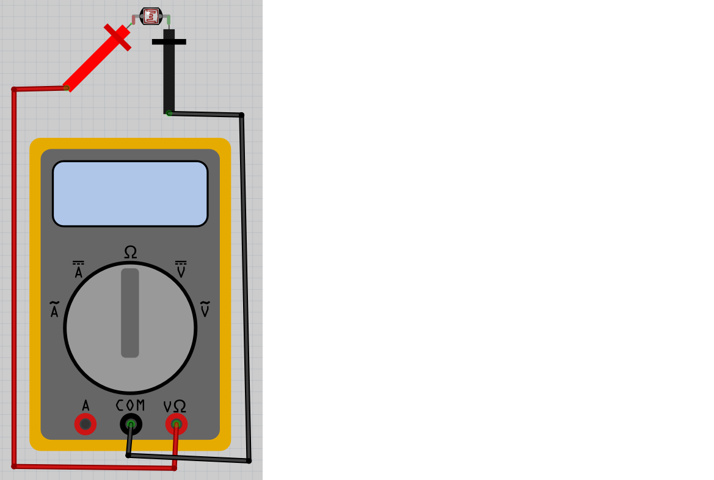
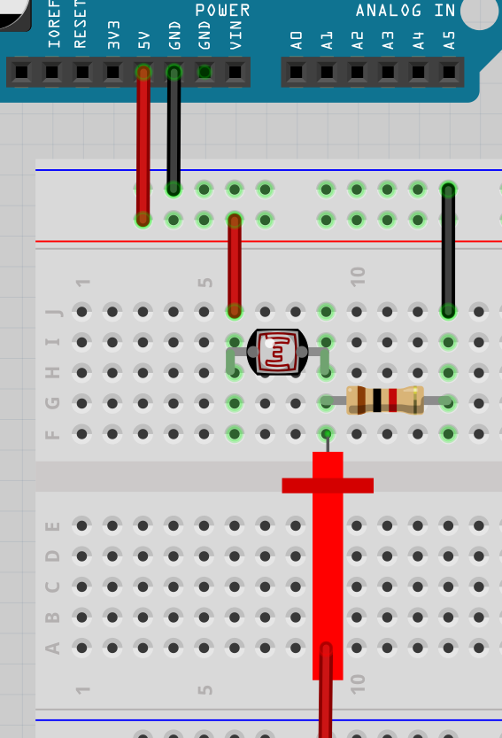

# Lektion 16: Mätning av en LDR

Under den här lektionen ska vi mäta en LDR!

## 16.1. Att mäta en LDR med en multimeter

Vrid vridknappen på multimetern till Ohm symbolen.
Sätt på multimetern och koppla:

- röda mätpinnen på den vänstra benen av LDRen
- svarta mätpinnen på den högra benen av LDRen

Vad visar mätningen?

### 16.1. Svar

Multimetern visar en motstånd för vanligt ljus (om inte: fråga hjälp!).

## 16.2. Att mäta en LDR med en multimeter

Hålla LDRen nära en lampa. Vad visar mätningen?

### 16.2. Svar

I ljuset har en LDR högsta motstånd

## 16.3. Att mäta en LDR med en multimeter

Ta bort ljuset till LDRen med, t.ex. din hand. Vad visar mätningen?

### 16.3. Svar

I mörkret har en LDR högsta motstånd

## 16.4. Att mäta en LDR med en skop

Bygga elkretsen nadåt: 

Röda proben gå till en oscilloskop.

På skopen gör:

- Sätt tidskalan till 1 sekund
- Sätt spänningsskalan till 2 volts

Vilken spänning visar skopen?

### 16.4. Svar

Det skulle vara en spänning mellan 0 och 5 volt,
för att detta är spänningen av Arduinon

## 16.5. Att mäta en LDR med en skop

Hålla LDRen nära en lampa.
Vilken spänning visar skopen nu?

### 16.5. Svar

Spänningen öker, men aldrig högre än 5 volt

## 16.6. Att mäta en LDR med en skop

Ta bort ljuset till LDRen med, t.ex. din hand.
Vilken spänning visar skopen nu?

### 16.6. Svar

Spänningen sänker,  men aldrig mindre än 0 volt

## 16.7. Slutuppgift

Hämta:

- 1 st multimeter
- 1 st skop
- 1 st LDR
- 4 st sladdar
- 1 st 1000 Ohm motstånd (rött, brun, svart, guld)

Läs igenom slutuppgiften först, för du har 5 minuter på dig.

- Steg 1: Fråga någon för att få göra provet. Den personen får inte hjälpa dig.

Starta en timer och gör följande:

- Steg 2: Visar hur att öka och sänka motståndsvärde av LDRen på multimetern

- Steg 3: Visar hur att öka och sänka spänningen av LDRen på oscilloskopen
