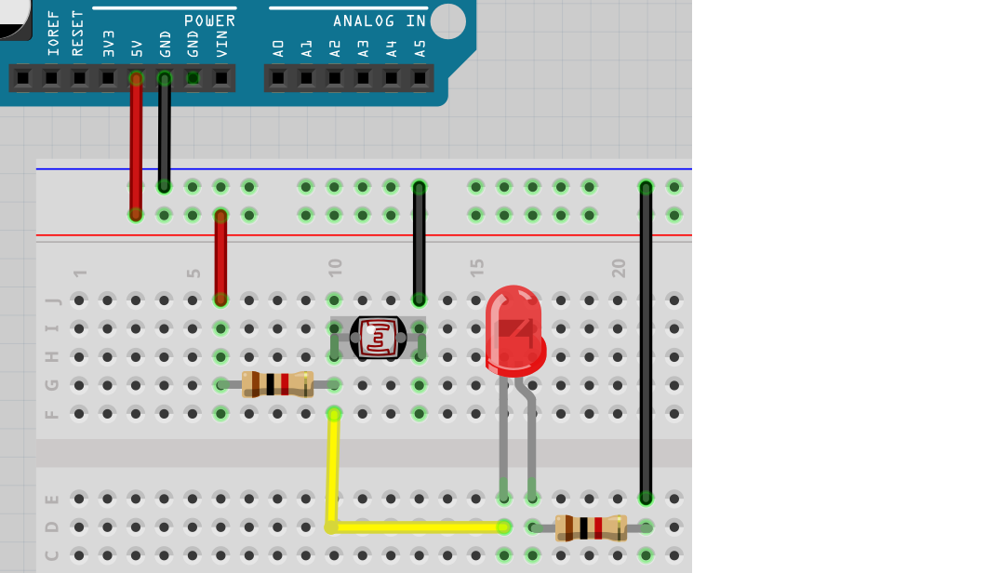

# Lektion 17: Anslutning av en LDR

Under den här lektionen ska vi ansluta en LDR till en lysdiod!

## 17.1. Att koppla en LDR till en ljusdiod

Koppla tillsammans som schemat och koppla Arduino till en dator.
Det längsta benet på ljusdioden ska kopplas till GND.

- Vad tror du kommer att hända?
- Vad händer om du fördystrar LDRen?
- Vad händer om du lyser nåt på LDRen?

\pagebreak

### 17.1. Svar

Lysdioden brinnar (om du har använt rätta motstånder).

Effekten av ljus är:

- Om du fördystrar LDRen, blir lysdioden mörkare.
- Om du lysar på LDRen, lyser lysdioden mer också.

## 17.2. Att koppla en LDR till en ljusdiod

Bygg om strömkretsen till den här bilden.
Den enstaka skillnad är att LDRen och motståndet har byts.

Vad tror du kommer att hända?
Vad händer om du fördystrar LDRen?
Vad händer om du lyser nåt på LDRen?

\pagebreak

### 17.2. Svar

Lysdioden antagligen brinnar.

Effekten av ljus är nu tvärtom:

- Om du fördystrar LDRen, lyser lysdioden mer
- Om du lysar på LDRen, släcker lysdioden

## 17.3. Slutuppgift

Ta bort alla sladdar.

Läs igenom slutuppgiften först, för du har 15 minuter på dig.

1. Fråga någon för att få göra provet. Den personen får inte hjälpa dig.

Starta en timer och gör följande:

1. Koppla båda elkretsar på samma breadboard
1. Visar att båda LDR:er funkar
