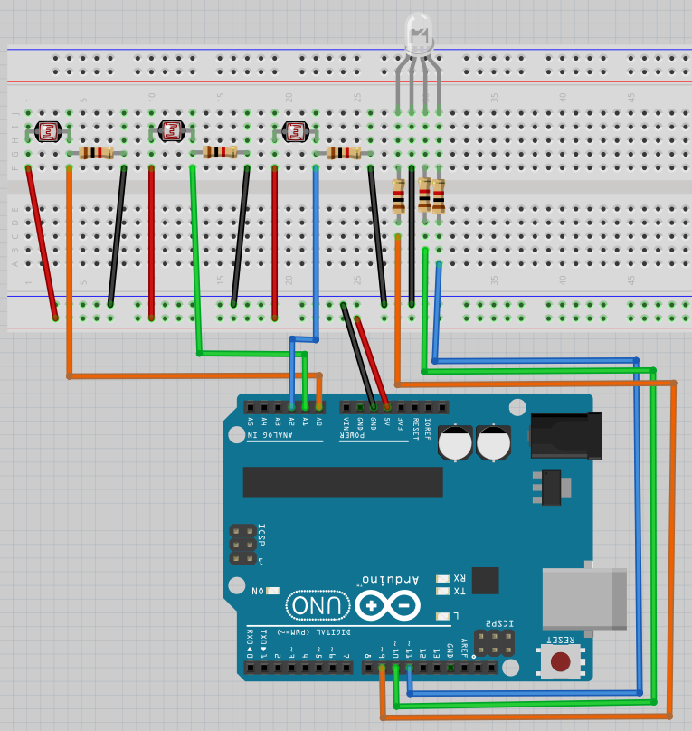

# Lektion 18: Användning av en LDR

Under den här lektionen ska vi använda en LDR!

## 18.1. Elkretsen



Koppla tillsammans som schemat och förbind Arduino till en dator.
Det er den långsta ben av RGB ljusdiod som skulle kopplades till GND.

\pagebreak

## 18.2. Ett lysdiod

Ladda upp den här koden:

```c++
const int pin_ldr_1{A0};
const int pin_led_r{9};

void setup() {
  pinMode(pin_ldr_1, INPUT);
  pinMode(pin_led_r, OUTPUT);
}

void loop() {
  const int ldr_1{analogRead(pin_ldr_1)};
  const int ljus_styrka_r{ldr_1 / 4};
  analogWrite(pin_led_r, ljus_styrka_r);
}
```

Kör koden och rör LDR:er. Vad ser du?

\pagebreak

### 18.2. Svar

Om du inte rör LDR:er är färgen svagt rött (men det kan bero på RGB lysdiod,
så den kan också vara grönt eller blått).
Om du fördystra eller lyser på den första LDR  kan du ändra ljusstyrka.

## 18.3. Vad koden betyder

Kolla igenom kod.

Kan du översätta varje mening till svenska?

### 18.3. Svar

```c++
const int pin_ldr_1{A0};
```

> Kära dator, minns en variabel kallades `pin_ldr_1`, som
> är en helvärtstal som kan inte ändrar sig, med initiälvärd `A0`


```c++
const int pin_led_r{9};
```

> Kära dator, minns en variabel kallades `pin_led_r`, som
> är en helvärtstal som kan inte ändrar sig, med initiälvärd `9`

```c++
void setup() {}
```

> Kära dator, göra detta mellan parantheser
> ett gång i början av programmet

\pagebreak

```c++
pinMode(pin_ldr_1, INPUT);
```

> Kära dator, Arduino stift `pin_ldr_1` är för att mäta el

```c++
pinMode(pin_led_r, OUTPUT);
```

> Kära dator, Arduino stift `pin_led_r` är för att schicka el

```c++
void loop() {}
```

> Kära dator, göra detta mellan parantheser
> för evigt, efter `setup` är färdigt


```c++
const int ldr_1{analogRead(pin_ldr_1)};
```

> Kära dator, minns en variabel kallades `ldr_1`, som
> är en helvärtstal som kan inte ändrar sig, med initiälvärd
> det som Arduino läser av stift `pin_ldr_1`

```c++
const int ljus_styrka_r{ldr_1 / 4};
```

> Kära dator, minns en variabel kallades `ljus_styrka_r`, som
> är en helvärtstal som kan inte ändrar sig, med initiälvärd
> `ljus_styrka_r` delad med fyra


```c++
analogWrite(pin_led_r, ljus_styrka_r);
```

> Kära dator, schick `ljus_styrka_r` el till Arduino stiften `pin_led_r`

## 18.4. Två lysdiod

Lägga till:

- en variabel kallades `pin_ldr_2` med initiälvärde `A1`
- en variabel kallades `pin_led_g` med initiälvärde `10`
- Få andra riktning av LDR:er att ändra en annat färg,
  likadant första riktning med första färg

\pagebreak

### 18.4. Svar

```c++
const int pin_ldr_1{A0};
const int pin_ldr_2{A1};
const int pin_led_r{9};
const int pin_led_g{10};


void setup() {
  pinMode(pin_ldr_1, INPUT);
  pinMode(pin_ldr_2, INPUT);
  pinMode(pin_led_r, OUTPUT);
  pinMode(pin_led_g, OUTPUT);
}

void loop() {
  const int ldr_1{analogRead(pin_ldr_1)};
  const int ldr_2{analogRead(pin_ldr_2)};
  const int ljus_styrka_r{ldr_1 / 4};
  const int ljus_styrka_g{ldr_2 / 4};
  analogWrite(pin_led_r, ljus_styrka_r);
  analogWrite(pin_led_g, ljus_styrka_g);
}
```

## 18.5. Tre lysdiod

Lägga till:

- en variabel kallades `pin_ldr_3` med initiälvärde `A2`
- en variabel kallades `pin_led_b` med initiälvärde `11`
- Få knappen av LDR:er att ändra en annat färg,
  likadant första riktning med första färg

\pagebreak

### Svar

```c++
const int pin_ldr_1{A0};
const int pin_ldr_2{A1};
const int pin_ldr_3{A2};
const int pin_led_r{9};
const int pin_led_g{10};
const int pin_led_b{11};


void setup() {
  pinMode(pin_ldr_1, INPUT);
  pinMode(pin_ldr_2, INPUT);
  pinMode(pin_ldr_3, INPUT);
  pinMode(pin_led_r, OUTPUT);
  pinMode(pin_led_g, OUTPUT);
  pinMode(pin_led_b, OUTPUT);
}

void loop() {
  const int ldr_1{analogRead(pin_ldr_1)};
  const int ldr_2{analogRead(pin_ldr_2)};
  const int joy_sw{analogRead(pin_ldr_3)};
  const int ljus_styrka_r{ldr_1 / 4};
  const int ljus_styrka_g{ldr_2 / 4};
  const int ljus_styrka_b{joy_sw / 4};
  analogWrite(pin_led_r, ljus_styrka_r);
  analogWrite(pin_led_g, ljus_styrka_g);
  analogWrite(pin_led_b, ljus_styrka_b);
}
```

\pagebreak

## 18.6. Slutuppgift

Ta bort alla sladdar.

Läs igenom slutuppgiften först, för du har 15 minuter på dig.

1. Fråga någon för att få göra provet. Den personen får inte hjälpa dig.

Starta en timer och gör följande:

1. Koppla allt tillsammans igen
1. Visar att alla LDR:er funkar
