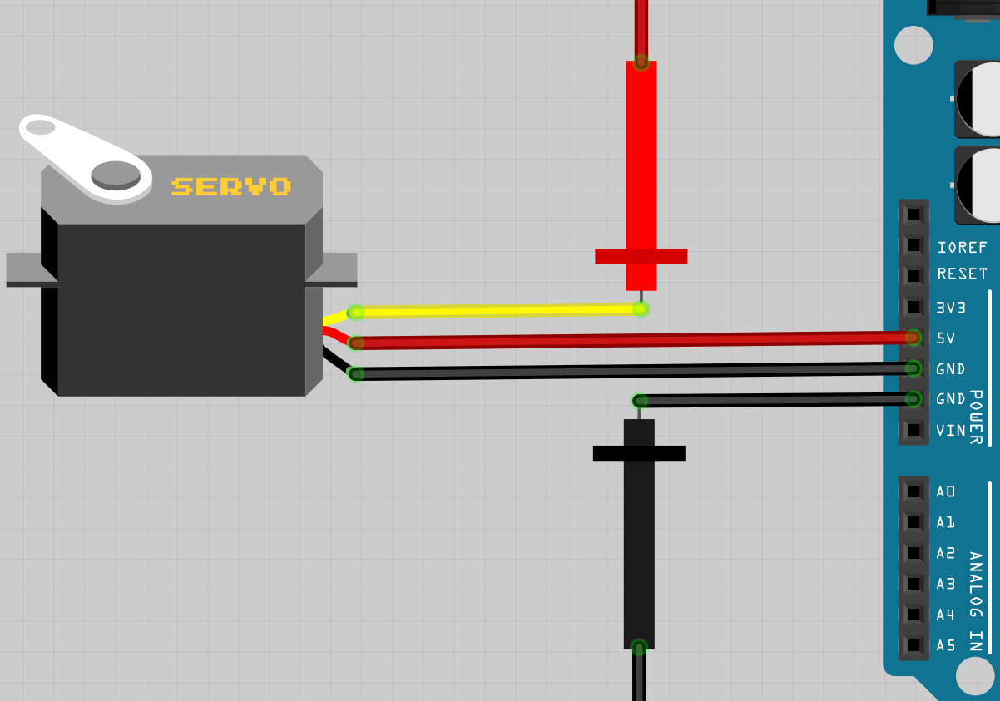
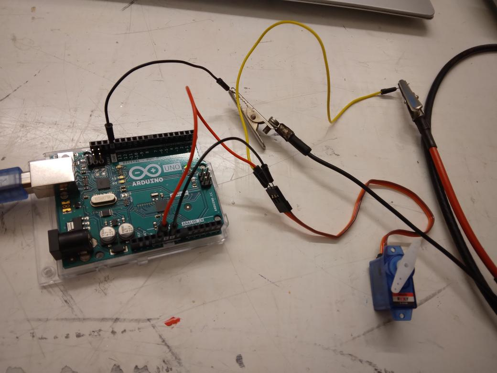
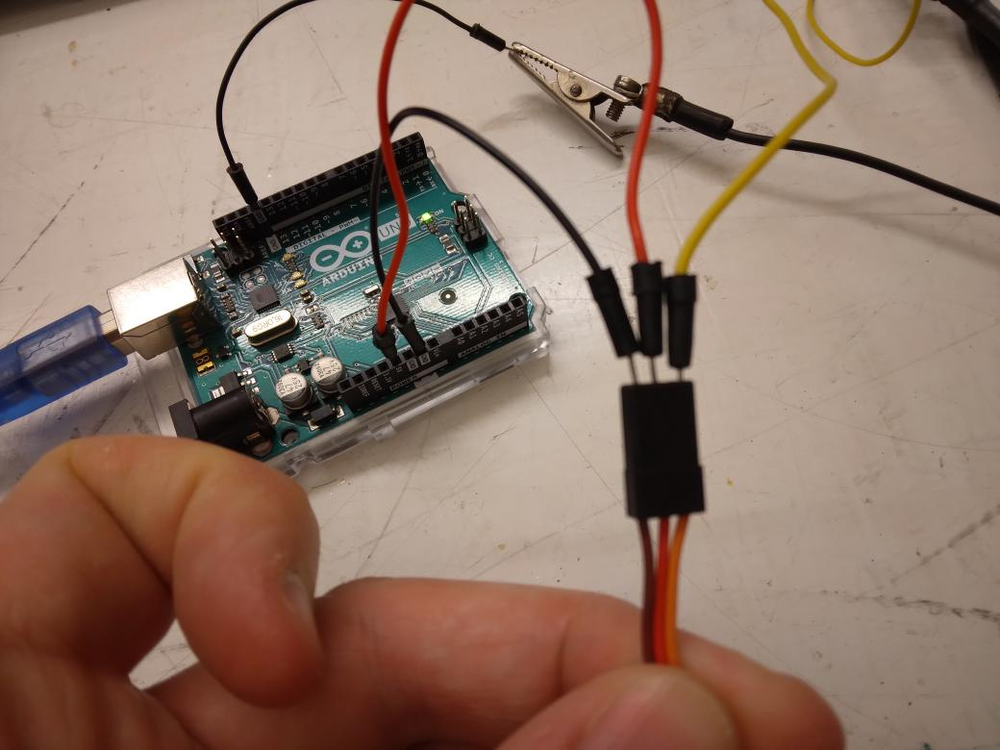
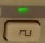
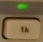
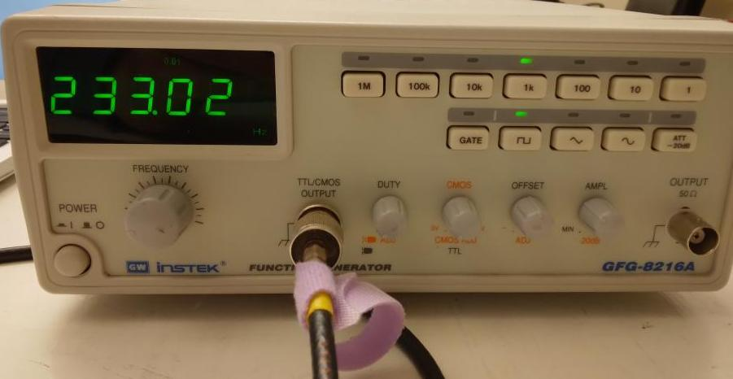

# Lektion 19: Anslutning av en servo

Under den här lektionen ska vi ansluta en servo!

## 19.1. Att koppla en servo

> Schemat av kopplingen

Koppla tillsammans som schemat. 
Röda och svarta prob ska kopplas till signalgeneratorn
Koppla Arduino till en dator.

Servor har sladdor av olika färger, här är vad dem betyder:

Färger     |Vad
-----------|------
Brun, svart|GND
Röd        |5V
Orange, gul|Signal

På signalgeneratorn:

- sät spänning på blockspänning

> Sät spänning på blockspänning

- sät frekvens på 1k hertz. '1k' betyder 'ett tusen'. Ett tusen hertz
  betyder ett tusen blockvågar per sekund

> Sät frekvens på 1k hertz

Vrid 'Frequency' knappen.

Vad händer?

\pagebreak

### 19.1. Svar

Servon vrider sig. Beroende på vilken servo du har vrider den från
t.ex 250.000 och 750.000.

## 19.2. Slutuppgift

Ta bort alla sladdar.

Läs igenom slutuppgiften först, för du har 5 minuter på dig.

- Steg 1: Fråga någon för att få göra provet. Den personen får inte hjälpa dig.

Starta en timer och gör följande:

- Steg 2: Koppla elkretsen
- Steg 3: Styr servo med signalgeneratorn.
- Steg 4: Visar siffra när servo har styrts till vänster (emot klockan) mest
- Steg 5: Visar siffra när servo har styrts till höger (med på klockan) mest
