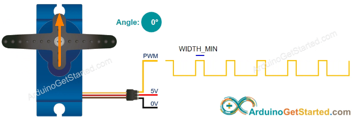
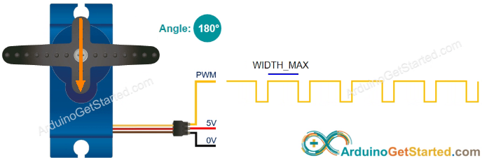

# Lektion 16: Mätning av en LDR

Under den här lektionen ska vi mäta en LDR!

## 16.1. Att mäta motståndet av en LDR med en multimeter


Vrid vridknappen på multimetern till Ohm symbolen.
Sätt på multimetern och koppla:

- röda mätpinnen på den vänstra benen av LDRen
- svarta mätpinnen på den högra benen av LDRen

Vad visar mätningen?

```c++
#include <Servo.h>

Servo min_servo;

void setup()
{
  min_servo.attach(9);
}

void loop()
{
  min_servo.write(0);
  delay(1000);
  min_servo.write(180);
  delay(1000);
}
```







\pagebreak

### 16.1. Svar

Multimetern visar en motstånd för vanligt ljus (om inte: fråga hjälp!).

Vi fick 1.7 kOhm, dvs 1700 Ohm.

## 16.2. Att mäta motståndet av en LDR med en multimeter

Hålla LDRen nära en lampa. Vad visar mätningen?

\pagebreak

### 16.2. Svar

Vi fick 0.68 kOhm, dvs 680 Ohm.

I ljuset har en LDR minsta motstånd

## 16.3. Att mäta motståndet av en LDR med en multimeter

Ta bort ljuset till LDRen med, t.ex. din hand. Vad visar mätningen?

\pagebreak

### 16.3. Svar

I mörkret har en LDR högsta motstånd

Vi fick 68 kOhm, dvs 68.000 Ohm.

## 16.4. Att mäta spänningen av en LDR med en multimeter

Bygga elkretsen nadåt:


Röda proben gå till en oscilloskop.

På skopen gör:

- Sätt tidskalan till 1 sekund
- Sätt spänningsskalan till 2 volts

Vilken spänning visar skopen?

\pagebreak

### 16.4. Svar

Det skulle vara en spänning mellan 0 och 5 volt,
för att detta är spänningen av Arduinon

Vi fick 2.12 volt

## 16.5. Att mäta spänningen av en LDR med en multimeter

Hålla LDRen nära en lampa.
Vilken spänning visar skopen nu?

\pagebreak

### 16.5. Svar

Spänningen öker, men aldrig högre än 5 volt

Vi fick 3.1 volt.

## 16.4. Att mäta spänningen av en LDR med en multimeter

Ta bort ljuset till LDRen med, t.ex. din hand.
Vilken spänning visar skopen nu?

\pagebreak

### 16.6. Svar

Spänningen sänker,  men aldrig mindre än 0 volt

Vi fick 0.28 volt.

## 16.7. Att mäta en LDR med en skop

Bygga elkretsen nadåt:


Röda proben gå till en oscilloskop.

På skopen gör:

- Sätt tidskalan till 1 sekund
- Sätt spänningsskalan till 2 volts

Vilken spänning visar skopen?

### 16.7. Svar

Det skulle vara en spänning mellan 0 och 5 volt,
för att detta är spänningen av Arduinon

Vi fick 2.12 volt

## 16.8. Att mäta en LDR med en skop

Hålla LDRen nära en lampa.
Vilken spänning visar skopen nu?

### 16.8. Svar

Spänningen öker, men aldrig högre än 5 volt

Vi fick 3.1 volt.

## 16.9. Att mäta en LDR med en skop

Ta bort ljuset till LDRen med, t.ex. din hand.
Vilken spänning visar skopen nu?

### 16.9. Svar

Spänningen sänker,  men aldrig mindre än 0 volt

Vi fick 0.28 volt.

## 16.10. Slutuppgift

Hämta:

- 1 st multimeter
- 1 st skop
- 1 st LDR
- 4 st sladdar
- 1 st 1000 Ohm motstånd (rött, brun, svart, guld)

Läs igenom slutuppgiften först, för du har 5 minuter på dig.

- Steg 1: Fråga någon för att få göra provet. Den personen får inte hjälpa dig.

Starta en timer och gör följande:

- Steg 2: Visar hur att öka och sänka motståndsvärde av LDRen på multimetern

- Steg 3: Visar hur att öka och sänka spänningen av LDRen på multimetern

- Steg 4: Visar hur att öka och sänka spänningen av LDRen på oscilloskopen
