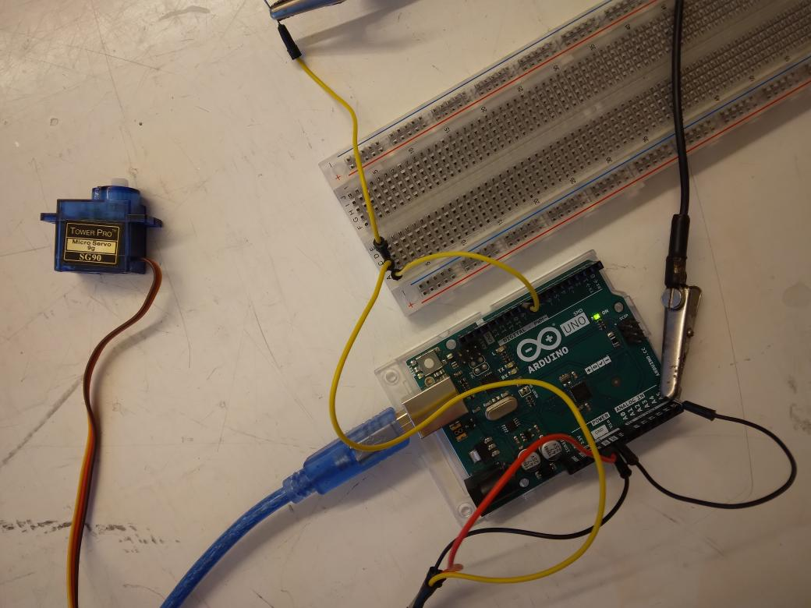
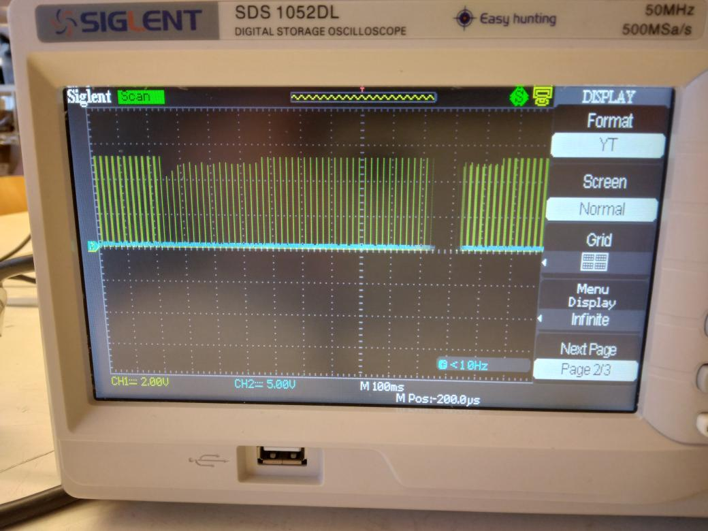

# Lektion 20: Mätning av en servo

Under den här lektionen ska vi mäta en servo!

## 20.1. Att mäta motståndet av en servo med en skop

Koppla en servo till en skop, så här:



Servor har sladdor av olika färger, här är vad dem betyder:

Färger     |Vad
-----------|------
Brun, svart|GND
Röd        |5V
Orange, gul|Signal

- röda mätpinnen på den signalingång av servoen
- svarta mätpinnen på den GND av servoen

\pagebreak

Laddar upp följande kod på Arduinon:

```c++
#include <Servo.h>

Servo min_servo;

void setup()
{
  min_servo.attach(9);
}

void loop()
{
  min_servo.write(0);
  delay(1000);
  min_servo.write(180);
  delay(1000);
}
```

Vad visar mätningen?




\pagebreak

## 20.2. Slutuppgift

Hämta:

- 1 st skop
- 1 st servo
- sladdar

Läs igenom slutuppgiften först, för du har 5 minuter på dig.

- Steg 1: Fråga någon för att få göra provet. Den personen får inte hjälpa dig.

- Steg 2: ta bort alla sladdar. Stäng av skopen.

Starta en timer och gör följande:

- Steg 3: Visar hur frekvens på skopen ändrar sig när Arduino skicker
  en budskap till skopen.
