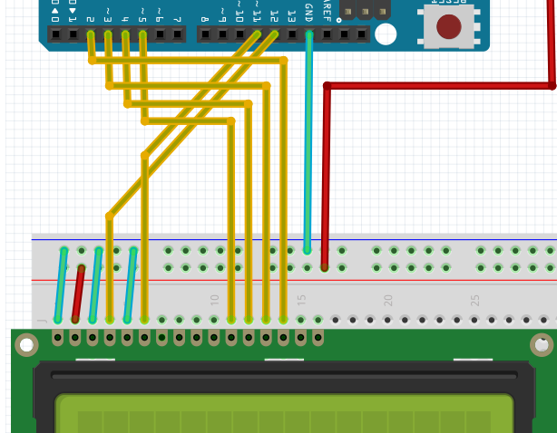

# Lektion 16: använding av en LCD

En LCD är en del för att visa något, som bokstäver och symboler.
LCD betyder "Liquid Crystal Display", detta är engelska för "Liquid Crystal Screen"


## 16.1 Anslut LCD

Det finns flera sätt att ansluta en LCD-skärm:

Sätt|Kontrastjusterbar?|Med bakgrundsbelysning?
----|------------------|-----------------------
1   |Nej               |Nej
2   |Ja                |Nej
3   |Nej               |Ja
4   |Ja                |Ja

### 16.1.1. Anslut LCD sätt 1

Detta är det enklaste sättet:



Om du inte kan se bokstäverna kan du fortfarande behöva justera kontrasten (sätt 2),
eller anslut bakgrundsbelysningen (sätt 3), eller båda.

### 16.1.2. Anslut LCD sätt 2

Här kan du justera kontrasten med en potentiometer.


Om du inte kan se bokstäverna bör du fortfarande ansluta bakgrundsbelysningen (väg 4).

### 16.1.3. Anslut LCD sätt 3

Här anger du bakgrundsbelysningens spänning.


Om du inte kan se bokstäverna bör du också kunna justera kontrasten (sätt 4).

### 16.1.4. Anslut LCD sätt 4

Det här sättet fungerar alltid


### 16.2. programmera en LCD

Det finns många exempelprogram i Arduino IDE, under `File | Exempel | LiquidCrystal`.

### 16.2.1. `Hej världen`

Det enklaste är `File | Exempel | LiquidCrystal | HelloWorld`:

```
#include <LiquidCrystal.h>

LiquidCrystal lcd(12, 11, 5, 4, 3, 2);

void setup() {
  lcd.begin(16, 2);
  lcd.print("hello, world!");
}

void loop() {
  lcd.setCursor(0, 1);
  lcd.print(millis()/1000);
}
```

Detta gör att du kan få text på skärmen.

### 16.2.2. Custom Character

En svårare är `File | Exempel | LiquidCrystal | CustomCharacter`:

```
#include <LiquidCrystal.h>

LiquidCrystal lcd(12, 11, 5, 4, 3, 2);

byte heart[8] = {
  0b00000,
  0b01010,
  0b11111,
  0b11111,
  0b11111,
  0b01110,
  0b00100,
  0b00000
};

byte smiley[8] = {
  0b00000,
  0b00000,
  0b01010,
  0b00000,
  0b00000,
  0b10001,
  0b01110,
  0b00000
};


void setup() {
  lcd.createChar(1, heart);
  lcd.createChar(2, smiley);
  lcd.begin(16, 2);
  lcd.print("I "); 
  lcd.write(1);
  lcd.print(" Arduino! ");
  lcd.write(2);

}

void loop() {}
```

Detta gör att du kan få dina egna figurer på skärmen.

## Övningar

* Anslut en LCD
* Sätt programmet "Hello World" på Arduino
* Vad gör `LiquidCrystal lcd(12, 11, 5, 4, 3, 2)`? Tips: vilka stift går dina ledningar till?
* Vad gör `lcd.begin(16, 2)`? Tips: hur många rektanglar finns det på din LCD-skärm?
* Vad gör `lcd.print("hej, värld!")`? Tips: prova `lcd.print("Edge is top")`
* Vad gör `lcd.setCursor(0, 1)`? Tips: ställ in den första siffran till '1', ställ in den andra siffran på '0'
* Vad gör `lcd.print(millis()/1000)`? Tips: prova `lcd.print(millis())`
* Skapa en fin text själv
* Sätt programmet "CustomCharacter" på Arduino
* Ta en ordentlig titt på nollorna och ettorna i 'byte heart'. 'heart' är engelska för 'hjärta'. Vad betyder dessa nollor och ettor?
* Vad gör `lcd.createChar(1, heart)`? Tips: detta fungerar tillsammans med `lcd.write(1)`
* Vad gör `lcd.createChar(2, smiley)`? Tips: detta fungerar tillsammans med `lcd.write(2)`
* Gör något roligt själv med din egen figur
