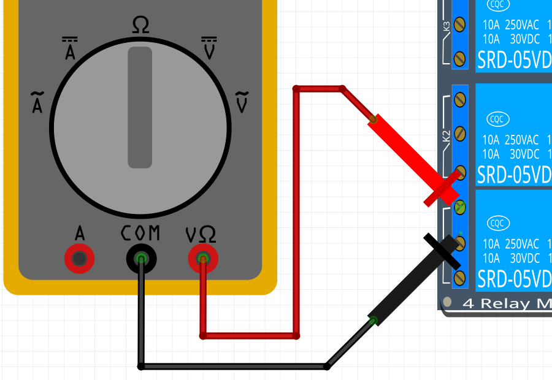

# 22. Mätning av en relais

<!-- 

Downloaded the Fritzing file at

https://github.com/KAST-Tech/fritzing-parts/blob/main/4-Channel%205v%20Relay%20Shield.fzpz

Direct download:

https://github.com/KAST-Tech/fritzing-parts/raw/refs/heads/main/4-Channel%205v%20Relay%20Shield.fzpz

This does not work:

https://fritzing.org/projects/smd-4-x-relay-board 

-->

Connect:

Set the multimeter to beeping.

Check the multimeter by connecting the probes. It should beep.

What does it means if it beeps?

- That electricity can freely flow between the probes

Measure 2 and 3. You can put the probes on the screws.

Does it beep? What does that mean?

- Yes, it should beep
- It means that electricity can freely flow between 2 and 3.

Measure 1 and 2:

Does it beep? What does that mean?

- No, it should not beep
- It means that no electricity can flow between 1 and 2.

Measure 1 and 3:

Does it beep? What does that mean?

- No, it should not beep
- It means that no electricity can flow between 1 and 3.

Now connect GND. You should hear a click. Also, an LED on the board should
light up.

Do the same measurements.

Exam:

- A relais is sometimes called a button that you can press electronically.
  Why is that true?
- A relais is used when more electricity is used.
  Explain how this works.

