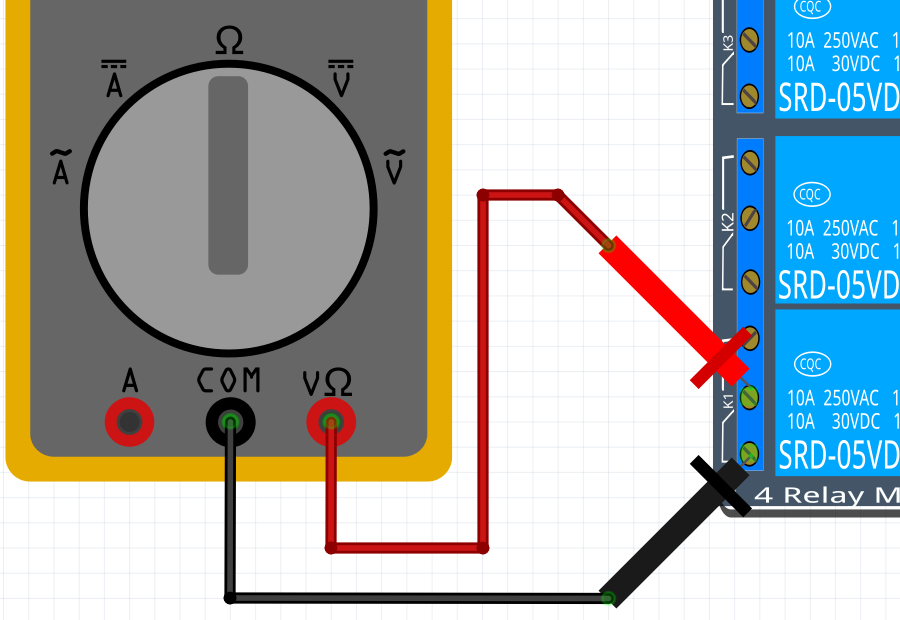
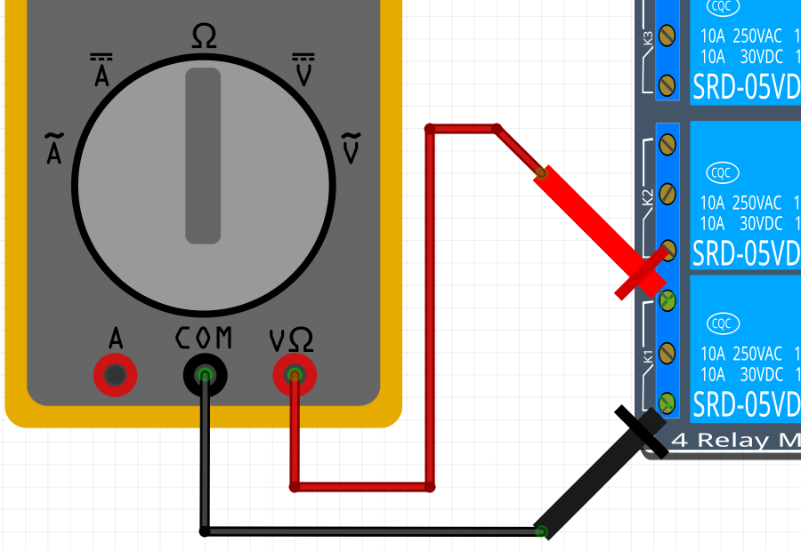

# Lektion 22: Mätning av en relais

<!-- 

Downloaded the Fritzing file at

https://github.com/KAST-Tech/fritzing-parts/blob/main/4-Channel%205v%20Relay%20Shield.fzpz

Direct download:

https://github.com/KAST-Tech/fritzing-parts/raw/refs/heads/main/4-Channel%205v%20Relay%20Shield.fzpz

This does not work:

https://fritzing.org/projects/smd-4-x-relay-board 

-->

En relais är liksom en knapp som kan blir tryckt elektroniskt.
Vi behöver relais om vi vill skydda vär kära Arduino emot,
bland annat, DC motorer.

Under den här lektion **mäter** vi hur den fungerar.

Vi använder en 4-relais kort: en kretskort som har fyra relais.
So ser en 4-relais kort ut:

## 22.1. Förbereda multimetern

Tar en multimeter.
Sätt den på att mäta motstånd.
Sätter mätpennorna emot varann,
likadant den här figur:

Vad bör du mäta om multimetern funkar väl?
Varför är det så?
Vad kan du göra om multimetern ger fel värd?

\pagebreak

### Svar

Du bör mäta noll Ohm.
Det är så för att det finns ingen (elektriskt)
motstånd mellan mätpennorna när dem är emot varann.

Om multimetern ger fel värd betyder det ofta:

- mätstiftarna är inte i korrekta hålar ov multimetern
- mätstiftarna har en glappkontakt till multimetern:
  vrida stifterna tills motståndet blir noll
- multimetern har illa om batteri

## 22.2. Koppling av en relais

Koppla en relais så här:

Vilken relais har numret 1? Hur såg du detta?

### 22.2. Svar

Relais som är mest ner är relais numret 1.
Vi kan ser det på texten på kretskort:
det står `K1` (på vänster sida i bilden)
nära relais-utgången.

## 22.3. Mät mellan 1 och 2

Med din multimeter, mäter motståndet mellan
ingång en och två av den första relais, så här:

Multimetern behövs inte vara skruvad i ingångerna,
att sticka den på skruvarna av ingånger
funkar just så bra.

Vad är motståndet? Vad betyder det?

### 22.3. Svar

Motstånded är noll Ohm.
Det betyder att el kan ströma fritt mellan ingånger 1 och 2.

## 22.4. Mät mellan 2 och 3

Med din multimeter, mäter motståndet mellan
ingång två och tre av den första relais, så här:

Vad är motståndet? Vad betyder det?

### 22.4. Svar

Motstånded är oändligt Ohm.
Det betyder att el kan inte ströma mellan ingånger 2 och 3.

## 22.5. Mät mellan 1 och 3

Med din multimeter, mäter motståndet mellan
ingång en och två av den första relais, så här:

Vad är motståndet? Vad betyder det?

### 22.5. Svar

Motstånded är oändligt Ohm.
Det betyder att el kan inte ströma mellan ingånger 1 och 3.

Här är en översikt av vad vi har mått nu:

Stift|Stift|Motsånd
-----|-----|--------
1    |2    |Oändligt
1    |3    |Oändligt
2    |3    |Noll

## 22.6. Sätt på en relais

Koppla `GND` av Arduino med `IN1` av relaiskortan.

Vad ser och hör du när du gör det?

### 22.6. Svar

Du hör ett klick och en lysdiod (med namnet `D5`)
på kortan börjar att lysa.

## 22.7. Gör igen

Gör samma mätningar igen.
Du får använda tabellen här:

Stift|Stift|Motstånd
-----|-----|--------
1    |2    |?
1    |3    |?
2    |3    |?

Bland vilka stiftar finns nu noll Ohm?

## Slutuppgift

Går igenom all sex mätningar, som i tabellen här:

`GND` kopplat till `IN1`?|Stift|Stift|Motstånd
-------------------------|-----|-----|--------
Nej                      |1    |2    |?
Nej                      |1    |3    |?
Nej                      |2    |3    |?
Ja                       |1    |2    |?
Ja                       |1    |3    |?
Ja                       |2    |3    |?

För varje mätning:

- förutspå vilken motstånd multimeter ska visar
- visar det med en multimeter

Fem av sex gånger skulle du förutspå rätt och visar rätt.

Förklara varför en relais är liksom en knapp som kan blir tryckt
elektronikt.
