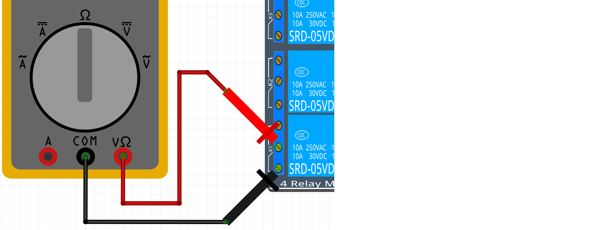
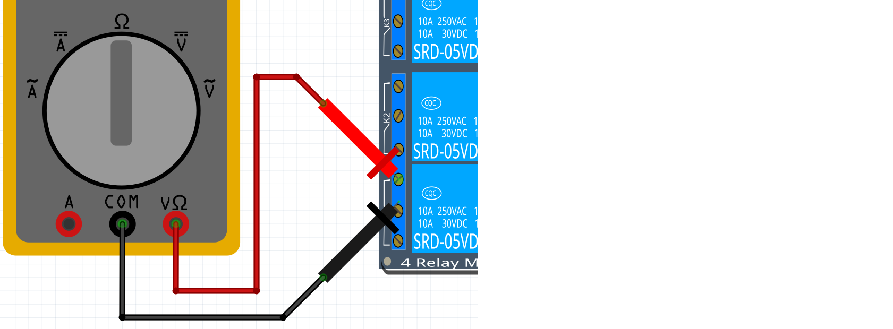

# Lektion 22: Mätning av ett relä

<!--

Downloaded the Fritzing file at

https://github.com/KAST-Tech/fritzing-parts/blob/main/4-Channel%205v%20Relay%20Shield.fzpz

Direct download:

https://github.com/KAST-Tech/fritzing-parts/raw/refs/heads/main/4-Channel%205v%20Relay%20Shield.fzpz

This does not work:

https://fritzing.org/projects/smd-4-x-relay-board

-->

Ett relä är som en knapp som kan styras elektroniskt.
Vi använder relä för att skydda vår kära Arduino när vi styr kraftiga komponenter,
till exempel DC-motorer.

Under den här lektionen **mäter** vi hur den fungerar.

Vi använder ett 4-relä kort: ett kretskort som har fyra relän.
Så här ser ett 4-relä kort ut:

\pagebreak

## 22.1. Förbereda multimetern

Ta en multimeter.
Ställ in den på att mäta motstånd.
Sätt mätpennorna mot varandra,
som i den här figuren:

Vad bör du mäta om multimetern fungerar väl?
Varför är det så?
Vad kan du göra om multimetern ger fel värde?

\pagebreak

### Svar

Du bör mäta noll Ohm.
Det är så för att det inte finns något (elektriskt)
motstånd mellan mätpennorna när de är mot varandra.

Om multimetern visar fel värde betyder det ofta:

- mätstiften är inte i rätt hål på multimetern
- mätstiften har dålig kontakt till multimetern:
  vrid stiften tills motståndet blir noll
- multimetern har dåligt batteri

## 22.2. Koppling av ett relä

Koppla ett relä så här:

Vilket relä har numret 1? Hur såg du det?

\pagebreak

### 22.2. Svar

Reläet som är längst ner är relä nummer 1.
Vi kan se det på texten på kretskortet:
det står `K1` (på vänster sida i bilden)
nära reläets utgång.

## 22.3. Mät mellan 1 och 2

Med din multimeter, mät motståndet mellan
ingång ett och två på det första reläet, så här:

Multimetern behöver inte vara inskruvad i ingångarna,
att sticka in den på skruvarna
fungerar lika bra.

Vad är motståndet? Vad betyder det?

\pagebreak

### 22.3. Svar

Motståndet är noll Ohm.
Det betyder att el kan strömma fritt mellan ingång 1 och 2.

## 22.4. Mät mellan 2 och 3

Med din multimeter, mät motståndet mellan
ingång två och tre på det första reläet, så här:

Vad är motståndet? Vad betyder det?

\pagebreak

### 22.4. Svar

Motståndet är oändligt Ohm.
Det betyder att el inte kan strömma mellan ingång 2 och 3.

## 22.5. Mät mellan 1 och 3

Med din multimeter, mät motståndet mellan
ingång ett och tre på det första reläet, så här:

Vad är motståndet? Vad betyder det?

\pagebreak

### 22.5. Svar

Motståndet är oändligt Ohm.
Det betyder att el inte kan strömma mellan ingång 1 och 3.

Här är en översikt av vad vi har mätt nu:

Stift|Stift|Motstånd
-----|-----|--------
1    |2    |Noll
1    |3    |Oändligt
2    |3    |Oändligt

## 22.6. Sätt på ett relä

Koppla `GND` på Arduino med `IN1` på reläkortet.

Vad ser och hör du när du gör det?

\pagebreak

### 22.6. Svar

Du hör ett klick och en lysdiod (med namnet `D5`)
på kortet börjar att lysa.

## 22.7. Gör igen

Gör samma mätningar igen.
Du får använda tabellen här:

Stift|Stift|Motstånd
-----|-----|--------
1    |2    |?
1    |3    |?
2    |3    |?

Mellan vilka stift finns nu noll Ohm?

\pagebreak

## Slutuppgift

Gå igenom alla sex mätningar, som i tabellen här:

`GND` kopplat till `IN1`?|Stift|Stift|Motstånd
-------------------------|-----|-----|--------
Nej                      |1    |2    |?
Nej                      |1    |3    |?
Nej                      |2    |3    |?
Ja                       |1    |2    |?
Ja                       |1    |3    |?
Ja                       |2    |3    |?

För varje mätning:

- förutspå vilket motstånd multimetern ska visa
- visa det med en multimeter

Fem av sex gånger ska du förutspå rätt och visa rätt.

Förklara varför ett relä är som en knapp som kan styras
elektroniskt.
