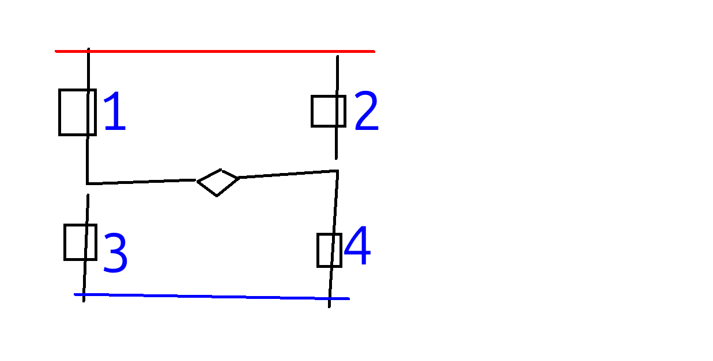

# Lektion 23: Anslutning av en relais

En relais är liksom en knapp som kan blir tryckt elektroniskt.
Vi behöver relais om vi vill skydda vär kära Arduino emot,
bland annat, DC motorer.

Under den här lektion ska vi ser hur den fungerar.

Vi använder en 4-relais kort: en kretskort som har fyra relais.

## 23.1. Koppla spänning till kretskorter

Koppla spänning till relais så här:

- Koppla `5V` av Arduino med `VCC` av kretskortet
- Koppla `GND` av Arduino med `GND` av kretskortet

Koppla en lysdiod till relaisen som här:

 | Vi kann koppla nästan allt till en relais: elkretsar är separata!
:-------------:|:----------------------------------------:

 | Självklart använder *vi* bara spänning under 12 volt!
:-------------:|:----------------------------------------:

- Koppla `5V` av batteriet till den långa benen av lysdiodedn
- Koppla korta benen av lysdioden till den ena sida av en 1000 Ohm motstånd
- Koppla den andra sidan av motståndet till hål 3 (den hål mest uppe på figuren)
  av relais 1 
  (den relais mest nere på figuren)
- Koppla `GND` av batteriet med hål 2 av relais 1

Lyser lysdioden? Varför?

### 23.1. Svar

Nej, den lyser inte. Vi har sett det i före lektion också.

## 23.2.

Koppla `GND` av Arduino med `IN1` av relaiskortan.

Vad ser och hör du när du gör det?

### 22.2. Svar

Du hör ett klick och en lysdiod (med namnet `D5`)
på kortan börjar att lysa.

Också lysdioden vi har kopplat lyser nu!

## 23.3 Två lysdioder

Bygg den kretsen här:

- Koppla `5V` av batteriet till den ena sida av en 1000 Ohm motstånd
- Koppla den andra sidan av motståndet till det långa benet
  av den blåa lysdiod
- Koppla det korta benet av den blåa lysdiod till `GND` av batteriet
- Koppla det korta ben av en grönt lysdiod till den långa ben av den blåa
  lysdiod.
- Koppla det långa ben av en grönt lysdiod till den korta ben av den blåa
  lysdiod.

Hur mycket lysdioder ska lyser? Varför?

### 23.3. Svar

En av dem två. Bara en lysdiod lyser för at el har bar en riktning at
gå igenom en lysdiod. För att lysdioderna har olika riktningar,
kan bara en av dem lysa samtidigt.

## 23.4 Den andra lysdiod

Andrar två sladder för att får den andra lysdiod att lysa.

### 23.4. Svar

Det finns två sladdar kopplat till lysdiodernas ben. Bytta
sladdarna för att vara kopplat till
den tvärtomma <!-- en bra gissning, eller hur! --> ben.

## 23.5. En H bro

Vi ska nästan bygga en H bro. 
En H bro gör det möjligt att el kan styras att går åt båda hål
i en elkrets. Den behöver vi för en DC motor som kan gå fram
och tillbaka!

För att förstå en H bro,
kolla på den schematiskt ritning här:

<!-- Image from https://www.build-electronic-circuits.com/h-bridge/ -->

Jag har tagit schemat från [en Engelska Arduino kurs](https://www.build-electronic-circuits.com/h-bridge/)
och den är lite mer formellt:

Tecken|Betydelse
------|----------------------------------------------------------------
`VCC` |Matspänningen, t.ex. `5V` av en Arduino, eller `+` av en batteri

Schemat ser litegrann ut som bokstavet `H`. Elen går, som alltid,
från plus (dvs `5V`) till minus (dvs `GND`). Den sladdar med numrarna
kan vara kopplade ja eller nej, likadant effect som att en knapp
är tryckt eller ej.

- I vilken riktning går elen när sladdar 1 och 4 är kopplade?
- I vilken riktning går elen när sladdar 2 och 3 är kopplade?
- Vad händer när bara sladd 1 och 3 är kopplade?

### 23.5. Svar

När sladdar 1 och 4 är kopplade går elen högeråt igenom
mittendelen.

När sladdar 2 och 3 är kopplade går elen vänsteråt igenom
mittendelen.

När sladdar 1 och 3 är kopplade har vi kortslutning!
 
## 23.6. En H bro

Nu byggar vi H bron på riktigt:

Vilken relais här är vilken sladd i schemat i senaste frågan?
Det är den blåa lysdiod som är viktigast.

Relais|Sladd
------|-----
1     |?
2     |?
3     |?
4     |?

### 23.6. Svar

Relais|Sladd |Varför
------|------|--------------------------------------------------------------------
1     |4     |Kopplat till GND och korta benet av blåa motstånd
2     |1     |Kopplat till 5V och långa benet av blåa motstånd
3     |3     |Kopplat till GND och 'fel minus sida' (långa benet) av blåa motstånd
4     |2     |Kopplat till 5V och 'fel plus sida' (korta benet) av blåa motstånd

## 23.7. Slutupgift

20 minuter.

- Bygg upp H bron från början
- Lysa den blåa ljusdiod. Berätta hör elen går igenom elkretset
- Lysa den gröna ljusdiod. Berätta hör elen går igenom elkretset
