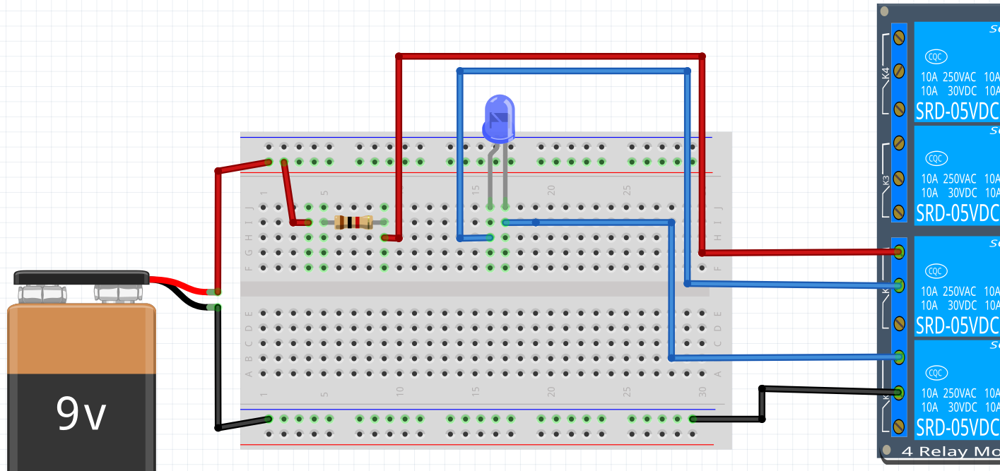

# Lektion 24: Användning av ett relä

Ett relä är som en knapp som kan styras elektroniskt.
Vi använder reläer för att skydda vår kära Arduino när vi styr kraftiga komponenter,
till exempel DC-motorer.

Under den här lektionen ska vi använda en Arduino för att styra det.

Vi använder ett 4-relä kort: ett kretskort som har fyra reläer.

## 24.1. Blink

Anslut en Arduino till reläkortet så här:


Anslut andra delen av reläkortet till ett batteri så här:


Skriv ett program som får lysdioden att blinka så här:

- lyser 5 sekunder
- släcker 1 sekund

 | Se upp: reläet är kopplat till `10`
:-------------:|:----------------------------------------:

 | Kanske är saker tvärtom mot dina förväntningar
:-------------:|:----------------------------------------:

\pagebreak

### 24.1. Svar

```c++
void setup() {
  pinMode(10, OUTPUT);
}

void loop() {
  digitalWrite(10, HIGH);
  delay(1000);
  digitalWrite(10, LOW);
  delay(5000);
}
```

Notera:

- Vi använder `10` för det är stiftet på Arduinon som är kopplat till relä 1
- Det är `digitalWrite(10, LOW);` som sätter **på** lysdioden

## 24.2. Två reläer

Vi bygger upp en H-brygga gradvis (som vanligt). Nu tar vi nästa steg!

Anslut en Arduino till reläkortet så här:


Anslut andra delen av reläkortet till ett batteri så här:



Skriv ett program som får lysdioden att blinka så här:

- lyser 5 sekunder
- släcker 1 sekund

\pagebreak

### 24.2. Svar

```c++
void setup() {
  pinMode(10, OUTPUT);
}

void loop() {
  digitalWrite(10, HIGH);
  digitalWrite(11, HIGH);
  delay(1000);
  digitalWrite(10, LOW);
  digitalWrite(11, LOW);
  delay(5000);
}
```

Nu behövs både stift 10 och 11 på Arduinon.

\pagebreak

## 24.3. Slutuppgift

Den här slutuppgiften har ingen tidsgräns.
Visa bara resultatet till en person som får ge
en underskrift. Lycka till!

Anslut en Arduino till reläkortet så här:


\pagebreak

Anslut andra delen av reläkortet till ett batteri så här:


Skriv ett program som får lysdioderna att blinka så här:

- den blåa lysdioden lyser 1 sekund
- släcker allt 1 sekund
- den gröna lysdioden lyser 1 sekund
- släcker allt 1 sekund

Förklara varför det är viktigt att allt är släckt mellan att man tänder de olika lysdioderna.
Vad kan hända om vi gör det snabbare?

