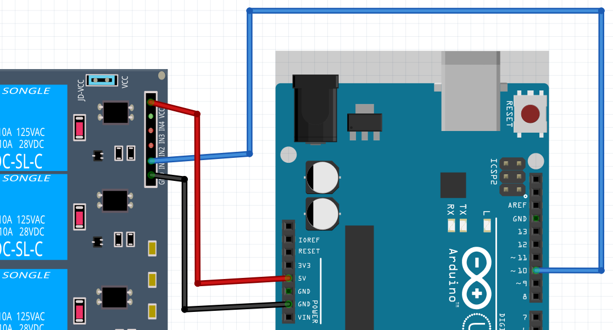

# Lektion 24: Använding av ett relais

Ett relä är liksom en knapp som kan blir tryckt elektroniskt.
Vi behöver reläer om vi vill skydda vär kära Arduino emot,
bland annat, DC motorer.

Under den här lektion ska vi använder en Arduino för att styra den.

Vi använder en 4-relä kort: en kretskort som har fyra relä.

## 24.1. Blink

Anslut en Arduino till reläkortet som här:



Anslut andra del av reläkortet till en batteri som här:


Skriv ett program som få lysdioden att blinka så här:

- lyser 5 sekund
- släcker 1 sekund

 | Ser up: reläet är kopplat till `10`
:-------------:|:----------------------------------------:

 | Kanske saker är tvärtom mot dina föreväntningar
:-------------:|:----------------------------------------:

### 24.1. Svar

```c++
void setup() {
  pinMode(10, OUTPUT);
}

void loop() {
  digitalWrite(10, HIGH);
  delay(1000);
  digitalWrite(10, LOW);
  delay(5000);
}
```

Tar notis om:

- Vi använder `10` för det är stiftet av Arduinon som är kopplat till relä 1
- Det ar `digitalWrite(10, LOW);` som sätter **på** lysdioden

## 24.2. Två relän

Vi bygger upp en H brygga gradvis (som vanligt). Nu tar vi nästa steg!

Anslut en Arduino till reläkortet som här:


Anslut andra del av reläkortet till en batteri som här:


Skriv ett program som få lysdioden att blinka så här:

- lyser 5 sekund
- släcker 1 sekund

### 24.2. Svar

```c++
void setup() {
  pinMode(10, OUTPUT);
}

void loop() {
  digitalWrite(10, HIGH);
  digitalWrite(11, HIGH);
  delay(1000);
  digitalWrite(10, LOW);
  digitalWrite(11, LOW);
  delay(5000);
}
```

Nu behövs båda stift 10 och 11 av Arduino.

## 24.3. Slutupgift

De här slutuppgift har ingen tajming.
Bara visar resultatet till en persom som får ger
en underskrift. Lyckas till!

Anslut en Arduino till reläkortet som här:


Anslut andra del av reläkortet till en batteri som här:


Skriv ett program som få lysdioden att blinka så här:

- lyser blåa lysdioden 1 sekund
- släcker allt 1 sekund
- lyser gröna lysdioden 1 sekund
- släcker allt 1 sekund

Förklar varför det är viktigt at allt är släckt mellan lysningen?
Vad kan hända om vi det snabbare?

