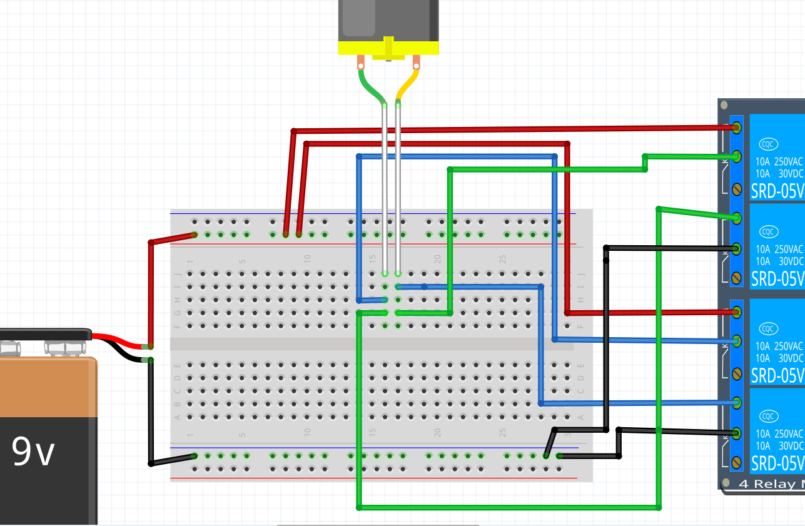

# Lektion 26: Anslutning av en DC motor

En DC motor är en motor som framåt när den får spänning
och åker bakåt när spänningen är tvärtom.

Man får aldrig koppla en DC motor till en Arduino,
även när motorn använder 5 volt!

Men, med ett relä kan man styra en DC motor ändå.
Under den här lektionen ska vi göra detta.

Vi använder ett 4-relä kort: ett kretskort som har fyra reläer.

\pagebreak

## 26.1. En knapp styr ett relä

Koppla reläskortet till Arduinon så här:

- Koppla `5V` på Arduino med `VCC` på reläskortet
- Koppla `GND` på Arduino med `GND` på reläskortet
- Koppla `GND` till ena sida av knappen
- Koppla `IN1` av reläskortet till andra sidan av knappen

Vad händer när man trycker på knappen? Varför?

\pagebreak

### 26.1 Svar

Reläet 1 klickar.

Det är på grund av att stift `IN1` blir kopplat till `GND` om knappen är tryckt.

\pagebreak

## 26.2. Ett relä styr en DC motor

Här använder vi en 9V batteri och en DC motor.

Koppla den enkla kretsen som här:

 | Vi kan koppla nästan vad som helst till ett relä: elkretsarna är separata!
:-------------:|:----------------------------------------:

 | En batteri har inget problem med den negativa spänning som en DC motor orsaker
:-------------:|:----------------------------------------:

Vad händer om man trycker på knappen? Varför?

\pagebreak

### 26.2. Svar

DC motor börjar snurra.

Om man trycker på knappen slutar reläet 1.
Om reläet 1 är sluten är elkretsen rund och DC motor kan snurra.

## 26.3. Två reläs styrs av en knapp

Koppla en sladd till i styrning av reläskortet:

Vad händer nu om man trycker på knappen?

\pagebreak

### 26.3. Svar

Om man trycker på knappen klickar båda reläs 1 och 2 samtidigt.

## 26.4. Hälften av H brygga

Nu bygger vi första hälften av en H brygga:

Vad är meningen av en H brygga igen?

\pagebreak

### 26.4. Svar

Målet av en H brygga är att möjligtgöra detta at har ström gor
igenom något i båda riktningar.

## 26.5. Två knappar som blir aldrig tryckt samtidigt

Koppla en knapp till, som styrs reläer 3 och 4:

Varför får man aldrig trycka på båda knappar i en H bygga?

\pagebreak

### 26.5. Svar

För att det ger kortslutning.

 | Om något blir het, genast tar bort/av batterin!
:-------------:|:----------------------------------------:

## 26.6. En H brugga med en DC motor

Komplettera H bryggan:

Varför får man aldrig trycka på båda knappar i en H bygga?

Nu kan du styra DC motorn åt båda hål! Grattis!

\pagebreak

### 26.6. Svar

För att det ger kortslutning.

 | Om något blir het, genast tar bort/av batterin!
:-------------:|:----------------------------------------:

## 26.7 Slutupgift

- Ta bort alla sladdar och komponenter
- Bygg upp hela kretsen i 25 minuter
- Förklara varför man får aldrig trycka på båda knappar i en H bygga
- Förklara hur man kan känna att det är kortslutning
- Visar att du kann styra DC motor åt båda hål
- Visar hur man handlar om det är kortslutning
