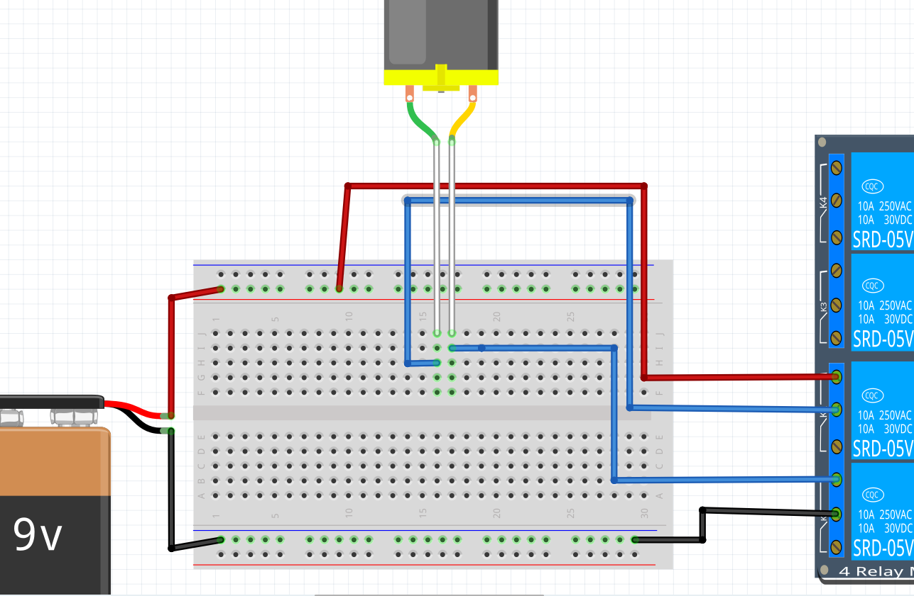

# Lektion 27: Användning av en DC motor

En DC motor är en motor som framåt när den får spänning
och åker bakåt när spänningen är trärtom.

Man får aldrig koppla en DC motor **direkt** till en Arduino,
men en DC motor kan blir kopplad till ett relä (som är styrd av en Arduino).

Under den här lektion ska vi koppla en DC motor till ett reläs
(till en Arduino).

## 27.1. Blink

Anslut en Arduino till reläkortet så här:


Anslut andra delen av reläkortet till ett batteri så här:


Skriv ett program som får DC motorn att snurra så här:

- snurrar 5 sekunder
- stannar 1 sekund

 | Se upp: reläet är kopplat till `10`
:-------------:|:----------------------------------------:

 | Kanske är saker tvärtom mot dina förväntningar
:-------------:|:----------------------------------------:

\pagebreak

### 27.1. Svar

```c++
void setup() {
  pinMode(10, OUTPUT);
}

void loop() {
  digitalWrite(10, HIGH);
  delay(1000);
  digitalWrite(10, LOW);
  delay(5000);
}
```

Notera:

- Vi använder `10` för det är stiftet på Arduinon som är kopplat till relä 1
- Det är `digitalWrite(10, LOW);` som sätter **på** DC motorn

## 27.2. Två reläer

Vi bygger upp en H-brygga gradvis (som vanligt). Nu tar vi nästa steg!

Anslut en Arduino till reläkortet så här:


Anslut andra delen av reläkortet till ett batteri så här:



Skriv ett program som får DC motorn att snurra så här:

- snurrar 5 sekunder
- stannar 1 sekund

\pagebreak

### 27.2. Svar

```c++
void setup() {
  pinMode(10, OUTPUT);
}

void loop() {
  digitalWrite(10, HIGH);
  digitalWrite(11, HIGH);
  delay(1000);
  digitalWrite(10, LOW);
  digitalWrite(11, LOW);
  delay(5000);
}
```

Nu behövs både stift 10 och 11 på Arduinon.

\pagebreak

## 27.3. Slutuppgift

Den här slutuppgiften har ingen tidsgräns.
Visa bara resultatet till en person som får ge
en underskrift. Lycka till!

Anslut en Arduino till reläkortet så här:


\pagebreak

Anslut andra delen av reläkortet till ett batteri så här:


Skriv ett program som får DC motorn att snurra så här:

- snurrar åt ena hål för 3 sekunder
- stannar 1 sekund
- snurrar åt ena andra hål för 3 sekunder
- stannar 1 sekund

Förklara varför det är viktigt att motorn vilar
mellan att man låt den snurra.
Vad kan hända om vi gör det snabbare?
