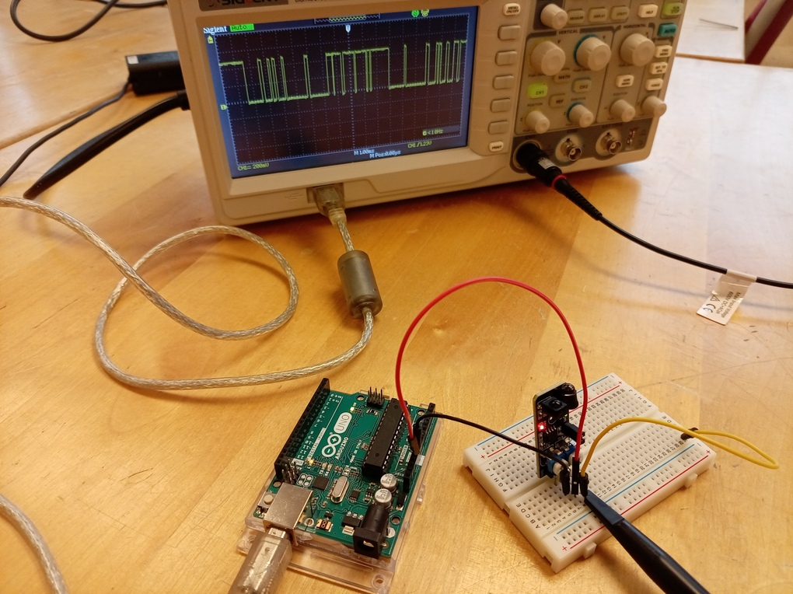
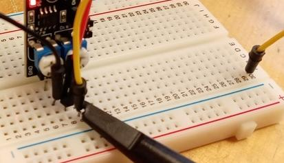
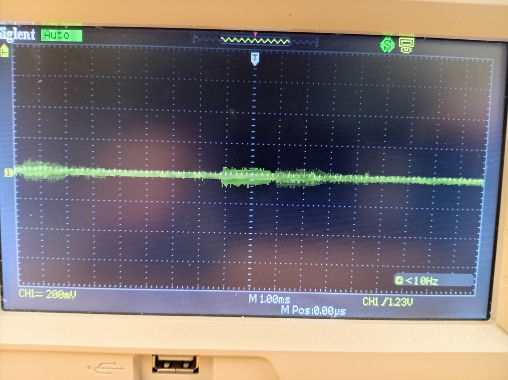
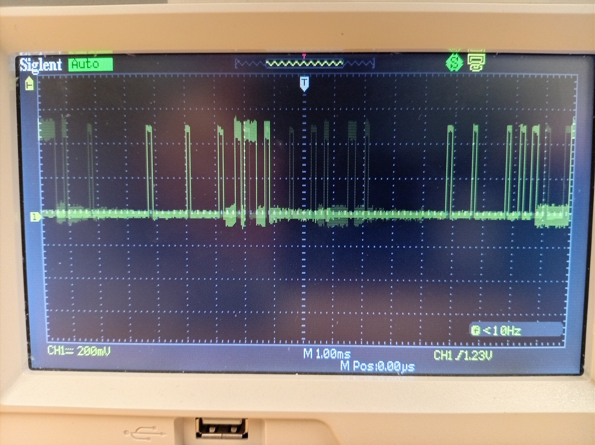

# Lektion 28: Mätning av en avståndssensor

<!-- Part from https://arduinomodules.info/download/ky-032-infrared-obstacle-avoidance-sensor-module-zip-file/ -->

En avståndssensor är en modul som kan känna om det finns en objekt
före den.

Under den här lektionen mäter vi hur den funkar.

## 28.1. Att koppla en oscilloskop till en avståndssensor

Koppla ett oscilloskop till en avståndssensor.

 | Man kan också använda USB portet av oscilloskopen!
:-------------:|:----------------------------------------:

Man kan använda en kopplingsslad för att förbinda proben av
oscilloskopen med `OUT` av avståndssensorn.

Hur mycket spänning (dvs volt) ger avståndssensor när något
(t.ex. din hand) är nära?

\pagebreak

### 28.1. Svar

I grunden mäter du noll volt: avståndssensorn ger ingen spänning
när något är nara, oavsett av lite rus:

## 28.2. En lite problem

Hur mycket spänning (dvs volt) ger avståndssensor när något är långt fram?
Vad är problemet när du kopplar det till en Arduino?

\pagebreak

### 28.2. Svar

Avståndssensorn ger **ibland** fem volt spänning
när något är långt fram.

Problemet på Arduino har att göra med den här **ibland**:
Arduino måste **minnas** att den fick fem volt spänning.

## 28.5 Slutuppgift

- Förklara hur en avståndssensor funkar och visar det på en oscilloskop
- Förklara vad problemet ska bli i dina egna ord
