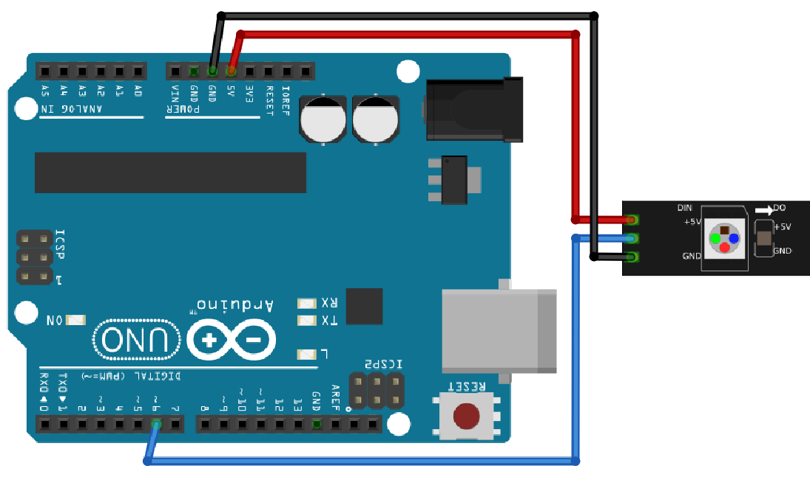

# Lektion 32: Användning av mer neopixels

Connect one neopixel



Upload:

```c++
#include <Adafruit_NeoPixel.h>

const int stift_neopixlar = 6;
const int antal_pixlar = 24 + 8 + 8 + 8;

Adafruit_NeoPixel pixlar = Adafruit_NeoPixel(
  antal_pixlar,
  stift_neopixlar,
  NEO_GRB + NEO_KHZ800
);

void setup()
{
  pixlar.begin();
}

int vilken_led = 0;

void loop()
{
  pixlar.setPixelColor(
   vilken_led, 
   Adafruit_NeoPixel::Color(255, 255, 255)
  );
  pixlar.show();
  delay(1000);
  vilken_led = vilken_led + 1;
  if (vilken_led > antal_pixlar) vilken_led = 0;
}
```

Connect a multimeter to Amp

What is the max amp an Arduino can have?

Answer: 200 mA

If your multimeter shows less than 0.1 A, add another neopixel.

Slutuppgift:

- Connect at least 2 neopixels in series
- Tell how much the max current is, show where you found out online
- Show that your amount of neopixels is safe

