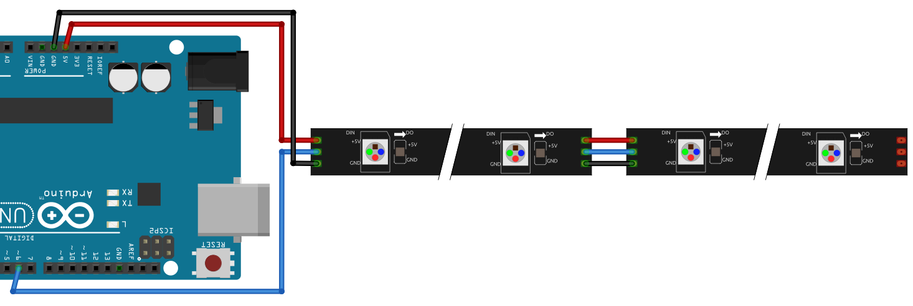
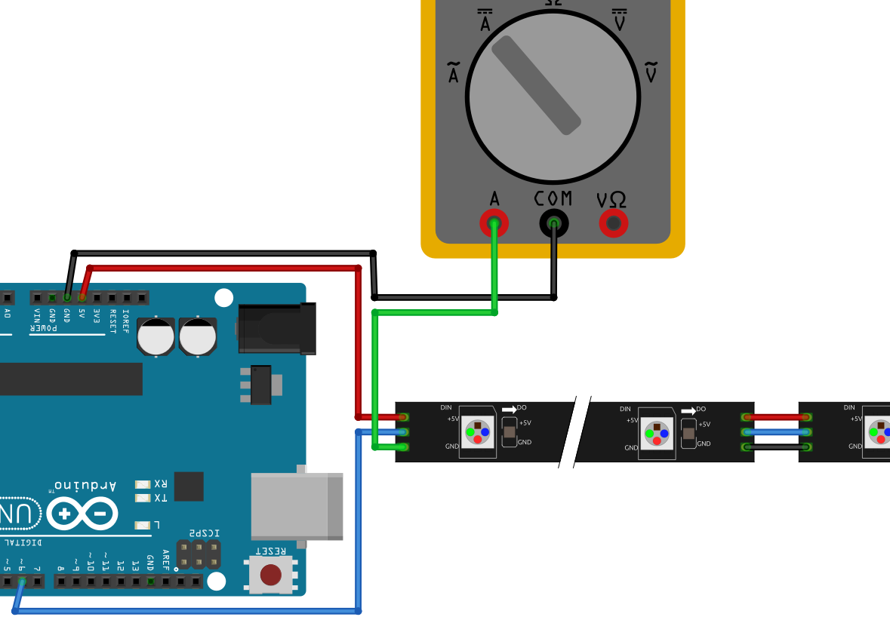

# Lektion 32: Användning av mer neopixels

## 32.1. Att koppla fler NeoPixlar

Koppla NeoPixlar till din Arduino:


Syfted med en NeoPixlar är att man kann koppla NeoPixlar
till fler NeoPixlar. Koppa en rad NeoPixlar till.



## 32.2. Att använda fler NeoPixlar

Ladd upp den här kod:

```c++
#include <Adafruit_NeoPixel.h>

const int stift_neopixlar = 6;
const int antal_pixlar = 8;

Adafruit_NeoPixel pixlar = Adafruit_NeoPixel(
  antal_pixlar,
  stift_neopixlar,
  NEO_GRB + NEO_KHZ800
);

void setup()
{
  pixlar.begin();
}

int vilken_led = 0;

void loop()
{
  pixlar.setPixelColor(
   vilken_led, 
   Adafruit_NeoPixel::Color(255, 255, 255)
  );
  pixlar.show();
  delay(1000);
  vilken_led = vilken_led + 1;
  if (vilken_led > antal_pixlar) vilken_led = 0;
}
```

Ändra koden så att all NeoPixlar blir använda.

### 32.2. Svar

Raden som måste ändras är:

```c++
const int antal_pixlar = 8;
```

Ändra siffret till hur mycket pixlar den är.

## 33.3. Att mäta ström

Elektricitet är fler egenskaper.
En av den är **hur mycket** elektroner (dem är lille partiklar)
flöder igenom elkretsen.
Just det ska vi mäta: vi ska mäta **strömstyrka**.
Strömstyrka är uttryckt i **Ampere** med symbolet **A**.
Man kann säga 'Mitt laptop använder 13 Ampere'
eller 'En Arduino kan amvända maximalt 0,2 A'.

För att mäta strömstyrkan, multimetern måste vara del av kretsen.
På grund av detta har multimetern en tredje ingång för just detta.

Koppla multimetern i kretsen som här:



Slå på Arduinon och kör programmet.

## 33.4. Slutuppgift

Fråga någon för att var domare. Til hen, svara den här frågorna:

- Hur mycket ström använder varje Neopixel?
- Om Arduino kan använda maximalt 0,2 A,
  hur mycket NeoPixlar kan man koppla till en Arduino?
- Har du kopplat för mycket NeoPixlar till Arduinon?

Visar eller berättar dina beräkningar.
