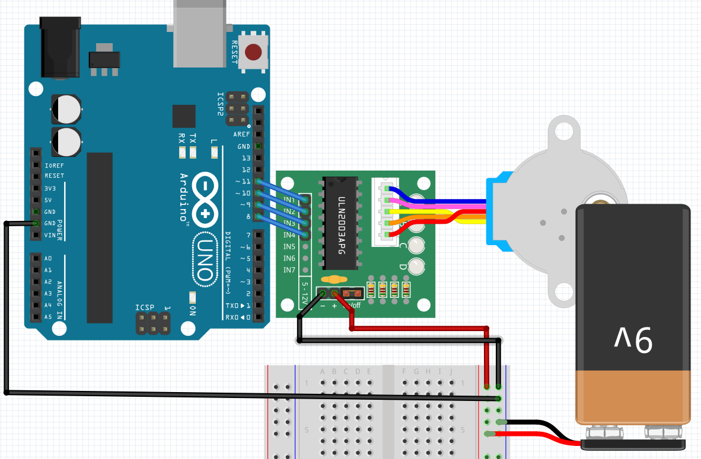

# Lektion 42: Användning av en stegmotor

<!-- https://github.com/mgesteiro/fritzing-parts/tree/main/28BYJ-48-driver -->
<!-- https://github.com/mgesteiro/fritzing-parts/tree/main/28BYJ-48-motor -->

Bygg upp den här krets:




Ladda upp den här koden:

```bash
#include <Stepper.h>

const int n_steps_per_rotation{48};

Stepper stepper(n_steps_per_rotation, 8, 9, 10, 11);

void setup()
{
  stepper.setSpeed(500);
}

void loop() 
{
  stepper.step(1);
  delay(1);
}
```

Om de inte har installerat `CheapStepper`, so får du en felmeldning så här:


Installera `SteapStepper` so här:


## Slutuppgift

Får en stegmotor att fungerar med hjälp av den här information.
