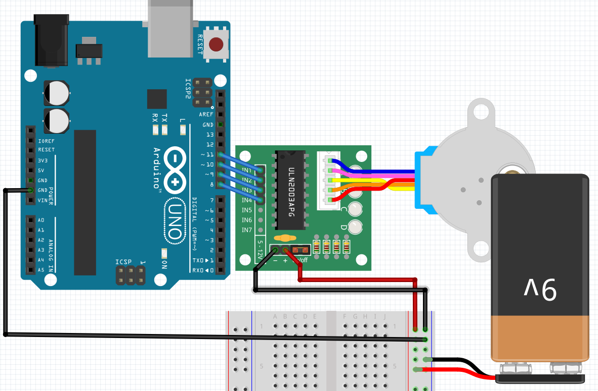
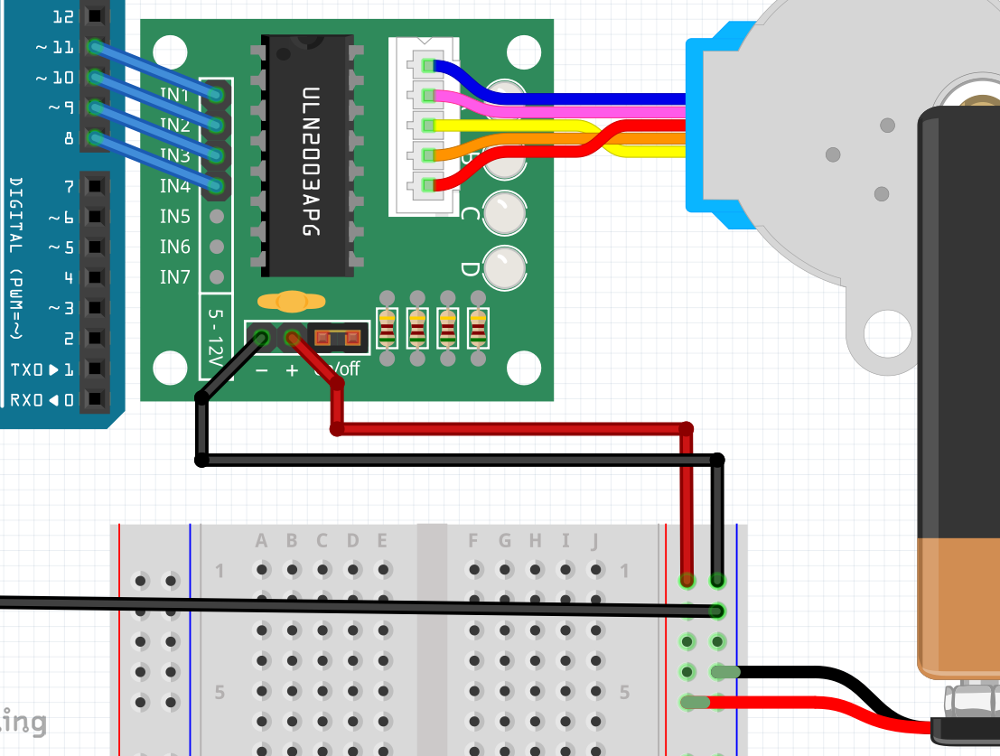

# Lektion 33: Användning av en stegmotor

En stegmotor är en motor man kan driva nogrann, snurra rund
och har mycket kraft.
I jämförselse med en DC motor är en stegmotor nogrannare,
för att man kan driva en stegmotor stegsvis.
Olikt en servormotor kan en stegmotor snurra runt.
Det finns servormotor då, som kan också snurra runt,
men den är mindre kraftig än en stegmotor.

Största nackdel med en stegmotor är att den behöver att har en **drivare**.
En drivare, ofta en lite mönsterkort, försörjer och förenklar
hur en stegmotor blir använd.

## 33.1. Att bygga elkretsen

Bygg upp den här krets (förstorning finns på nästa sida):



\pagebreak

Här är förstorningen:



\pagebreak

## 33.2. Att ladda upp koden

Ladda upp den här koden:

```bash
#include <Stepper.h>

const int n_steps_per_rotation{48};

Stepper stepper(n_steps_per_rotation, 8, 9, 10, 11);

void setup()
{
  stepper.setSpeed(500);
}

void loop() 
{
  stepper.step(1);
  delay(1);
}
```

\pagebreak

Om de inte har installerat `CheapStepper`, so får du en felmeldning så här:


\pagebreak

Installera `SteapStepper` so här:


## 33.3. Slutuppgift

Får en stegmotor att fungerar.
