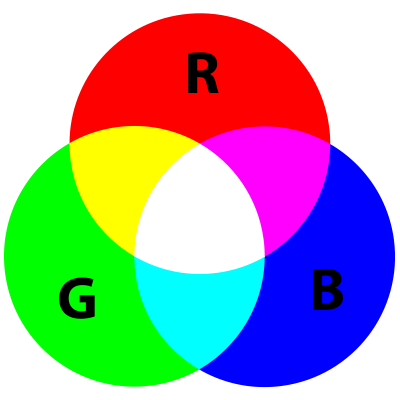

# Lektion 33: Användning av neopixels

Under den här lektion gör vi Blink med NeoPixels!


> FLORAbrella, ett paraply med NeoPixels

\pagebreak


TODO
/home/richel/GitHubs/arduino_foer_ungdomar/docs/kapitel/33_anvaendning_av_neopixels/click_tools_manage_libraries.png
/home/richel/GitHubs/arduino_foer_ungdomar/docs/kapitel/33_anvaendning_av_neopixels/install_library.png
/home/richel/GitHubs/arduino_foer_ungdomar/docs/kapitel/33_anvaendning_av_neopixels/library_missing.png

## 33.1. Anslutning


Anslut en Arduino till NeoPixels så här:

Stift NeoPixels | Stift Arduino
----------------|--------------
GND         | GND
5V          | 5V
DIN         | 6

\pagebreak

Detta är koden för 'Blink':

```c++
#include <Adafruit_NeoPixel.h>

const int stift_neopixels = 6;
const int antal_pixlar = 8;

Adafruit_NeoPixel pixlar = Adafruit_NeoPixel(
  antal_pixlar,
  stift_neopixels,
  NEO_GRB + NEO_KHZ800
);

void setup()
{
  pixlar.begin();
}

void loop()
{
  pixlar.setPixelColor(0, Adafruit_NeoPixel::Color(64, 0, 0));
  pixlar.show();
  delay(1000);
  pixlar.setPixelColor(0, Adafruit_NeoPixel::Color(0, 0, 0));
  pixlar.show();
  delay(1000);
}
```

 | Har du glömt här ljusfärger smälta sammans? Se figuret nedåt
:-------------:|:----------------------------------------:



> Färgcirkel. Här kan du ser att gul är en blandning av röd och grön.

Färg  |Röd|Grön|Blå
------|---|----|----
Röd  |255|0  |0
Gul  |255|255 |0
Blå  |0  |0  |255

 | 
:-------------:|:------------------------------------------------:
`pixlar.show()`|'Bästa dator, låt lysdioderna visa sina färger.'

Skriv in koden i Arduino IDE och klicka på "Ladda upp".

\pagebreak

Blinkar nu

- den första lysdioden: en Arduino börjar räkna från noll
- i rött: d.v.s. med ett roed_vaerde på 64, grönt värde på 0 och ett blaa_vaerde på 0

## 33.1. Att blinka två lysdioder

Gå nu

- den andra lysdioden
- grön
- blinka växelvis

\pagebreak

### Svar

```c++
#include <Adafruit_NeoPixel.h>

const int stift_neopixels = 6;
const int antal_pixlar = 8;

Adafruit_NeoPixel pixlar = Adafruit_NeoPixel(
  antal_pixlar,
  stift_neopixels,
  NEO_GRB + NEO_KHZ800
);

void setup()
{
  pixlar.begin();
}

void loop()
{
  pixlar.setPixelColor(0, Adafruit_NeoPixel::Color(64, 0, 0));
  pixlar.setPixelColor(1, Adafruit_NeoPixel::Color(0 , 0, 0));
  pixlar.show();
  delay(1000);
  pixlar.setPixelColor(0, Adafruit_NeoPixel::Color(0, 0 , 0));
  pixlar.setPixelColor(1, Adafruit_NeoPixel::Color(0, 64, 0));
  pixlar.show();
  delay(1000);
}
```

\pagebreak

## 33.2. 

Gå nu

- den tredje lysdioden
  *blått
- blinkar växelvis, efter rött och grönt

\pagebreak

### Svar

```c++
#include <Adafruit_NeoPixel.h>

const int stift_neopixels = 6;
const int antal_pixlar = 8;

Adafruit_NeoPixel pixlar = Adafruit_NeoPixel(
  antal_pixlar,
  stift_neopixels,
  NEO_GRB + NEO_KHZ800
);

void setup()
{
  pixlar.begin();
}

void loop()
{
  pixlar.setPixelColor(0, Adafruit_NeoPixel::Color(64, 0, 0));
  pixlar.setPixelColor(1, Adafruit_NeoPixel::Color(0 , 0, 0));
  pixlar.setPixelColor(2, Adafruit_NeoPixel::Color(0 , 0, 0));
  pixlar.show();
  delay(1000);
  pixlar.setPixelColor(0, Adafruit_NeoPixel::Color(0, 0 , 0));
  pixlar.setPixelColor(1, Adafruit_NeoPixel::Color(0, 64, 0));
  pixlar.setPixelColor(2, Adafruit_NeoPixel::Color(0, 0 , 0));
  pixlar.show();
  delay(1000);
  pixlar.setPixelColor(0, Adafruit_NeoPixel::Color(0, 0, 0));
  pixlar.setPixelColor(1, Adafruit_NeoPixel::Color(0, 0, 0));
  pixlar.setPixelColor(2, Adafruit_NeoPixel::Color(0, 0, 64));
  pixlar.show();
  delay(1000);
}
```

\pagebreak

## 33.3.

Använd nu koden nedan, men gör lysdioderna blåa:

```c++
#include <Adafruit_NeoPixel.h>

const int stift_neopixels = 6;
const int antal_pixlar = 8;

Adafruit_NeoPixel pixlar = Adafruit_NeoPixel(
  antal_pixlar,
  stift_neopixels,
  NEO_GRB + NEO_KHZ800
);

void setup()
{
  pixlar.begin();
}

int vilken_led = 0;

void loop()
{
  pixlar.setPixelColor(vilken_led, Adafruit_NeoPixel::Color(64, 0, 0));
  pixlar.show();
  delay(100);
  vilken_led = vilken_led + 1;
}
```

\pagebreak

### Svar

```c++
#include <Adafruit_NeoPixel.h>

const int stift_neopixels = 6;
const int antal_pixlar = 8;

Adafruit_NeoPixel pixlar = Adafruit_NeoPixel(
  antal_pixlar,
  stift_neopixels,
  NEO_GRB + NEO_KHZ800
);

void setup()
{
  pixlar.begin();
}

int vilken_led = 0;

void loop()
{
  pixlar.setPixelColor(vilken_led, Adafruit_NeoPixel::Color(0, 0, 64));
  pixlar.show();
  delay(100);
  vilken_led = vilken_led + 1;
}
```

\pagebreak

## 33.4

Använd nu inte ett blaa väde på `64`, utan av `vilken_led`. Vad ser du?

\pagebreak

### Svar

Koden blir så här:

```c++
#include <Adafruit_NeoPixel.h>

const int stift_neopixels = 6;
const int antal_pixlar = 8;

Adafruit_NeoPixel pixlar = Adafruit_NeoPixel(
  antal_pixlar,
  stift_neopixels,
  NEO_GRB + NEO_KHZ800
);

void setup()
{
  pixlar.begin();
}

int vilken_led = 0;

void loop()
{
  pixlar.setPixelColor(
    vilken_led,
    Adafruit_NeoPixel::Color(0, 0, vilken_led)
  );
  pixlar.show();
  delay(100);
  vilken_led = vilken_led + 1;
}
```

Du ser nu att lysdioderna lyser från mörkt blå till mer och mer ljusblå.

\pagebreak

## 33.5.

Använd nu inte ett röd vaerde på `0`, utan av `64 - vil`. Vad ser du?

\pagebreak

### Svar

```c++
#include <Adafruit_NeoPixel.h>

const int stift_neopixels = 6;
const int antal_pixlar = 8;

Adafruit_NeoPixel pixlar = Adafruit_NeoPixel(
  antal_pixlar,
  stift_neopixels,
  NEO_GRB + NEO_KHZ800
);

void setup()
{
  pixlar.begin();
}

int vilken_led = 0;

void loop()
{
  pixlar.setPixelColor(
    vilken_led,
    Adafruit_NeoPixel::Color(0 - vilken_led, 0, vilken_led)
  );
  pixlar.show();
  delay(100);
  vilken_led = vilken_led + 1;
}
```

Du ser nu att den blåa del av ljuset fortfarande blir lysare.
Men nu också ser du att den röda del av ljuset börjar ljusröd och
blir mer och mer mörkrart.
Tillsammans heter färgen magenta.

\pagebreak

## 33.6.

Istället för att alltid göra `vilken_led` högre,
vi kan också göra det med en ny variabel: `roed_vaerde`.
Skapa en ny variabel, av typen "int", med namnet `roed_vaerde` och initialvärdet noll.
Använd `roed_vaerde` där
du bestämmer det röda värdet på en lysdiod.
Låt `roed_vaerde` öka med 1 varje gång.

\pagebreak

### Svar

```c++
#include <Adafruit_NeoPixel.h>

const int stift_neopixels = 6;
const int antal_pixlar = 8;

Adafruit_NeoPixel pixlar = Adafruit_NeoPixel(
  antal_pixlar,
  stift_neopixels,
  NEO_GRB + NEO_KHZ800
);

void setup()
{
  pixlar.begin();
}

int vilken_led = 0;
int roed_vaerde = 0;

void loop()
{
  pixlar.setPixelColor(
    vilken_led,
    Adafruit_NeoPixel::Color(roed_vaerde, 0, vilken_led)
  );
  pixlar.show();
  delay(100);
  vilken_led = vilken_led + 1;
  roed_vaerde = roed_vaerde + 1;
}
```

\pagebreak

## 33.7.

Istället för att alltid göra `vilken_led` högre,
vi kan också göra det med en ny variabel: `blaa_vaerde`.
Skapa en ny variabel, av typen "int", med namnet `blaa_vaerde` och initialvärdet 32.
Använd `blaa_vaerde` där du bestämmer det blåa värdet på en lysdiod.
Låt `blaa_vaerde` minska med 1 varje gång.

\pagebreak

### Svar

```c++
#include <Adafruit_NeoPixel.h>

const int stift_neopixels = 6;
const int antal_pixlar = 8;

Adafruit_NeoPixel pixlar = Adafruit_NeoPixel(
  antal_pixlar,
  stift_neopixels,
  NEO_GRB + NEO_KHZ800
);

void setup()
{
  pixlar.begin();
}

int vilken_led = 0;
int roed_vaerde = 0;
int blaa_vaerde = 32;

void loop()
{
  pixlar.setPixelColor(
    vilken_led, 
    Adafruit_NeoPixel::Color(roed_vaerde, 0, blaa_vaerde)
  );
  pixlar.show();
  delay(100);
  vilken_led = vilken_led + 1;
  roed_vaerde = roed_vaerde + 1;
  blaa_vaerde = blaa_vaerde - 1;
}
```

\pagebreak

## 33.8.

Vår maskin gör nu igenom all lysdioder bara en gång.
Använd en `if`-sats: om `vilken_led` är större än `antal_pixlar`,
så ska `vilken_led` blir noll igen.

\pagebreak

### Svar

```c++
#include <Adafruit_NeoPixel.h>

const int stift_neopixels = 6;
const int antal_pixlar = 8;

Adafruit_NeoPixel pixlar = Adafruit_NeoPixel(
  antal_pixlar,
  stift_neopixels,
  NEO_GRB + NEO_KHZ800
);

void setup()
{
  pixlar.begin();
}

int vilken_led = 0;
int roed_vaerde = 0;
int blaa_vaerde = 32;

void loop()
{
  pixlar.setPixelColor(
    vilken_led,
    Adafruit_NeoPixel::Color(roed_vaerde, 0, blaa_vaerde)
  );
  pixlar.show();
  delay(100);
  vilken_led = vilken_led + 1;
  roed_vaerde = roed_vaerde + 1;
  blaa_vaerde = blaa_vaerde - 1;
  if (vilken_led > antal_pixlar) vilken_led = 0;
}
```

\pagebreak

## 33.9.

I vårt program nu överstiger röttvärdet 255,
även om det gör ingenting i praktiken.
Använd en `if`-sats: om dett röda värdet är större än 32,
att dett röda värdet blir noll.

\pagebreak

### Svar

```c++
#include <Adafruit_NeoPixel.h>

const int stift_neopixels = 6;
const int antal_pixlar = 8;

Adafruit_NeoPixel pixlar = Adafruit_NeoPixel(
  antal_pixlar,
  stift_neopixels,
  NEO_GRB + NEO_KHZ800
);

void setup()
{
  pixlar.begin();
}

int vilken_led = 0;
int roed_vaerde = 0;
int blaa_vaerde = 32;

void loop()
{
  pixlar.setPixelColor(
    vilken_led,
    Adafruit_NeoPixel::Color(roed_vaerde, 0, blaa_vaerde)
  );
  pixlar.show();
  delay(100);
  vilken_led = vilken_led + 1;
  roed_vaerde = roed_vaerde + 1;
  blaa_vaerde = blaa_vaerde - 1;
  if (vilken_led > antal_pixlar) vilken_led = 0;
  if (roed_vaerde > 32) roed_vaerde = 0;
}
```

\pagebreak

## 33.10

I vårt program nu gåt blåttvärdet under noll,
även om det gör ingenting i praktiken.
Använd en `if`-sats: om dett blåa värdet är mindre än noll,
att dett blåa värdet blir 32.

\pagebreak

### Svar

```c++
#include <Adafruit_NeoPixel.h>

const int stift_neopixels = 6;
const int antal_pixlar = 8;

Adafruit_NeoPixel pixlar = Adafruit_NeoPixel(
  antal_pixlar,
  stift_neopixels,
  NEO_GRB + NEO_KHZ800
);

void setup()
{
  pixlar.begin();
}

int vilken_led = 0;
int roed_vaerde = 0;
int blaa_vaerde = 32;

void loop()
{
  pixlar.setPixelColor(
    vilken_led,
    Adafruit_NeoPixel::Color(roed_vaerde, 0, blaa_vaerde)
  );
  pixlar.show();
  delay(100);
  vilken_led = vilken_led + 1;
  roed_vaerde = roed_vaerde + 1;
  blaa_vaerde = blaa_vaerde - 1;
  if (vilken_led > antal_pixlar) vilken_led = 0;
  if (roed_vaerde > 32) roed_vaerde = 0;
  if (blaa_vaerde < 0) blaa_vaerde = 32;
}
```

\pagebreak

## 33.11. Slutuppgift

Skapa en ny variabel `groent_vaerde`, som bestämmer det gröna värdet
för lysdioderna.
Den här får hela tiden gå med två (istället för ett).
Om detta värdet är över 32, måste den blir noll igen.

<!--


#include <Adafruit_NeoPixel.h>

const int stift_neopixels = 6;
const int antal_pixlar = 8;

Adafruit_NeoPixel pixlar = Adafruit_NeoPixel(
  antal_pixlar,
  stift_neopixels,
  NEO_GRB + NEO_KHZ800
);

void setup()
{
  pixlar.begin();
}

int vilken_led = 0;
int roed_vaerde = 0;
int blaa_vaerde = 32;
int groent_vaerde = 0;

void loop()
{
  pixlar.setPixelColor(
   vilken_led, 
   Adafruit_NeoPixel::Color(
     roed_vaerde, 
     groent_vaerde,
     blaa_vaerde
    )
  );
  pixlar.show();
  delay(100);
  vilken_led = vilken_led + 1;
  roed_vaerde = roed_vaerde + 1;
  blaa_vaerde = blaa_vaerde - 1;
  groent_vaerde = groent_vaerde + 2;
  if (vilken_led > antal_pixlar) vilken_led = 0;
  if (roed_vaerde > 32) roed_vaerde = 0;
  if (groent_vaerde > 32) groent_vaerde = 0;
  if (blaa_vaerde < 0) blaa_vaerde = 32;
}

-->
