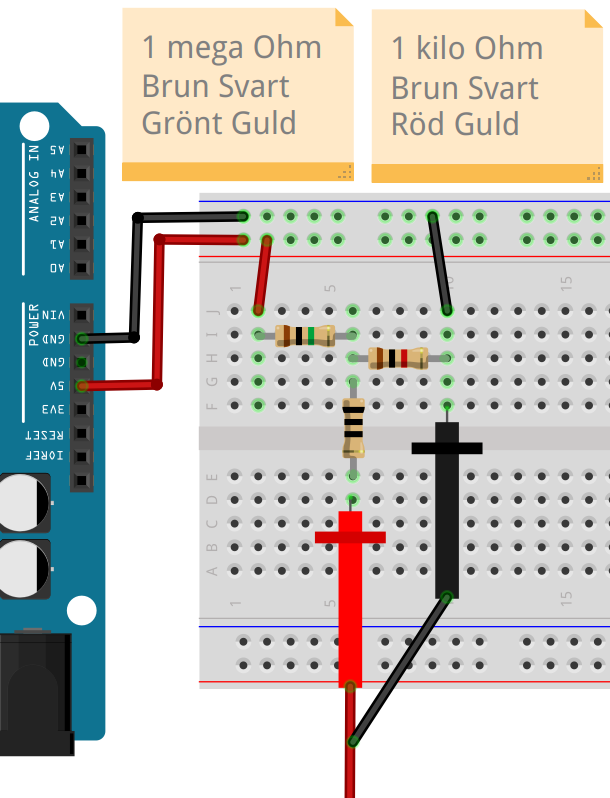
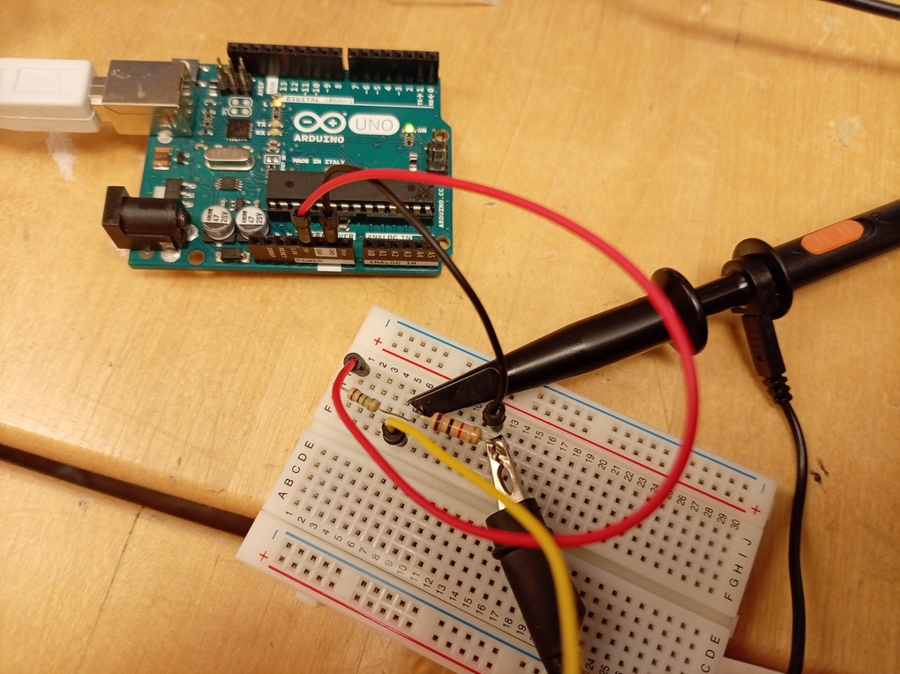
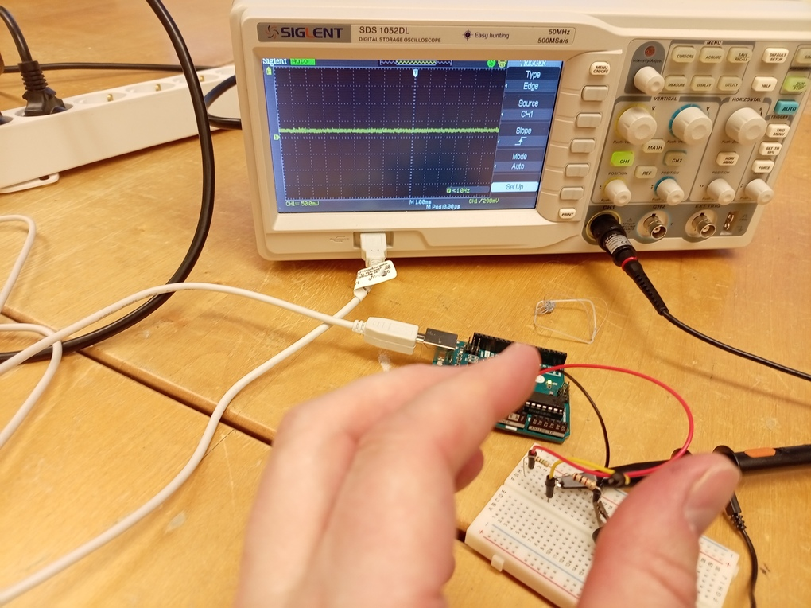
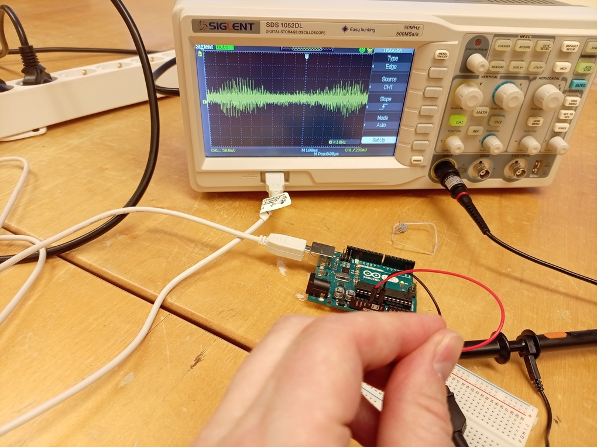

# Lektion 34: Mätning av en kapacitiv knapp

En kapacitiv knapp är en inte en vanligt knapp,
men en koppling för att trycka på avstånd (!).

Under den här lektionen mäter vi hur den funkar.

## 34.1. Att koppla en oscilloskop till en avståndssensor

Koppla ett oscilloskop till två motstånd.
Motständerna måste var 1 million Ohm (1 MOhm)
och 1 tusen Ohm (1 kOhm). Sätt proben i mitten
och koppla 'sidoproben' till GND sida.

 | Man kan också använda USB portet av oscilloskopen!
:-------------:|:----------------------------------------:

Emellan motstånderna, har en sladd eller något annat som kan
leda el (aluminiumfolie är kanon!).

Vilka skillnader ser du på oscilloskopen om du rör sladden mellan
motstånderna?

\pagebreak

### 34.1. Svar

Om du inte rör sladden, är spänningen stabilt:

Om du rör sladden, är spänningen mer instabilt:

## 34.2 Slutuppgift

- Förklara hur en kapacitiv knapp funkar och visar det på en oscilloskop
