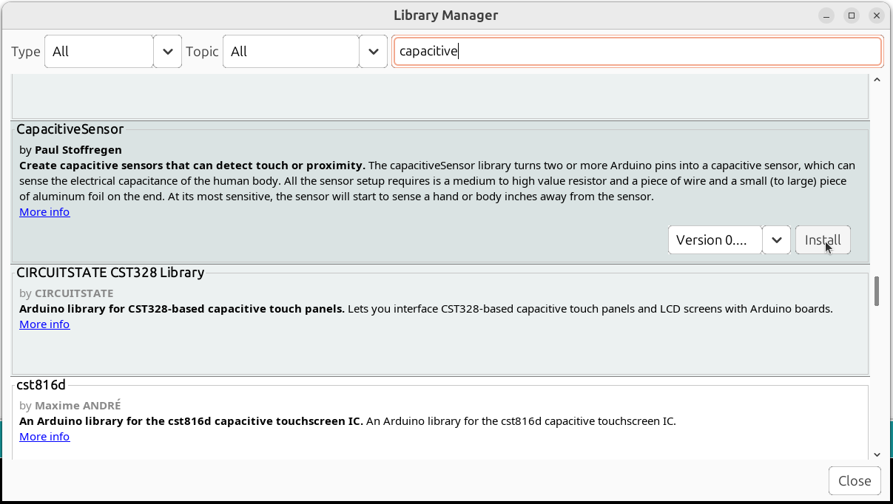
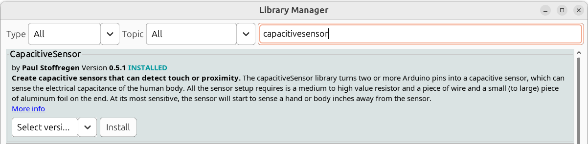
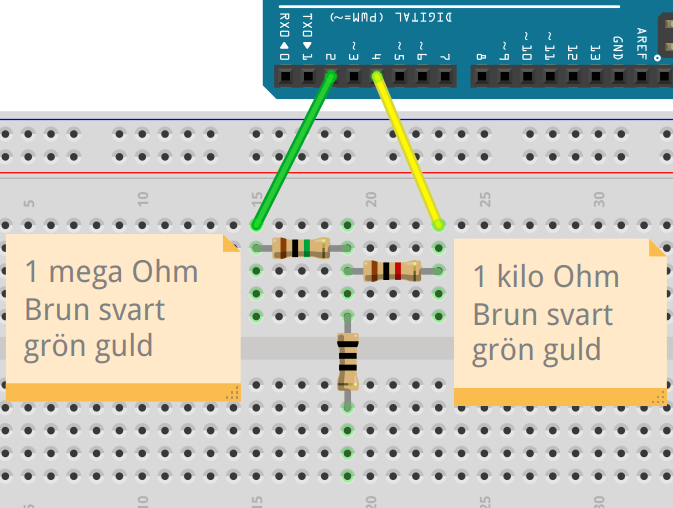
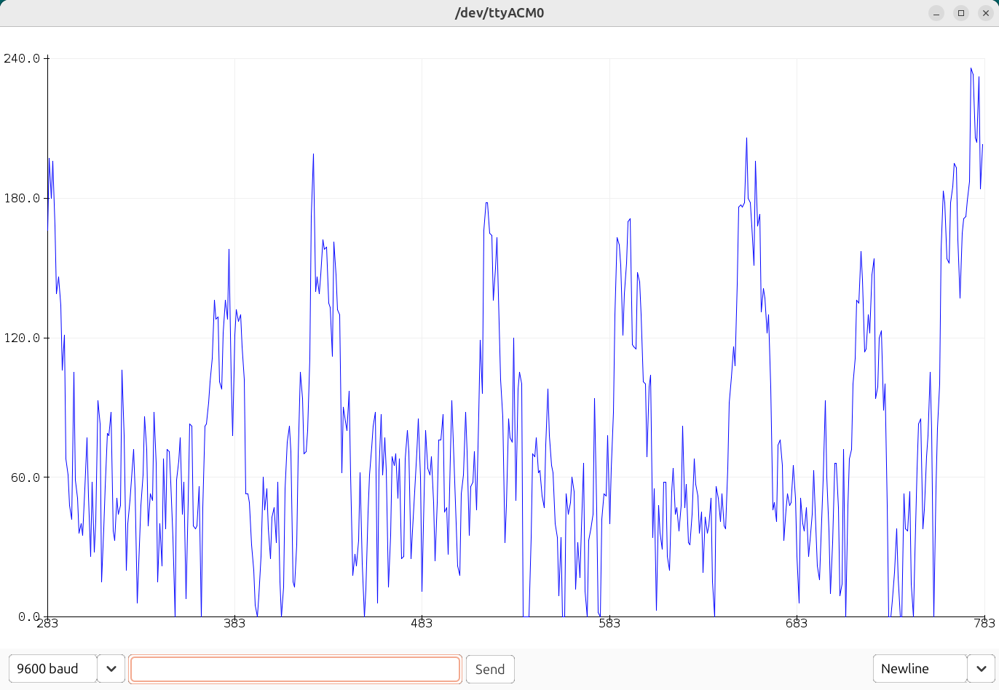
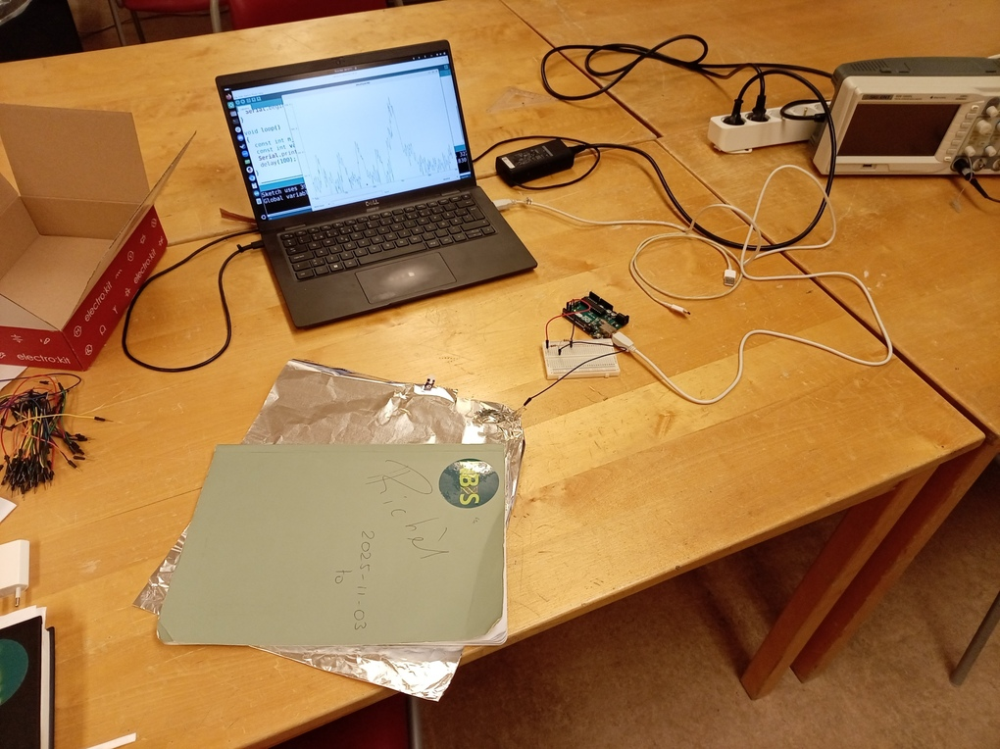
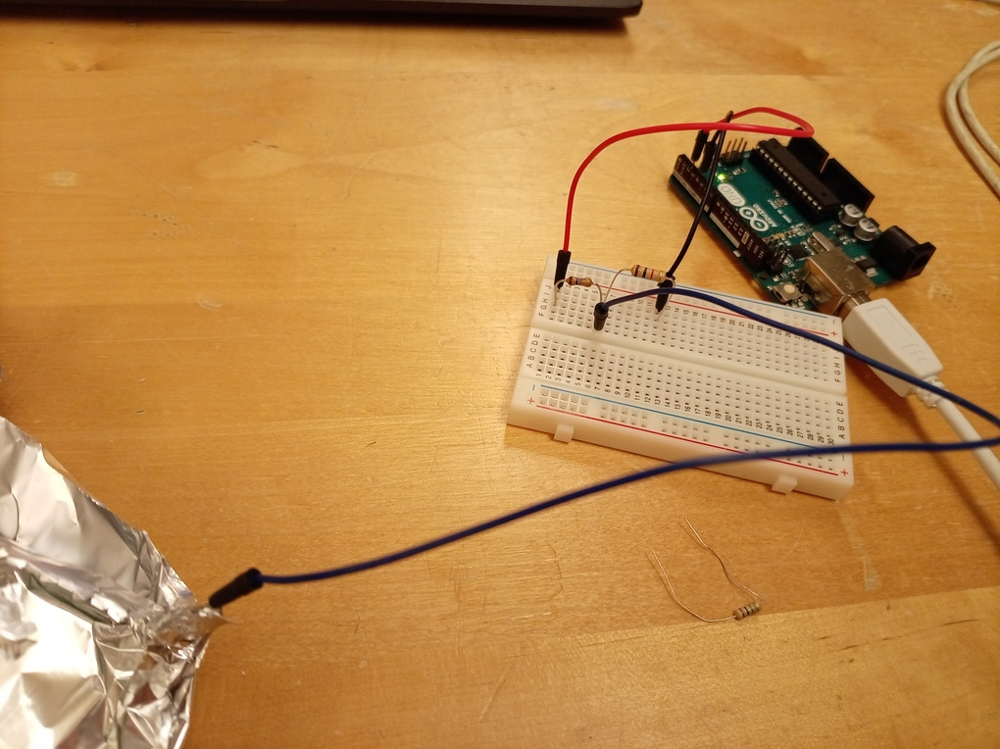
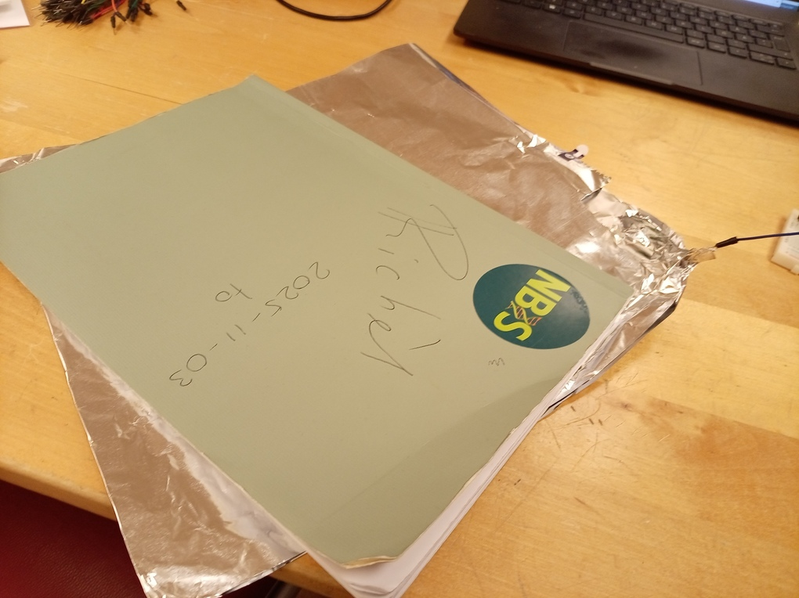

# Lektion 36: Användning av en kapacitiv knapp

En kapacitiv knapp är en inte en vanligt knapp,
men en koppling för att trycka på avstånd (!).

Under den här lektionen använder vi en.

\pagebreak

## 36.1 Att installera biblioteket

Vi behöver en bibliotek (dvs kod skriven av andra)
kallad `CapacitiveSensor`.

Kanske du har redan installerat den:
i Arduino IDEn, gå till `Examples`.
Om du ser `CapacitiveSensor`, är biblioteket redan installerat! 


\pagebreak

Om `CapacitiveSensor` är inte installerat, gör så här:

- Klicka i Arduino IDEn på `Sketch | Import Library | Manage libraries`


- Leta efter `CapacitiveSensor`:


- Klicka på 'Install':



- Nu är biblioteket installerat!



\pagebreak

## 36.2. Att använda en kapacitiv knapp

Koppla ett Arduino till två motstånd.
Motständerna måste var 1 million Ohm (1 MOhm)
och 1 tusen Ohm (1 kOhm). 



Emellan motstånderna, har en sladd eller något annat som kan
leda el (aluminiumfolie är kanon!).

Ladd upp följande kod till Arduino:

```c++
#include <CapacitiveSensor.h>

const int pin_sensor = 2;
const int pin_hjaelp = 4;
CapacitiveSensor cap_sensor = CapacitiveSensor(pin_hjaelp, pin_sensor);

void setup()
{
  Serial.begin(9600);
}

void loop()
{
  const int n_maetningar = 10;
  const int vaerde = cap_sensor.capacitiveSensor(n_maetningar);
  Serial.println(vaerde);
  delay(100);
}
```

Vad visar den 'Serial Plotter'?

\pagebreak

### Svar

Om allt är väl, visar den 'Serial Plotter' en värde som
går uppåt om du är nära och some går nere om du är längre fram:



Det coola är att du inte behöver röra något! Bara att vara nära räcker!

## 36.3. Att tweaka

Antagligen ser din grafik annorlunda ut.

Det finns några nätt att förbättra beteende av din krets:

## 36.3.1. Tryck på resetknappen på Arduino och gå borta

Om du tryck på resetknappen på Arduino,
kalibrerar Arduinon.
Om du snabbt gå borta efter du trycker,
kann dett finnas en möjligt förbättring.

## 36.3.2. Använder en aluminiumfolie

Att koppla sladden i mitten till en aluminiumfolie är en möjligt förbättring.







## 36.3.3. Använder en större motstånd

Istället av en 1 MOhm motstånd, använder en som är än större,
t.ex. 100 MOhm (brun, svart, violet, guld),
är en möjligt förbättring.

## Slutuppgift

- Lägga till en lysdiod. Skriv kod som gör något med den kapacitativa sensorn.
  Det behöver inte vara för tufft, t.ex. att lysdiod brinner
  5 sekunder efter en person har nått sig.
