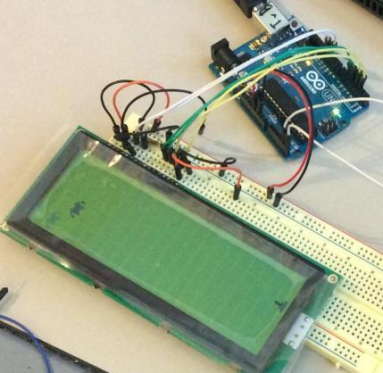
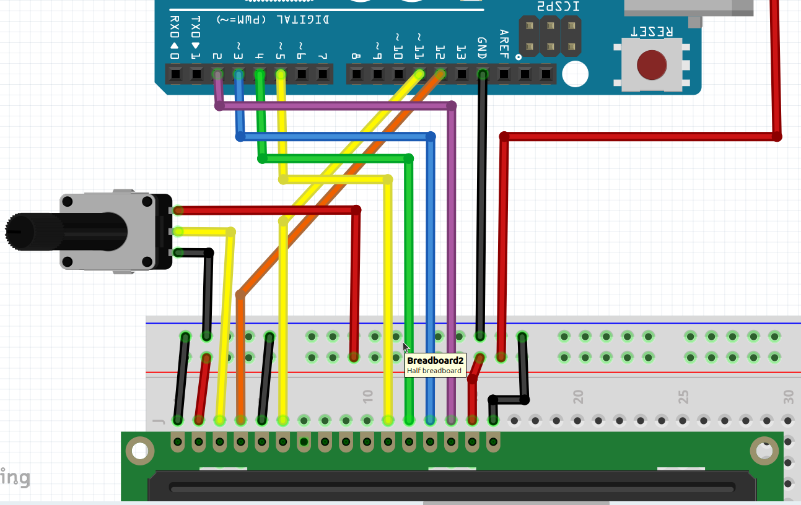
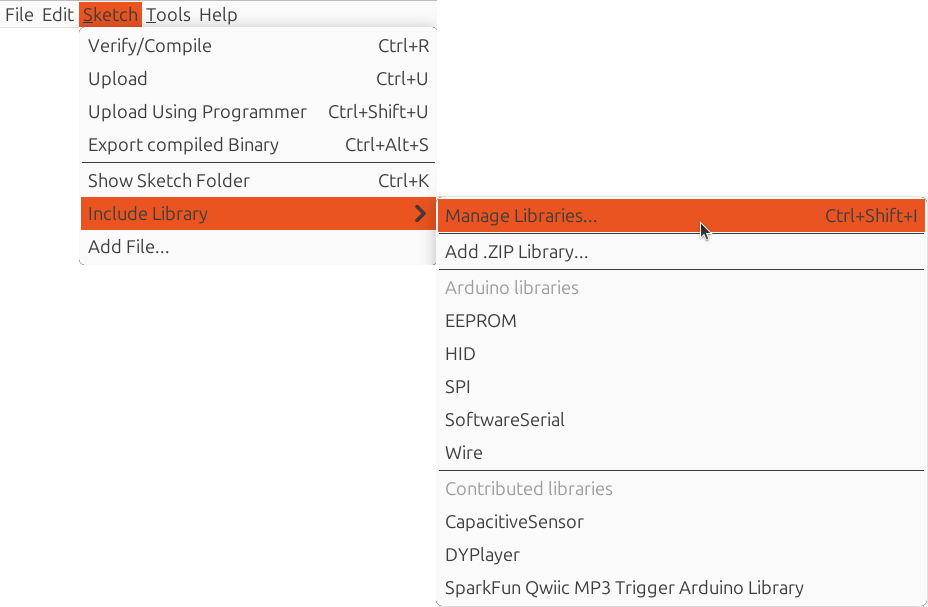

# Lektion 39: Användning av en LCD

En LCD är en del för att visa något, som bokstäver och symboler.
LCD är en förkortning av 'Liquid Crystal Display',
som är engelska för 'flytande kristal skärm'.



## 39.1 Anslut LCD

Anslut en LCD som här:



- Den röda sladd, såklart, går till 5V

Vridmotstånded är för att justera kontrasten på LCD schärmet.

### 39.2. Installera `LiquidCrystal` biblioteket

Installera `LiquidCrystal` biblioteket:

Klick på 'Sketch | Include library | Manage libraries'.



Skriv `LiquidCrystal` is sök-boxen (i toppen-högert hörnet) och klick
på 'Install'


### 39.3. programmera en LCD

Efter att du har installerat `LiquidCrystal` biblioteket,
finns många exempelprogram i Arduino IDE, under `File | Exempel | LiquidCrystal`.

Kör den enklaste: `File | Exempel | LiquidCrystal | HelloWorld`:

```c++
#include <LiquidCrystal.h>

LiquidCrystal lcd(12, 11, 5, 4, 3, 2);

void setup() {
  lcd.begin(16, 2);
  lcd.print("hello, world!");
}

void loop() {
  lcd.setCursor(0, 1);
  lcd.print(millis()/1000);
}
```

Detta gör att du kan få text på skärmen.

 | Det här är en så kallad 'Hello World' program
:-------------:|:----------------------------------------:

 | En 'Hello World' program är användt för att testa om saker funkar
:-------------:|:----------------------------------------:


## 39.4. En egen karaktär

En svårare är `File | Exempel | LiquidCrystal | CustomCharacter`:

```c++
#include <LiquidCrystal.h>

LiquidCrystal lcd(12, 11, 5, 4, 3, 2);

byte heart[8] = {
  0b00000,
  0b01010,
  0b11111,
  0b11111,
  0b11111,
  0b01110,
  0b00100,
  0b00000
};

byte smiley[8] = {
  0b00000,
  0b00000,
  0b01010,
  0b00000,
  0b00000,
  0b10001,
  0b01110,
  0b00000
};


void setup() {
  lcd.createChar(1, heart);
  lcd.createChar(2, smiley);
  lcd.begin(16, 2);
  lcd.print("I ");
  lcd.write(1);
  lcd.print(" Arduino! ");
  lcd.write(2);

}

void loop() {}
```

Detta gör att du kan få dina egna figurer på skärmen.

## 39.5 Slutuppgift

- Får en Arduino och LCD att funkar
- Skapar en program med en text och en enen karaktär

