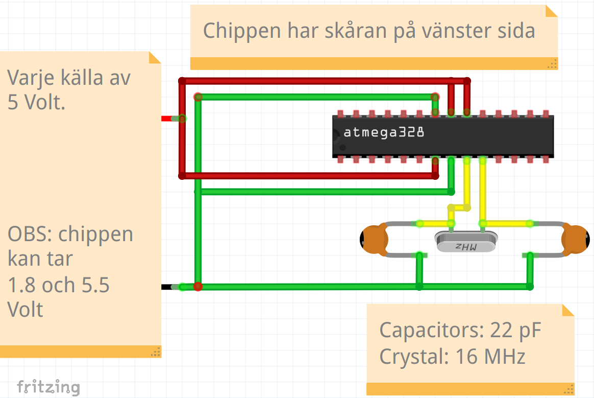

# Lektion 41: Bare-bone Arduino

Om du vill bygga maskiner på riktigt,
du vill inte längre att en hela Arduino ska sitta i innerste av maskinen.
Istället, du vill bara använda det som är absolut nodvändigt.
Den absolut minimumdel av en Arduino är kalled en 'bare-bone Arduino',
en 'bara-ben Arduino'.

## 41.1. Ansluting

Bygg den här elkretsen. Det finns ett anslutningschema på nästa sida också.

> Bare bone Arduino anslutning

\pagebreak

Anslutningschemat:

Från                             | Till
---------------------------------|--------------------------------
Chip toppen 7:e                  | GND
Chip toppen 8:e                  | 5V
Chip toppen 9:e                  | 5V
Chip botten 7:e                  | 5V
Chip botten 8:e                  | GND
Chip botten 9:e                  | Kristal (16 MHz) ena sida
Chip botten 10:e                 | Kristal (16 MHz) andra sida
Kristal (16 MHz) ena sida        | Kondensator 1 (22 pF) ena sida
Kristal (16 MHz) andra sida      | Kondensator 2 (22 pF) ena sida
Kondensator 1 (22 pF) andra sida | GND
Kondensator 2 (22 pF) andra sida | GND

\pagebreak
För att får 5 volt potential, använder eller en Arduino eller
en stromförsörjning för en kopplingsdäck.

Om du avänder en Arduino, koppla Arduinon till en dator och använder
stiften `5V`för 5 volt och stiften `GND` för jord.

Om du avänder en stromförsörjning för en
kopplingsdäck, t.ex. Electro:kit's EKM008 (bild här nere),
ser upp at `+` av försörjning är användt för 5 volt på kopplingsdäcket
(och `-` måste blir användt för jord).

](de53_EKM008-1.png)

## 41.1. Slutuppgift

Koppla på en bare-bone Arduino och övertyger att den funkar.
