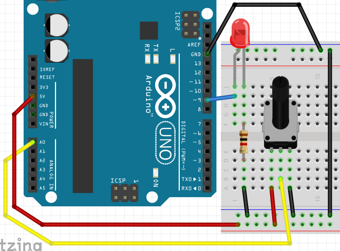

# Potmeter

Met een potmeter kun je een spanning naar de Arduino sturen.
Deze kun je gebruiken als bijvoorbeeld een volumeknop.


In deze les leer je:

* Wat een potmeter is
* Hoe je een potmeter gebruikt

## Aansluiten

Eerst sluiten we alleen een Arduino aan:


Ik denk dat dit wel moet lukken :-)

## Code: lezen potmeter met seriele monitor

Met deze code meten we de stand van de potmeter:

```c++
void setup() 
{
  pinMode(A0, INPUT);
  Serial.begin(9600);
}

void loop()
{
  Serial.println(analogRead(A0));
  delay(100);
}
```

Dit doet de code:

* In de `setup` functie gebeuren twee dingen
    * `pinMode(A0, INPUT)`: de pin `A0` is een pin die leest, een input
    * `Serial.begin(9600)`: de seriele monitor stuurt 9600 bits ('nullen en enen') per seconde
* In de `loop` functie gebeuren twee dingen
    * `Serial.println(analogRead(A0))`: lees de pin `A0` uit en schrijf deze naar de seriele monitor
    * `delay(100)`: wacht honderd milliseconden

## Opdrachten

 1. Upload het programma. In de Arduino IDE, klik rechtsboven op 'Seriele Monitor'. Wat zie je?
 2. Draai de potmeter helemaal naar links (tegen de klok in). Welke waarde zie je op de seriele monitor?
 3. Draai de potmeter helemaal naar rechts (met de klok mee). Welke waarde zie je op de seriele monitor?

## Oplossingen

 1. Je ziet een getal van nul tot 1024, afhankelijk van de stand van de potmeter
 2. Je ziet het getal nul
 3. Je ziet het geal 1023

# Aansluiten potmeter met LED

Nu sluiten we ook een LED aan:



Let op:

* het weerstandje aan de LED is duizend Ohm (bruin-zwart-rood-goud)
* het LEDje moet op een pin met PWM ('een golfje')

## Reageren op potmeter

Nu gaan we het LEDje laten reageren op de potmeter:

```c++
void setup() 
{
  pinMode(A0, INPUT);
  pinMode(9, OUTPUT);
}

void loop()
{
  analogWrite(9, analogRead(A0) / 8);
  delay(100);
}
```

Dit doet de code

* In de `setup` functie gebeuren drie dingen:
    * `pinMode(A0, INPUT)`: de pin `A0` is een pin die leest, een input
    * `pinMode(9, OUTPUT)`: pin `9` is een pin waar stroom uitkomt, een output
* In de `loop` functie gebeuren twee dingen:
    * `analogWrite(9, analogRead(A0) / 8)`: zet op pin 9 een spanning van
     `analogRead(A0) / 8`. `analogRead(A0) / 8` betekent: de waarde gelezen van A0
     gedeeld door acht (de `/` is een deelstreep).
    * `delay(100)`: wacht honderd milliseconden

## Opdracht

* Wat gebeurt er als je het getal van de deling verandert?
* Wat is de beste waarde van het getal voor de deling/

## Oplossingen

 1. Bij een hoger getal, gaat het lampje steeds minder hard in volle stand.
    Bij een lager getal dan vier gaat het lampje raar reageren: het lampje gaat eerst harder,
    dan uit en weer harder, etc
 2. Het beste getal is vier. Want uit `analogRead` komt hoogstens 1023, terwijl je met `analogWrite`
    hoogstens 255 kunt schrijven. 1023 gedeeld door 4 is 255 rest 3. De Ardiono maakt daar 255 van

## Eindopdracht

* Sluit vier LEDjes aan: een rode, gele, groene en blauwe
* Als de potmeter helemaal naar links is, moet er geen LEDje branden.
* Als de potmeter meer naar rechts gedraaid wordt, gaat het groene LEDje branden
* Als de potmeter nog meer naar rechts gedraaid wordt, gaat het gele LEDje branden
* Als de potmeter nog meer naar rechts gedraaid wordt, gaat het rode LEDje branden
* De blauwe LED gaat langzaam aan als er meer naar rechts gedraaid wordt
