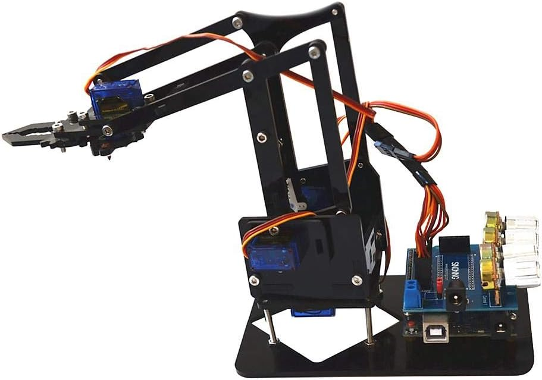
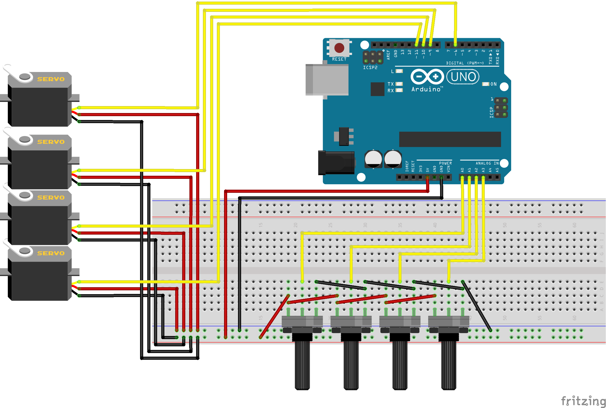

# Programmering av en robotarm

Under den här lektionen ska vi programmera denna coola robotarm

## Styra robotarmen

Bilden nedan är en schematisk vy över robotarmens koppling.  
Observera att du **INTE** behöver koppla något, det är bara att ansluta roboten till datorn via en USB-sladd.

Koden nedan är helt fungerande för att styra robotarmen, varje potentiometer rör en led på armen/klon men behöver kompletteras med ett ändamål.

Varje servo har ett spann som man måste vara inom för att servona inte ska köra utanför sitt arbetsområde, det ungefärliga spannet för varje servo är kommenterat i koden och inlagt i mapfunktionen.
Potentiometrarna är "omvända", det vill säga att om du vrider dem max medsols så returnerar de 0 och max motsols så visar de 1023.
Lycka till att erövra världen med din robotarm!

## Arduinokod för robotarmen

- [Koden](robotstyrning/robotstyrning.ino)
