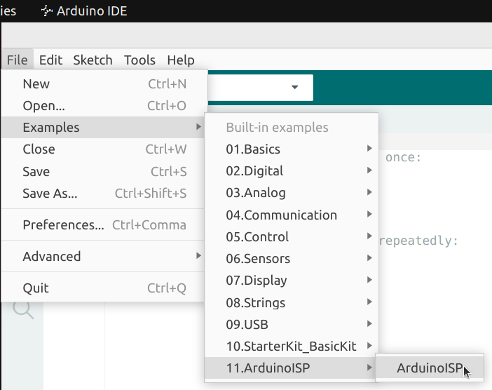
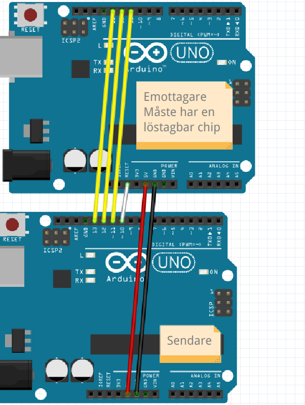
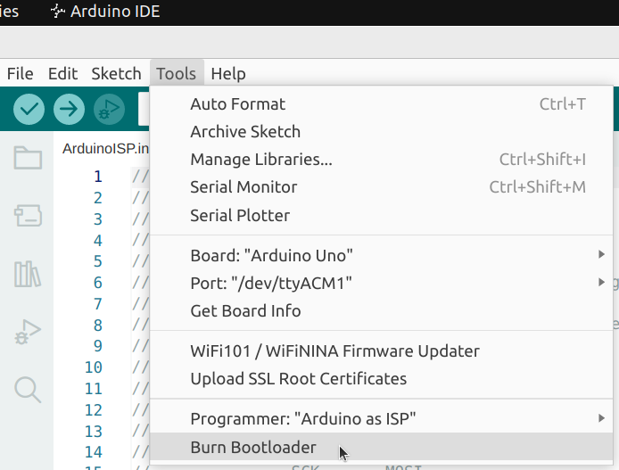

# ArduinoISP

Under den här lektionen ska vi bränna en bootloader på en ATMega328 chip,
med slutmålet att har en 'bare bone Arduino' (som är nästa lektion).

## Ladda up ISP kod

> Den 'ArduinoISP' exempel code

Ladd up 'ArduinoISP' på en Arduino UNO.

## Anslutning

> Den hela stromkrets

Bygga up den stromkrets, från bilden uppåt
eller från tabellen nedåt.

Sändare|Mottagare
-------|----------
5V     |5V
GND    |GND
10     |RESET
11     |11
12     |12
13     |13

> Förbindningar

Glöm inte: mottagare skulle ha en löstagbar chip!

## Bränna bootloader

> Bränna bootloader

* I Arduino IDE, sätter 'Programmer' till 'Arduino as ISP'
* Klick 'Burn Bootloader'

På botten skulle kommer ingen felmeldning.

## Länker

* [https://docs.arduino.cc/built-in-examples/arduino-isp/ArduinoISP](https://docs.arduino.cc/built-in-examples/arduino-isp/ArduinoISP)
