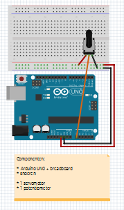

# 90. Arduino och bearbetning

I lektionen kommer vi att lära oss hur en Arduino
låt oss prata med Processing.

Detta görs i två steg:

- Arduino måste prata med din dator
- Bearbetning måste göra något med detta föredrag

## 90.1. Få Arduino att prata

Vi kommer att få Arduino att säga vad som står
är från en potentiometer.

Så här ansluter du potentiometern:



Dessa är kopplingarna:

- `5V`: stiftet på fem volt måste gå till ena sidan av potentiometern
- `GND`: jorden måste flytta till andra sidan av potentiometern
- `A0`: beroende på potentiometerns position kommer det att finnas noll till fem volt på `A0`

Detta är koden för din Arduino:

```c++
void setup()
{
  pinMode(A0, INPUT);
  Serial.begin(9600);
}

void loop()
{
  Serial.write(analogRead(A0) / 4);
  delay(10);
}
```

Meningen "prata med datorn" är inte längre tillräckligt exakt.
Bättre att säga att Arduino skickar karaktärer via
seriekabeln (i det här fallet: via din USB-kabel).

Detta är vad koden gör:

- `void setup() {}`: `setup`-funktionen är en funktion som görs en gång vid uppstart. Det som händer är mellan hängslen
- `Serial.begin(9600)`: Arduino skickar 9600 tecken per sekund genom seriekabeln
- `void loop() {}`: `loop`-funktionen är en funktion som körs hela tiden efter uppstart. Det som händer är mellan hängslen
- `Serial.write(analogRead(A0) / 4)`: Jag gör detta i bitar:
  - `Serial.write()`: skicka ett tecken till seriekabeln
  - `analogRead(A0)`: mäter spänningen på stift `A0`. En spänning på 5 volt blir siffran `1023`
  - `analogRead(A0) / 4`: Mät spänningen på stift `A0` och dividera den med fyra. En spänning på 5 volt blir ett nummer "255", detta är ett praktiskt nummer att använda i bearbetning
  - `Serial.write(analogRead(A0) / 4)`: mät spänningen på stiftet `A0`, dividera den med fyra och skicka den siffran genom seriekabeln
- `delay(10)`: vänta tio millisekunder

## 90.2. Uppgifter

- Stäng flödesschemat som bilden
- Sätt koden på din Arduino
- Kör koden och klicka på knappen `Serial Monitor` längst upp till höger. Vad ser du? Se till att Arduino skickar initialen till ditt förnamn
- Om du inte ser något, kontrollera om numret längst ner till höger på den seriella monitorn är inställt på `9600`!

## 90.3. Får bearbetning att lyssna

Om du inte har Processing ännu, ladda ner den [här!](https://processing.org/download)

Detta är koden för bearbetning:

```processing
import processing.serial.*;
Serial port;

int x = 0;

void setup()
{
  size(1000, 256);
  println(Serial.list());
  port = new Serial(this, Serial.list()[0], 9600);
  background(255, 255, 255);
}

void draw()
{
  while(port.available() > 0) {
    final int y = port.read();
    point(x, y);
    ++x;
    if (x > 1000) x = 0;
  }
}
```

Bearbetning läser vad som kommer in på serieporten.

Detta är vad koden gör:

- `import processing.serial.*;` : hämta all kod som behövs för att prata med en seriell port
- `Serial port` : skapa en ny seriell port och kalla den `port`
- `void setup(){}` : `setup`-funktionen är en funktion som görs en gång vid uppstart. Vad som händer är mellan de lockiga parenteserna
- `size(500, 500);` : skapa en skärm med en storlek på 500 gånger 500 pixlar
- `println(Serial.list());` : skriver ut en lista över alla seriella portar till konsolen (den svarta delen längst ner i bearbetningsmiljön)
- `port = new Serial(this, Serial.list()[0], 9600);` : Jag gör detta i bitar:
- `port = new Serial()` : gör `port` till en ny seriell port...
- `detta,` : ...används i den här filen...
- `Serial.list()[0],` : ...och den första på listan över serieportar är (vanligtvis är detta Arduino, annars måste du ändra siffran `0`)...
- `9600`: och tar emot 9600 tecken per sekund
- `void draw() {}`: `draw`-funktionen är en funktion som görs hela tiden efter start. Vad som händer är mellan de lockiga parenteserna
- `while(port.available() > 0) {}` : gör det som står inom parentes endast när något kommer in på serieporten
- `int number` : skapa ett heltal som heter `number`
- `= port.read();` : skapa `nummer` det som kommer in på serieporten
- `background(number);` : läs `number` som en grå nyans och gör det till bakgrundsfärgen. Vid 0 är bakgrunden svart, vid 255 är den vit

## 90.4. Uppgifter

- Lägg koden i Processing
- Kör din kod genom att trycka på play-knappen längst upp till vänster
- Vrid potentiometern, vad ser du?
- Vad skulle hända om du inte delade `analogRead(A0)` med fyra i Arduino-koden? Försök!
