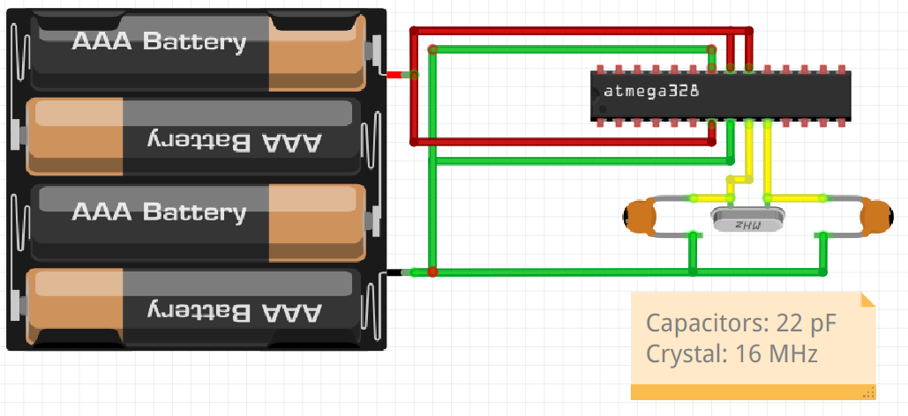

# Bare-bone Arduino

En bare bone Arduino

## Ansluting

> Bare bone Arduino anslutning

Från                             | Till
---------------------------------|--------------------------------
Chip toppen 7:e                  | GND
Chip toppen 8:e                  | 5V
Chip toppen 9:e                  | 5V
Chip botten 7:e                  | 5V
Chip botten 8:e                  | GND
Chip botten 9:e                  | Kristal (16 MHz) ena sida
Chip botten 10:e                 | Kristal (16 MHz) andra sida
Kristal (16 MHz) ena sida        | Kondensator 1 (22 pF) ena sida
Kristal (16 MHz) andra sida      | Kondensator 2 (22 pF) ena sida
Kondensator 1 (22 pF) andra sida | GND
Kondensator 2 (22 pF) andra sida | GND

Tips:

* Du kann får 5V och GND från en vanligt Arduino som är anslutad till en dator
* Chip toppen 10:e ar stift 13 :-)

