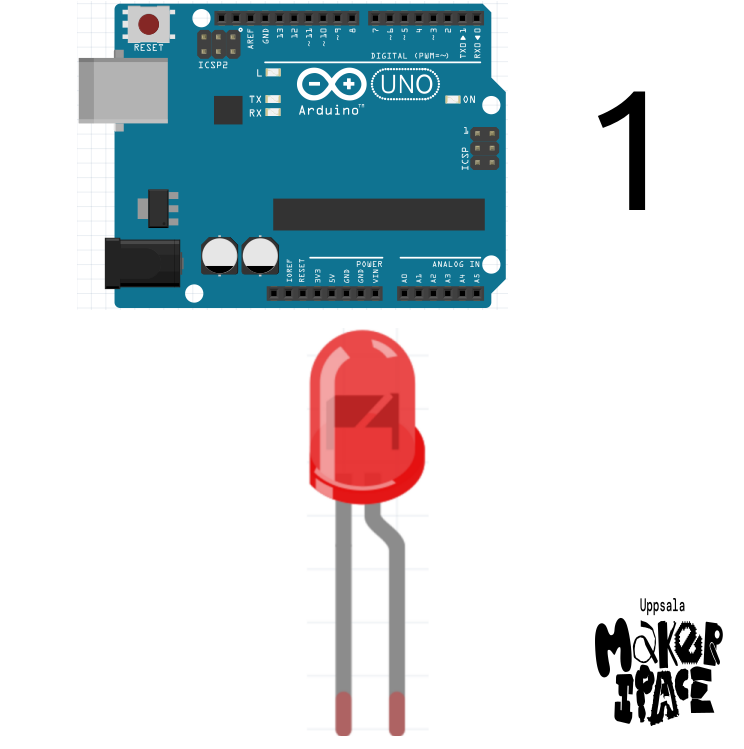

# Arduino för ungdomar
# Bok 1

`#`|Beskriving
---|------------------------------------
0  |Installera Arduino IDEn
1  |Användning av den inbyggda lysdioden
2  |Användning av en multimeter
3  |Anslutning av en lysdiod

