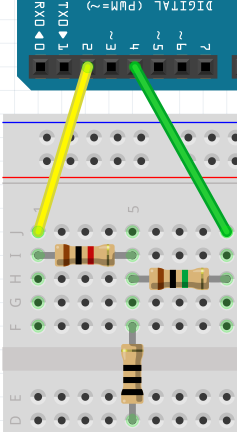
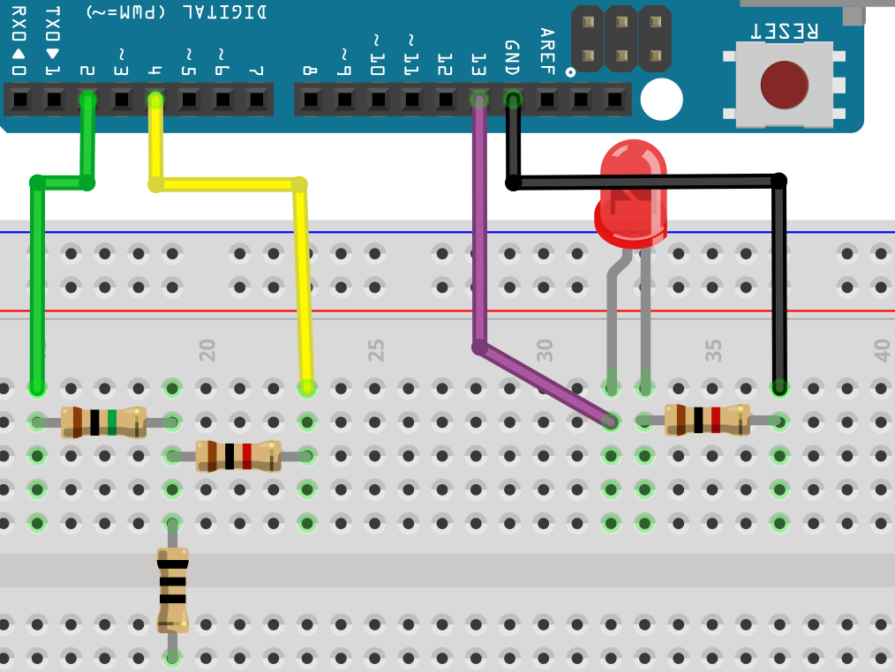

# Capacitieve sensoren

Als je wilt dat je Arduino reageert op aanraking,
kun je een drukknop gebruiken. Maar misschien zoek
je wel iets (nog) simpelers. Dan maak je een
capacitieve sensor, met twee weerstandjes.

\pagebreak

## Bibliotheek geinstalleerd?

In de Arduino IDE, ga naar `Examples`. Zie je `CapacitiveSensor` ertussen staan? Dan is deze bibliotheek al geinstalleerd!


\pagebreak

## Bibliotheek installeren

Is `CapacitiveSensor` niet geinstalleerd, doe dan:

- Klik in de Arduino IDE op `Sketch | Import Library | Add Library`


- Klik op de *folder* en op OK


- Nu is de bibliotheek geinstalleerd:


\pagebreak

## Opdracht

Sluit een capacitive sensor aan:



De weerstand met zwarte strepen is de knop. De knop
hoeft geen weerstand met zwarte strepen te zijn.
De knop mag alles zijn waar electriciteit doorheen kan:
een draadje, een metalen sleutel, aluminiumfolie.

Als de bibliotheek is geinstalleerd, kunnen we een capacitieve sensor uitlezen:

```c++
#include <CapacitiveSensor.h>

const int pin_sensor = 2;
const int pin_hulp = 4;
CapacitiveSensor cap_sensor = CapacitiveSensor(pin_hulp, pin_sensor);        

void setup()                    
{
  Serial.begin(9600);
}

void loop()                    
{
  const int aantal_metingen = 30;
  const int waarde = cap_sensor.capacitiveSensor(aantal_metingen);
  Serial.println(waarde);
  delay(100);
}
```

\pagebreak

## Opdracht 1

Sluit de capacitieve sensor aan en upload de code. Bekijk de Seriele Monitor.

- Wat is de gemeten waarde als je de knop niet aanraakt?
- Wat is de gemeten waarde als je de knop wel aanraakt?

\pagebreak

## Oplossing 1

- Als je de knop niet aanraakt, is de waarde tussen 0 en 10. Het vaakst zie je nul en een.
- Als je de knop wel aanraakt, is de waarde tussen ongeveer 500 en 5000. De getallen wisselen veel

 | De knop kan ook op afstand meten!
:-------------:|:----------------------------------------:

 | Hoe groter de knop (aluminiumfolie!), hoe verder deze kan meten
:-------------:|:----------------------------------------:

\pagebreak

## Opdracht 2

Laat de capacitieve sensor een LEDje aansturen.
Het LEDje moet aan gaan als je op de knop drukt

\pagebreak

## Oplossing 2



```c++
#include <CapacitiveSensor.h>

const int pin_sensor = 2;
const int pin_hulp = 4;
const int pin_led = 13;
CapacitiveSensor cap_sensor = CapacitiveSensor(pin_hulp, pin_sensor);        

void setup()                    
{
  pinMode(pin_led, OUTPUT);
}

void loop()                    
{
  const int aantal_metingen = 30;
  const int waarde = cap_sensor.capacitiveSensor(aantal_metingen);
  if (waarde > 10)
  {
    digitalWrite(pin_led, HIGH);
  }
  else
  {
    digitalWrite(pin_led, LOW);
  }
  delay(10);
}
```

\pagebreak

## Eindopdracht

- Sluit nu ook een tweede LEDje aan. Deze moet juist uit zijn als er op de knop wordt gedrukt.
