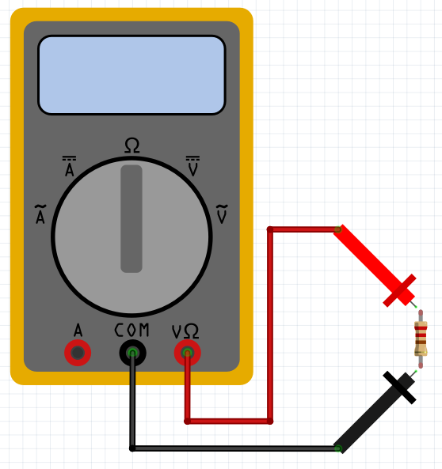

# Multimeter

## En stor tabel

Vad mäter vi?|Bild                        |Frågor                                                 |Elkrets är på?
-------------|----------------------------|-------------------------------------------------------|--------------
Ström        ||Hur mycket ström går hår? Är det kortslutning?         |Ja
Motstånd     |      |Vad är motståndet? Är det kortslutning? Funkar sladden?|Nej
Spänning     ||Hur mycket spänning finns fär? Ska lysdioden överleva? |Ja

## Skärad upp

Vad mäter vi?|Bild
-------------|---------------------------------------------------------
Ström        |
Motstånd     |
Spänning     |

Vad mäter vi?|Frågor
-------------|---------------------------------------------------------
Ström        |Hur mycket ström går hår? Är det kortslutning?
Motstånd     |Vad är motståndet? Är det kortslutning? Funkar sladden?
Spänning     |Hur mycket spänning finns fär? Ska lysdioden överleva?

Vad mäter vi?|Elkrets är på?
-------------|--------------
Ström        |Ja
Motstånd     |Nej
Spänning     |Ja
