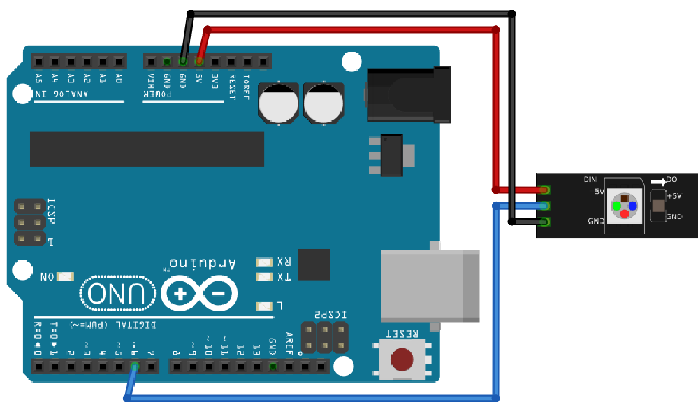
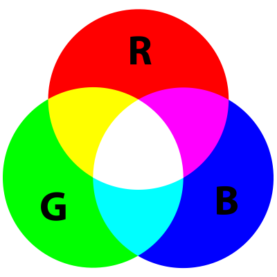

# NeoPixels 1: Blink

Under den här lektion gör vi Blink med NeoPixels!


> FLORAbrella, ett paraply med NeoPixels

\pagebreak

## NeoPixels 1: uppgift 1, anslutning



Anslut en Arduino till NeoPixels så här:

Stift NeoPixels | Stift Arduino 
----------------|--------------
GND             | GND
5V              | 5V
DIN             | 6

\pagebreak

## Neopixel 1: uppdrag 1, programmering

Detta är koden för 'Blink':

```c++
#include <Adafruit_NeoPixel.h>

const int stift_neopixels = 6;
const int antal_pixels = 60;

Adafruit_NeoPixel pixlar = Adafruit_NeoPixel(
   antal_pixels,
   stift_neopixels,
   NEO_GRB + NEO_KHZ800
);

void setup()
{
   pixels.begin();
}

void loop()
{
   pixels.setPixelColor(0, pixels.Color(64, 0, 0));
   pixels.show();
   delay(1000);
   pixels.setPixelColor(0, pixels.Color(0, 0, 0));
   pixels.show();
   delay(1000);
}
```

 | Har du glömt här ljusfärger smälta sammans? Se figuret nedåt
:-------------:|:----------------------------------------: 



> Färgcirkel. Här kan du ser att gul är en blandning av röd och grön.

Färg  |Röd|Grön|Blå
------|---|----|----
Röd   |255|0   |0
Gul   |255|255 |0
Blå   |0  |0   |255

 | 
:-------------:|:------------------------------------------------:
`pixels.show()`|'Bästa dator, låt lysdioderna visa sina färger.'

Skriv in koden i Arduino IDE och klicka på "Ladda upp".

\pagebreak

## Neopixel 1: uppgift 2

Blinkar nu
 
 * den första lysdioden: en Arduino börjar räkna från noll
 * i rött: d.v.s. med ett roed_vaerde på 64, grönt värde på 0 och ett blaa_vaerde på 0

Gå nu

 * den andra lysdioden
 * grön
 * blinka växelvis

\pagebreak

## Neopixel 1: lösning 2

```c++
#include <Adafruit_NeoPixel.h>

const int stift_neopixels = 6;
const int antal_pixels = 60;

Adafruit_NeoPixel pixlar = Adafruit_NeoPixel(
   antal_pixels,
   stift_neopixels,
   NEO_GRB + NEO_KHZ800
);

void setup()
{
   pixels.begin();
}

void loop()
{
   pixels.setPixelColor(0, pixels.Color(64, 0, 0));
   pixels.show();
   delay(1000);
   pixels.setPixelColor(0, pixels.Color(0, 0, 0));
   pixels.setPixelColor(1, pixels.Color(0, 64, 0));
   pixels.show();
   delay(1000);
   pixels.setPixelColor(1, pixels.Color(0, 0, 0));
}
```

\pagebreak

## Neopixel 1: uppgift 3

Gå nu

  * den tredje lysdioden
  *blått
  * blinkar växelvis, efter rött och grönt

\pagebreak

## Neopixel 1: lösning 3

```c++
#include <Adafruit_NeoPixel.h>

const int stift_neopixels = 6;
const int antal_pixels = 60;

Adafruit_NeoPixel pixlar = Adafruit_NeoPixel(
   antal_pixels,
   stift_neopixels,
   NEO_GRB + NEO_KHZ800
);

void setup()
{
   pixels.begin();
}

void loop()
{
   pixels.setPixelColor(0, pixels.Color(64, 0, 0));
   pixels.show();
   delay(1000);
   pixels.setPixelColor(0, pixels.Color(0, 0, 0));
   pixels.setPixelColor(1, pixels.Color(0, 64, 0));
   pixels.show();
   delay(1000);
   pixels.setPixelColor(1, pixels.Color(0, 0, 0));
   pixels.setPixelColor(2, pixels.Color(0, 0, 64));
   pixels.show();
   delay(1000);
   pixels.setPixelColor(2, pixels.Color(0, 0, 0));
}
```

\pagebreak

## Neopixel 1: uppgift 4

Använd nu koden nedan, men gör lysdioderna blåa:

```c++
#include <Adafruit_NeoPixel.h>

const int stift_neopixels = 6;
const int antal_pixels = 60;

Adafruit_NeoPixel pixlar = Adafruit_NeoPixel(
   antal_pixels,
   stift_neopixels,
   NEO_GRB + NEO_KHZ800
);

void setup()
{
   pixels.begin();
}

int vilken_led = 0;
void loop()
{
   pixels.setPixelColor(which_led, pixels.Color(64, 0, 0));
   pixels.show();
   delay(100);
   vilken_led = vilken_led + 1;
}
```

\pagebreak

## Neopixel 1: lösning 4

```c++
#include <Adafruit_NeoPixel.h>

const int stift_neopixels = 6;
const int antal_pixels = 60;

Adafruit_NeoPixel pixlar = Adafruit_NeoPixel(
   antal_pixels,
   stift_neopixels,
   NEO_GRB + NEO_KHZ800
);

void setup()
{
   pixels.begin();
}

int vilken_led = 0;
void loop()
{
   pixels.setPixelColor(which_led, pixels.Color(0, 0, 64));
   pixels.show();
   delay(100);
   vilken_led = vilken_led + 1;
}
```

\pagebreak

## Neopixel 1: uppgift 5

Använd nu inte ett blaa_vaerde på `64`, utan av `which_ledje`. Vad ser du?

\pagebreak

## Neopixel 1: lösning 5

```c++
#include <Adafruit_NeoPixel.h>

const int stift_neopixels = 6;
const int antal_pixels = 60;

Adafruit_NeoPixel pixlar = Adafruit_NeoPixel(
   antal_pixels,
   stift_neopixels,
   NEO_GRB + NEO_KHZ800
);

void setup()
{
   pixels.begin();
}

int vilken_led = 0;

void loop()
{
   pixels.setPixelColor(which_led, pixels.Color(0, 0, which_led));
   pixels.show();
   delay(100);
   vilken_led = vilken_led + 1;
}
```

\pagebreak

## Neopixel 1: uppgift 5

Använd nu inte ett roed_vaerde på `0`, utan av `64 - which_ledje`. Vad ser du?

\pagebreak

## Neopixel 1: lösning 5

```c++
#include <Adafruit_NeoPixel.h>

const int stift_neopixels = 6;
const int antal_pixels = 60;

Adafruit_NeoPixel pixlar = Adafruit_NeoPixel(
   antal_pixels,
   stift_neopixels,
   NEO_GRB + NEO_KHZ800
);

void setup()
{
   pixels.begin();
}

int vilken_led = 0;

void loop()
{
   pixels.setPixelColor(which_led, pixels.Color(64 - which_led, 0, which_led));
   pixels.show();
   delay(100);
   vilken_led = vilken_led + 1;
}
```

\pagebreak

## Neopixel 1: uppgift 6

Istället för att alltid göra 'which_ledje' högre,
vi kan också göra det med en ny variabel: 'roed_vaerde'.
Skapa en ny variabel, av typen "int", med namnet "redvalue" och initialvärdet noll.
Använd 'roed_vaerde' där
du bestämmer det röda värdet på en lysdiod.
Låt 'roed_vaerde' öka med 1 varje gång.

\pagebreak

## Neopixel 1: lösning 6

```c++
#include <Adafruit_NeoPixel.h>

const int stift_neopixels = 6;
const int antal_pixels = 60;

Adafruit_NeoPixel pixlar = Adafruit_NeoPixel(
   antal_pixels,
   stift_neopixels,
   NEO_GRB + NEO_KHZ800
);

void setup()
{
   pixels.begin();
}

int vilken_led = 0;
int roed_vaerde = 0;

void loop()
{
   pixels.setPixelColor(vilken_led, pixlar.Färg(roed_vaerde, 0, vilken_led));
   pixels.show();
   delay(100);
   vilken_led = vilken_led + 1;
   roed_vaerde = roed_vaerde + 1;
}
```

\pagebreak

## Neopixel 1: uppgift 7

Istället för att alltid göra 'which_ledje' högre,
vi kan också göra det med en ny variabel: 'blaa_vaerde'.
Skapa en ny variabel, av typen "int", med namnet "bluevalue" och initialvärdet "32".
Använd 'blaa_vaerde' där du bestämmer det röda värdet på en lysdiod.
Låt 'blaa_vaerde' öka med 1 varje gång.

\pagebreak

## Neopixel 1: lösning 7

```c++
#include <Adafruit_NeoPixel.h>

const int stift_neopixels = 6;
const int antal_pixels = 60;

Adafruit_NeoPixel pixlar = Adafruit_NeoPixel(
   antal_pixels,
   stift_neopixels,
   NEO_GRB + NEO_KHZ800
);

void setup()
{
   pixels.begin();
}

int vilken_led = 0;
int roed_vaerde = 0;
int blaa_vaerde = 0;

void loop()
{
   pixels.setPixelColor(which_led, pixels.Color(redvalue, 0, bluevalue));
   pixels.show();
   delay(100);
   vilken_led = vilken_led + 1;
   roed_vaerde = roed_vaerde + 1;
   blaa_vaerde = blaa_vaerde + 1;
}
```

\pagebreak

## Neopixel 1: uppgift 8

Istället för att göra det "röda värdet" högre och högre,
vi kan alltid göra dessa två högre.
Men vi vill inte att det "röda värdet" ska överstiga "64".
Använd en "if"-sats: om "roed_vaerde" är större än "64",
det "röda värdet" blir då noll.

\pagebreak

## Neopixel 1: lösning 8

```c++
#include <Adafruit_NeoPixel.h>

const int stift_neopixels = 6;
const int antal_pixels = 60;

Adafruit_NeoPixel pixlar = Adafruit_NeoPixel(
   antal_pixels,
   stift_neopixels,
   NEO_GRB + NEO_KHZ800
);

void setup()
{
   pixels.begin();
}

int vilken_led = 0;
int roed_vaerde = 0;
int blaa_vaerde = 0;

void loop()
{
   pixels.setPixelColor(which_led, pixels.Color(redvalue, 0, bluevalue));
   pixels.show();
   delay(100);
   vilken_led = vilken_led + 1;
   roed_vaerde = roed_vaerde + 2;
   blaa_vaerde = blaa_vaerde + 1;
   if (roed_vaerde > 64)
   {
     roed_vaerde = 0;
   }
}
```

\pagebreak

## Neopixel 1: uppgift 9

Istället för att göra "blaa_vaerde" högre och högre,
vi kan alltid göra dessa tre högre.
Men vi vill inte att 'blaa_vaerde' överstiger '64'.
Använd en "if"-sats: om "blaa_vaerde" är större än "64",
att 'blaa_vaerde' då blir noll.

\pagebreak

## Neopixel 1: lösning 9

```c++
#include <Adafruit_NeoPixel.h>

const int stift_neopixels = 6;
const int antal_pixels = 60;

Adafruit_NeoPixel pixlar = Adafruit_NeoPixel(
   antal_pixels,
   stift_neopixels,
   NEO_GRB + NEO_KHZ800
);

void setup()
{
   pixels.begin();
}

int vilken_led = 0;
int roed_vaerde = 0;
int blaa_vaerde = 0;

void loop()
{
   pixels.setPixelColor(which_led, pixels.Color(redvalue, 0, bluevalue));
   pixels.show();
   delay(100);
   vilken_led = vilken_led + 1;
   roed_vaerde = roed_vaerde + 2;
   blaa_vaerde = blaa_vaerde + 3;
   if (roed_vaerde > 64)
   {
     roed_vaerde = 0;
   }
   if (blaa_vaerde > 64)
   {
     blaa_vaerde = 0;
   }
}
```

\pagebreak

## Neopixel 1: uppgift 10

`which_ledje` blir nu högre och högre.
Lägg nu till ett `if`-sats: om `which_led` är större *eller lika* än `number_neopixels`,
att `vilken_ledje` då blir noll.

\pagebreak

## Neopixel 1: lösning 10

```c++
#include <Adafruit_NeoPixel.h>

const int stift_neopixels = 6;
const int antal_pixels = 60;

Adafruit_NeoPixel pixlar = Adafruit_NeoPixel(
   antal_pixels,
   stift_neopixels,
   NEO_GRB + NEO_KHZ800
);

void setup()
{
   pixels.begin();
}

int vilken_led = 0;
int roed_vaerde = 0;
int blaa_vaerde = 0;

void loop()
{
   pixels.setPixelColor(which_led, pixels.Color(redvalue, 0, bluevalue));
   pixels.show();
   delay(100);
   vilken_led = vilken_led + 1;
   roed_vaerde = roed_vaerde + 2;
   blaa_vaerde = blaa_vaerde + 3;
   if (roed_vaerde > 64)
   {
     roed_vaerde = 0;
   }
   if (blaa_vaerde > 64)
   {
     blaa_vaerde = 0;
   }
   if (vilket_led >= antal_pixels)
   {
     vilken_led = 0;
   }
}
```

\pagebreak

## Neopixel 1: slutuppgift

Skapa en ny variabel "grönt värde", som bestämmer det gröna värdet för lysdioderna.
Den här får hela tiden fyra till. Om 'grönt värde' är över 64, ställ in det på noll.
