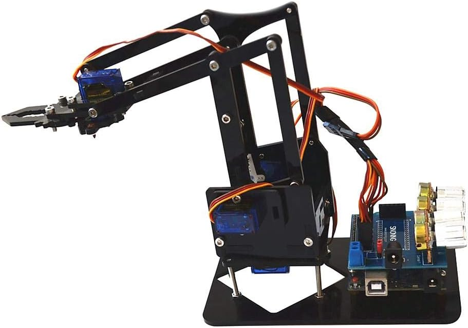
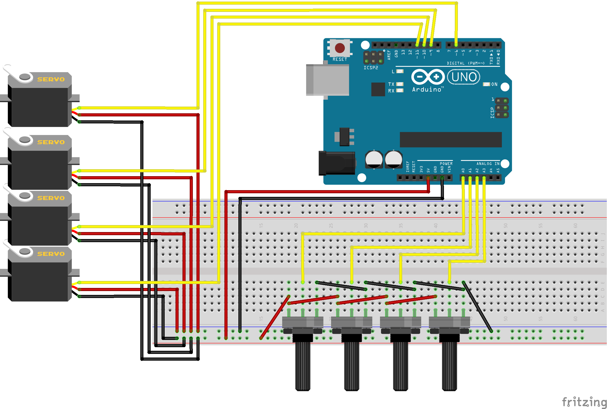

# Programmering av en robotarm

(kopierad från <https://github.com/richelbilderbeek/arduino_foer_ungdomar/tree/main/docs/kapitel/robot_arm>)

Under den här lektionen ska vi programmera denna coola robotarm



## Styra robotarmen

Bilden nedan är en schematisk vy över robotarmens koppling.  
Observera att du **INTE** behöver koppla något, det är bara att ansluta roboten till datorn via en USB-sladd.



Koden nedan är helt fungerande för att styra robotarmen, varje potentiometer rör en led på armen/klon men behöver kompletteras med ett ändamål.

Varje servo har ett spann som man måste vara inom för att servona inte ska köra utanför sitt arbetsområde, det ungefärliga spannet för varje servo är kommenterat i koden och inlagt i mapfunktionen.
Potentiometrarna är "omvända", det vill säga att om du vrider dem max medsols så returnerar de 0 och max motsols så visar de 1023.
Lycka till att erövra världen med din robotarm!

## Arduinokod för robotarmen

```c++
// Definierar array med stift för potentiometrar (analoga ingångar)
int sensorPin[] = {A0, A1, A2, A3}; // input pins for the potentiometer

// Definierar array med stift för servon (PWM-utgångar)
int controlPin[] = {6, 9, 10, 11}; // output pins for the servo

// Variabel för att lagra sensorvärdet från potentiometrarna
int sensorValue = 0;

void setup() {
  // Loop för att ställa in pin-lägen för både ingångar och utgångar
  for (int i = 0; i < 4; i++) {
    pinMode(controlPin[i], OUTPUT); // Ställ in PWM-stift som utgångar
    pinMode(sensorPin[i], INPUT); // Ställ in sensorstift som ingångar
  }
  Serial.begin(115200); // Startar seriell kommunikation med 115200 baud-rate
}

void loop() { 
  // Kommenterar intervallet för respektive servo
  // 6 - Styrservo med ett spann av 50-230
  // 9 - Joint-servo med ett spann av 120-255
  // 10 - Joint-servo med ett spann av 100-255
  // 11 - Styr öppen/stängd position med ett spann av 170-255

  // Kör koden varje sekund (millis() % 1000 == 0) 
  if (millis() % 1000 == 0) {
    // Loopar igenom alla sensorer
    for (int i = 0; i < 4; i++) {
      // Läser av värde från potentiometern (analog sensor)
      sensorValue = analogRead(sensorPin[i]);
      // Skickar avläst värde till seriell monitor
      Serial.print("A");
      Serial.print(i);
      Serial.print(" = ");
      Serial.print(sensorValue);
      Serial.print(", ");
    }
    // Skriver ut en ny rad i den seriella monitoren
    Serial.println("");
  }

  // Mappning och skrivning av PWM-signaler till servon baserat på potentiometervärden
  analogWrite(6, map(analogRead(A0), 1023, 0, 90, 255));   // Mappning för servo ansluten till pin 6
  analogWrite(9, map(analogRead(A1), 1023, 0, 120, 255));  // Mappning för servo ansluten till pin 9
  analogWrite(10, map(analogRead(A2), 1023, 0, 100, 255)); // Mappning för servo ansluten till pin 10
  analogWrite(11, map(analogRead(A3), 1023, 0, 170, 255)); // Mappning för servo ansluten till pin 11
}
```
