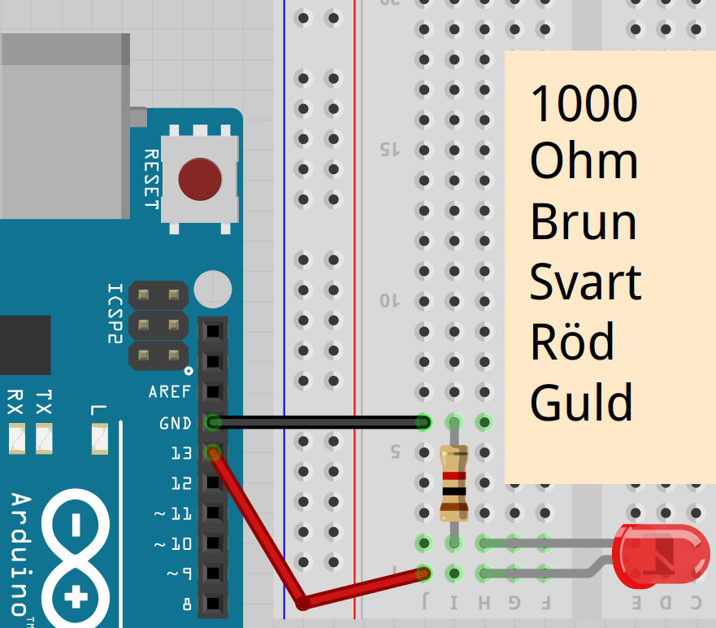
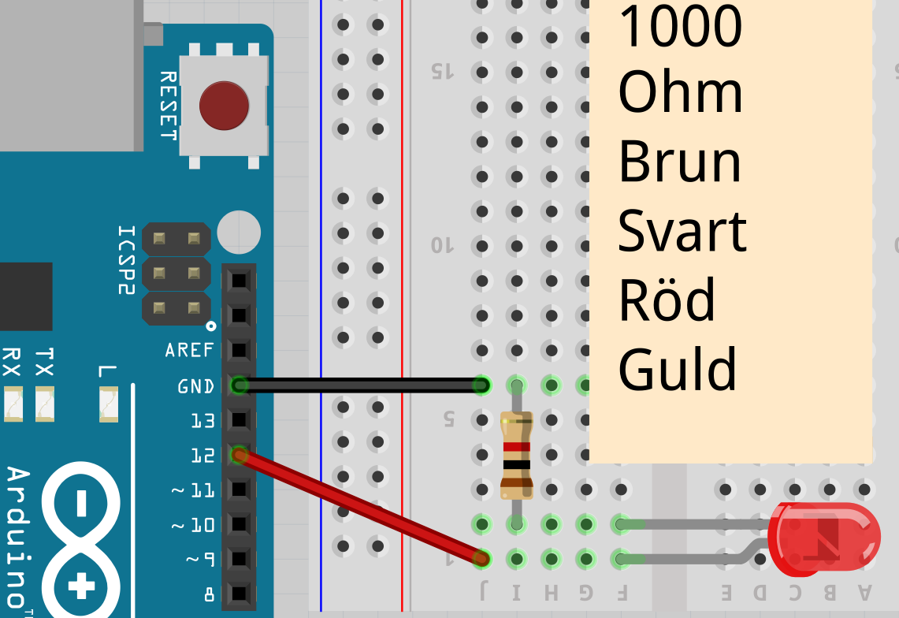
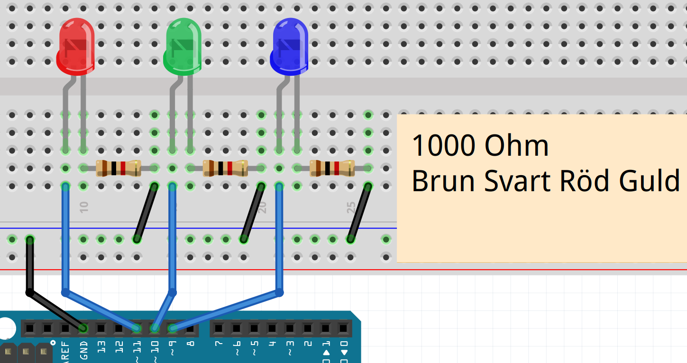

# Lektion 2: Blink Blink Blink

Den här lektionen kallas 'Blink Blink Blink',
eftersom det är Blink lektionen, men med tre LEDs.

## 2.1: Blink Blink Blink: Blink



\pagebreak

Här är `Blink`s kod på ett annat sätt:

```c++
const int led_stift = 13;

void setup() 
{
  pinMode(led_stift, OUTPUT);
}

void loop() 
{
  digitalWrite(led_stift, HIGH);
  delay(1000);
  digitalWrite(led_stift, LOW);
  delay(1000);
}
```

`led_stift` kallas en variabel: en plats i datorns minne med ett namn.

 | 
:-------------:|:----------------------------------------:
`const int led_stift = 13;`|'Kära dator, kom ihåg ett heltal som heter `led_stift` med startvärdet 13.'

\pagebreak

## 2.2: Blink Blink Blink: Uppgift 1

Anslut Blinkkretsen (ser uppåt) till stift 12
och ändra koden så att den blinkar.

\pagebreak

## 2.3: Blink Blink Blink: Lösning 1



Du behöver bara ändra en rad:

```c++
const int led_stift = 12;

void setup() 
{
  // ...
}

void loop() 
{
  // ...
}
```

## 2.4: Blink Blink Blink: Uppgift 2

Skapa en ny variabel för väntetiden, kallad `vantetid`, själv.
`vantetid` är ett heltal med initialt värde `1000`.
Använd `vantetid` som värde i `delay`.

 | Smart! Om du läser `vantetid` vet du vad det är till för. Vid `1000` vet du inte det
:-------------:|:----------------------------------------:

\pagebreak

## 2.5: Blink Blink Blink: Lösning 2

```c++
// ... [ange led_stift att vara 12]
const int vantetid = 1000;

void setup() 
{
  // ...
}

void loop() 
{
  // ... [sätter spänning på led_stift]
  delay(vantetid);
  // ... [stanger av spänning från led_stift]
  delay(vantetid);
}
```

| `// ... [nåt]` betyder 'koden du redan har där som handlar om vad som står inom hårdparentes'
:-------------:|:----------------------------------------:

## 2.6: Blink Blink Blink: Ansluter Blink Blink Blink

Nu är det dags att ansluta `Blink Blink Blink`:



* Koppla ur USB-kabeln från datorn, så att Arduino inte längre har ström
* Bygg kretsen enligt bilden

\pagebreak

## 2.7: Blink Blink Blink: Uppgift 3

Koppla in `Blink Blink Blink`kretsen.
Byt namn på variabeln `led_stift` till `led_stift_1`.
och se till att det har rätt startvärde.

\pagebreak

## 2.8: Lösning 3

```c++
const int led_stift_1 = 11;
// ... [väntetid]

void setup() 
{
  pinMode(led_stift_1, OUTPUT);
}

void loop() 
{
  digitalWrite(led_stift_1, HIGH);
  // [vänta vantetid millisekunder]
  digitalWrite(led_stift_1, LOW);
  // [vänta vantetid millisekunder]
}
```

 | Programmerare använder många variabler eftersom det gör koden lättare att förstå och ändra.
:-------------:|:----------------------------------------:

\pagebreak

## 2.9: Blink Blink Blink: Uppgift 4

Skapa en ny variabel `led_stift_2`.
Få först den första LEDen att tändas och släckas,
få sedan den andra LEDen tändas och släckas efter den första.

 | Sättet att skriva, med "_" i stället för mellanslag t.ex. 'led_stift_2' kallas 'snake case': 'snake' är engelska för orm
:-------------:|:----------------------------------------:

 | Skulle du skriva `pinLed2`, heter det 'camel case': 'camel' är engelska för kamel
:-------------:|:----------------------------------------:

 | Jag tänker båda är lika bra
:-------------:|:----------------------------------------:

\pagebreak

## 2.10: Blink Blink Blink: Lösning 4

```c++
const int led_stift_1 = 11;
const int led_stift_2 = 10;
// ...

void setup() 
{
  pinMode(led_stift_1, OUTPUT);
  pinMode(led_stift_2, OUTPUT);
}

void loop() 
{
  digitalWrite(led_stift_1, HIGH);
  // ... [vänta vantetid millisekunder]
  digitalWrite(led_stift_1, LOW);
  // ... [vänta vantetid millisekunder]
  digitalWrite(led_stift_2, HIGH);
  // ... [vänta vantetid millisekunder]
  digitalWrite(led_stift_2, LOW);
  // ... [vänta vantetid millisekunder]
}
```

\pagebreak

## 2.11: Blink Blink Blink: Uppgift 5

Skapa en tredje variabel `led_stift_3`.
Få nu alla lampor blinka samtidigt: alla på, sedan alla av.

 | Det här är ganska mycket att skriva! Senare får du lära dig hur detta kan göras smartare
:-------------:|:----------------------------------------:

 | Korrekt! Arrays låter dig lagra flera tal i en variabel
:-------------:|:----------------------------------------:

\pagebreak

## 2.12: Blink Blink Blink: Lösning 5

```c++
// ... [skapa vantetid, led_stift_1 och led_stift_2]
const int led_stift_3 = 9;

void setup() 
{
  // ... [led_stift_1 och led_stift_2 avger spänning]
  pinMode(led_stift_3, OUTPUT);
}

void loop() 
{
  // ... [sätter spänning på LED 1 och 2]
  digitalWrite(led_stift_3, HIGH);
  // ... [vänta vantetid millisekund]
  // ... [stäng av spänning på LED 1 en 2]
  digitalWrite(led_stift_3, LOW);
  // ... [vänta vantetid millisekund]
}
```

\pagebreak

## 2.13: Blink Blink Blink: Slutuppgift

Få nu LEDs lysa i ett 'Knight Rider-mönster': 1-2-3-2.
Det måste alltid finnas exakt en LED som lyser.

 | Knight Rider var en TV-serie med en talande bil.
:-------------:|:----------------------------------------:


