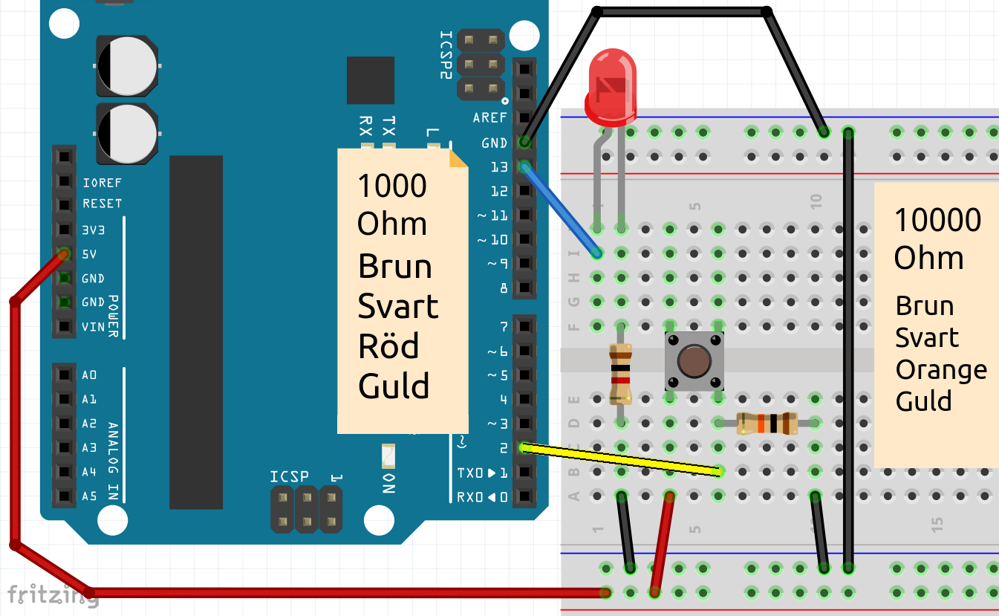
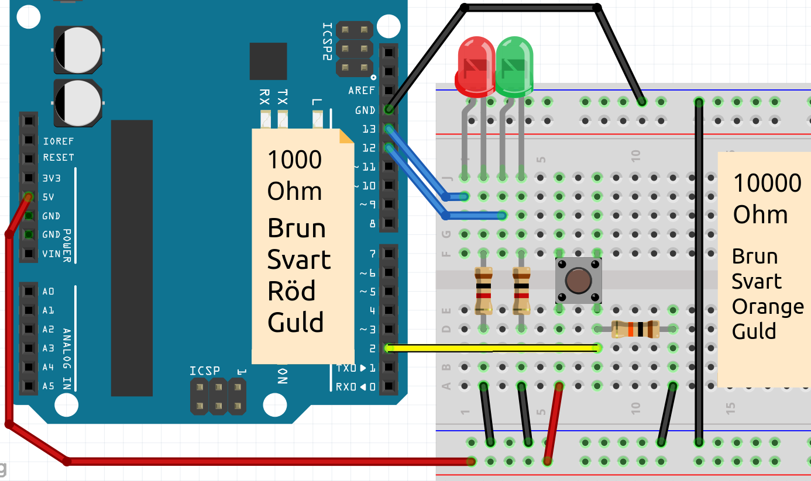
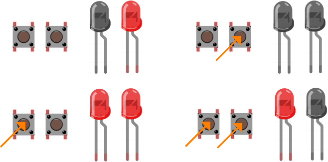

# Lektion 3: Knapp if ... else

I den här lektionen låter vi Arduino ställa frågor till sig själv.

 | Så Arduino blir en sorts filosof!
:-------------:|:----------------------------------------: 


## 3.1. Knapp if ... else: Anslut



 | Motståndet till jord kallas ett 'Pull Down'-motstånd
:-------------:|:----------------------------------------: 

\pagebreak

## 3.2. Knapp if ... else: Kod

Här är koden för att få LEDen att tändas,
när knappen trycks in:

```c++
const int led_stift = 13;
const int knapp_stift = 2;

void setup() 
{
  pinMode(led_stift, OUTPUT);
  pinMode(knapp_stift, INPUT);
}

void loop()
{
  digitalWrite(led_stift, digitalRead(knapp_stift));
}
```

|`digitalRead(knapp_stift)` 
:-----------:|:----------------------------------------: 
 |'Ge mig `HIGH` om `knapp_stift` har spänning. Annars ge `LOW`'

|`digitalWrite(led_stift, digitalRead(knapp_stift))`
:-----------:|:----------------------------------------: 
 |'Ger spänning till `led_stift` om `knapp_stift` har spänning'

\pagebreak

## 3.3. Knapp if ... else: Fråga

När du trycker på knappen, släcks eller tänds LEDen?

 | 'Pull Down'-motståndet ser till att stift 2 är anslutet till GND när knappen inte trycks in
:-------------:|:----------------------------------------: 

## 3.4. Knapp if ... else: Svara

LEDen tänds när du trycker på knappen.

 | LEDen tänds när du trycker på knappen
:-------------:|:----------------------------------------: 

\pagebreak

## 3.5. Knapp if ... else: `if`

Med en `if`-sats kan du få Arduino att göra något, 
t.ex. så här:

```c++
if (digitalRead(knapp_stift) == HIGH)
{
  digitalWrite(led_stift, HIGH);
}
else
{
  digitalWrite(led_stift, LOW);
}
```

Denna kod kontrollerar om det finns spänning på `knapp_stift`.
Om ja, ge Arduino spänning på `led_stift`.
Annars (`else`) stänger Arduino av spänningen på `led_stift`.

 |`if (digitalRead(knapp_stift) == HIGH) {}`
:------------:|:------------------------------------------: 
  |'Kära dator, om det finns spänning på `knapp_stift`, gör det inom parentes'


 | `=` kan tolkas som "blir". "==" kan tolkas som "är det lika med?"
:-------------:|:----------------------------------------: 

\pagebreak

## 3.6. Knapp if ... else: Uppgift 1

Detta är exempelkoden, som inte är helt färdig:

```c++
void setup() 
{
  pinMode(4, INPUT );
  pinMode(5, OUTPUT);
  pinMode(6, OUTPUT);
}

void loop()
{

  if (digitalRead(4) == HIGH)
  {
    digitalWrite(5, HIGH);
  }
  else
  {
    digitalWrite(6, LOW);
  }
}
```

Ändra koden så att:

 * När du trycker på knappen tänds lampan
 * om du inte trycker på knappen förblir lampan släckt
 * använd variabler för att namnge stiften

 | Det används inget semikolon efter de runda parenteserna för `if`.
:-------------:|:----------------------------------------: 

\pagebreak

## 3.7. Knapp if ... else: Lösning 1

```c++
// ...

void setup() 
{
  // ...
}

void loop()
{
  if (digitalRead(knapp_stift) == HIGH)
  {
    digitalWrite(led_stift, HIGH);
  }
  else
  {
    digitalWrite(led_stift, LOW);
  }
}
```

| `// ...` betyder 'koden du redan har där'
:-------------:|:----------------------------------------: 

\pagebreak

## 3.8. Knapp if ... else: Uppgift 2

Anslut en andra grön LED. Ändra koden så att:

 * när du trycker på knappen tänds den första LEDen och den andra LEDen släcks
 * om du inte trycker på knappen slocknar den första LEDen och den andra LEDen tänds
 * Namnge variabeln för stiftet på den röda LEDen `led_stift_rod`, för
   grön LED `led_stift_gron`

| Du kan skriva flera rader inom måsvingarna i en `if` sats. Precis som mellan måsvingarna i `setup` och `loop`!
:-------------:|:----------------------------------------: 

 | Glöm inte `else` ('annars')!
:-------------:|:----------------------------------------: 

\pagebreak

## 3.9. Knapp if ... else: Lösning 2

Bild `Lösning för 'Knapp med två LEDer'` visar hur man ansluter detta.



\pagebreak

Det här är koden:

```c++
const int led_stift_rod = 13;
const int led_stift_gron = 12;
// ...


void setup() 
{
  pinMode(led_stift_rod, OUTPUT);
  pinMode(led_stift_gron, OUTPUT);
  // ...
}

void loop()
{
  if (/* ... */)
  {
    digitalWrite(led_stift_gron, LOW);
    digitalWrite(led_stift_rod, HIGH);
  }
  else
  {
    digitalWrite(led_stift_gron, HIGH);
    digitalWrite(led_stift_rod, LOW);
  }
  delay(10);
}
```

| `/* ... */` betyder också 'koden du redan har där'
:-------------:|:----------------------------------------: 

\pagebreak

## 3.10. Knapp if ... else: slutuppgift



Anslut en andra knapp. Ändra koden så att

  * om du trycker på den första knappen tänds den första LEDen
  * om du släpper första knappen ska första LEDen slockna
  * om du trycker på den andra knappen slocknar den andra LEDen
  * om du inte trycker på den andra knappen tänds den andra LEDen

| Du kan änvanda mer än en `if` sats
:-------------:|:----------------------------------------: 

 | För en andra knapp behöver du ett andra motstånd på tio tusen ohm
:-------------:|:----------------------------------------: 

